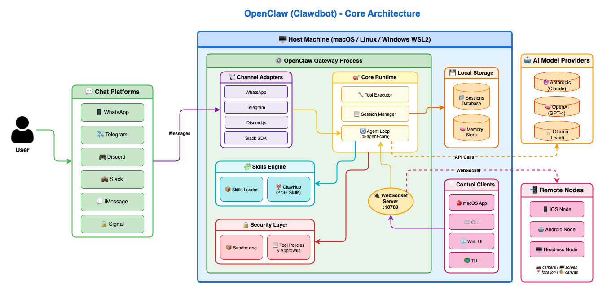
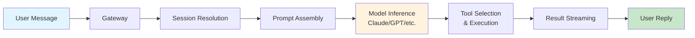

# Clawdbot (OpenClaw): The Open-Source Personal AI Assistant That Actually Does Things

*A comprehensive guide to understanding, deploying, and using Clawdbot/OpenClaw - the viral AI assistant that executes real tasks on your computer*

<!-- truncate -->

---

## 1. What is Clawdbot?

**Clawdbot** (now officially known as **OpenClaw**, previously called Moltbot) is an open-source personal AI assistant that has taken the developer community by storm. Unlike traditional AI chatbots that simply respond to queries, Clawdbot is an **agentic AI platform** that can execute actual tasks on your computer.

At its core, Clawdbot is:

- **An AI OS**: A complete operating system for AI agents that runs locally on your device
- **Multi-platform**: Works on macOS, Windows (via WSL2), Linux, iOS, Android, Docker, and even Raspberry Pi
- **Chat-first**: Communicates through messaging platforms you already use (WhatsApp, Telegram, Discord, Slack, iMessage, Signal, and more)
- **Open-source**: MIT licensed with 133,000+ GitHub stars

The tagline says it all: *"Your own personal AI assistant. Any OS. Any Platform. The lobster way. 🦞"*


### Why the Name Changes?

The tool was originally called "Clawdbot" but was renamed to "Moltbot" and then "OpenClaw" after polite pressure from Anthropic, since the original name was too similar to their AI model "Claude." The lobster branding (and molting reference) has stuck throughout these transitions.


---

## 2. Architecture / Overview



### Component Descriptions

| Component | Responsibility |
|-----------|---------------|
| **Gateway** | Long-lived daemon that owns all messaging surfaces and coordinates clients |
| **Clients** | Control-plane connections (macOS app, CLI, web UI) via WebSocket |
| **Nodes** | Device endpoints with specific capabilities (camera, screen, location) |
| **Session Manager** | Maintains conversation history, context, and memory |
| **Agent Runtime** | Executes the agent loop with model inference and tool execution |
| **Channel Providers** | Chat platform connectors (WhatsApp, Telegram, Discord, etc.) |
| **Skills** | Modular capability packages from ClawHub marketplace |

---

## 3. Why Clawdbot Matters

### The Problem It Solves

Traditional AI assistants like ChatGPT or Claude are **conversational** - they can answer questions and generate text, but they can't actually *do* anything on your computer. You still have to:

1. Copy-paste their suggestions
2. Manually execute commands
3. Navigate between apps yourself
4. Remember context across conversations

Clawdbot solves this by being an **autonomous agent** that:

- **Executes tasks directly** on your machine
- **Controls your browser** to interact with web applications
- **Manages files** and organizes your documents
- **Sends emails and messages** on your behalf
- **Runs programs** and scripts autonomously
- **Maintains persistent memory** across conversations

### Real-World Value

| Use Case | Traditional AI | Clawdbot |
|----------|----------------|----------|
| "Send an email to John" | Generates email text for you to copy | Actually sends the email via Gmail |
| "Organize my Downloads folder" | Provides suggestions | Moves and renames files directly |
| "Check my calendar and set reminders" | Tells you how to do it | Accesses calendar and creates reminders |
| "Research this topic and save notes" | Provides information | Browses web, extracts info, saves to Obsidian/Notion |

### Why Engineers and Businesses Adopt It

1. **Local-first architecture**: Your data stays on your device - no cloud processing
2. **Privacy**: Sensitive information never leaves your machine
3. **Customization**: 273+ skills and 50+ integrations that can be extended
4. **Model flexibility**: Supports Claude, GPT-4, Gemini, Grok, Mistral, DeepSeek, and local models via Ollama
5. **Automation**: Cron jobs, webhooks, and scheduled tasks

---

## 4. Where is Clawdbot Used?

### Industries and Scenarios

**Personal Productivity**
- Managing emails, calendars, and reminders
- Organizing files and documents
- Note-taking with Obsidian, Notion, Bear Notes
- Task management with Things 3, Trello

**Development and DevOps**
- Running shell commands and scripts
- Managing GitHub repositories
- Browser automation for testing
- Documentation lookup and code assistance

**Smart Home Automation**
- Controlling Philips Hue lights
- Integrating with Home Assistant
- Managing Sonos speakers

**Communication Management**
- Automated responses on WhatsApp, Telegram, Discord
- Slack workspace management
- Email triage and response drafting

### Supported Platforms

| Platform | Support Level |
|----------|--------------|
| macOS | Native app + CLI |
| Windows | WSL2 + CLI |
| Linux | CLI + systemd |
| iOS | Native app |
| Android | Native app |
| Docker | Official images |
| Raspberry Pi | Community supported |

### Documented Case Studies

Engineers have shared use cases including:
- **Automated meeting prep**: Clawdbot fetches calendar events, researches attendees, and prepares briefing notes
- **Code review assistant**: Watches GitHub for PRs and provides initial reviews
- **Personal CRM**: Tracks interactions and reminds about follow-ups
- **Smart home voice control**: Voice-activated commands via the Talk Mode feature

---

## 5. How Clawdbot Works

### High-Level Workflow

1. **You send a message** via WhatsApp, Telegram, iMessage, or any connected chat channel
2. **The Gateway receives it** - A local daemon that manages all connections
3. **The Agent Loop processes it** - Context assembly, model inference, tool selection
4. **Tools execute actions** - Browser control, file operations, API calls
5. **Results stream back** - Real-time updates via your chat channel

### Step-by-Step Process



### The Agent Loop

The Agent Loop is the core runtime that powers Clawdbot's agentic behavior.

Key features of the loop:
- **Serialized execution**: One run per session to prevent race conditions
- **Timeout protection**: Default 600-second limit prevents runaway tasks
- **Compaction**: Automatic context summarization for long sessions
- **Hook points**: Extensible via plugins at multiple lifecycle stages

---

## 6. Pros and Cons

### Advantages

| Advantage | Evidence |
|-----------|----------|
| **Local-first privacy** | All processing happens on your device; data never leaves your machine |
| **True task execution** | Unlike chatbots, it actually performs actions (file ops, browser control, API calls) |
| **Multi-platform** | Native apps for macOS, iOS, Android; works on Windows/Linux via CLI |
| **Chat interface flexibility** | Use WhatsApp, Telegram, Discord, Slack - whatever you prefer |
| **Model agnostic** | Switch between Claude, GPT-4, Gemini, local models without changing workflows |
| **Extensible** | 273+ skills, SDK for custom development, plugin hooks at every lifecycle stage |
| **Open source** | MIT license, 133k+ GitHub stars, active community |
| **Persistent memory** | Maintains context across sessions with intelligent compaction |

### Limitations

| Limitation | Details |
|------------|---------|
| **Setup complexity** | Requires local installation, API keys, and channel configuration |
| **Resource usage** | Gateway daemon runs continuously; requires system resources |
| **API costs** | LLM inference costs (Claude/OpenAI) can add up with heavy usage |
| **Platform limitations** | Some features (iMessage) only work on macOS; Windows requires WSL2 |
| **Learning curve** | Skills SDK and plugin system require developer knowledge to extend |
| **Security responsibility** | Self-hosted means you manage security, updates, and access control |

---

## Getting Started

### Quick Installation (macOS)

```bash
# Install via the official installer
curl -fsSL https://openclaw.ai/install.sh | bash

# Run the setup wizard
openclaw setup

# Start the gateway
openclaw gateway --bind lan
```
- Now OpenClaw is running in local and canvas available at http://0.0.0.0:18789/__openclaw__/canvas/

### Example Usage

Once configured, simply message your bot on Telegram/WhatsApp:

```
You: "Check my calendar for tomorrow and create a summary in Notion"

Clawdbot: "I'll check your calendar and create a Notion summary.

📅 Found 3 events for tomorrow:
- 9:00 AM: Team standup
- 2:00 PM: Client call with Acme Corp
- 4:30 PM: Code review session

✅ Created summary page in Notion: 'Tomorrow's Schedule'
Link: https://notion.so/..."
```

---

## Conclusion

Clawdbot (OpenClaw) represents a significant evolution in personal AI assistants - moving from conversational AI to **agentic AI** that can actually execute tasks. Its local-first architecture, extensive integrations, and open-source nature make it an attractive option for developers and power users who want an AI assistant that truly works for them.

While it requires more setup than cloud-based alternatives, the trade-off is complete control over your data, unlimited customization, and the ability to automate virtually any task on your computer through natural language.

