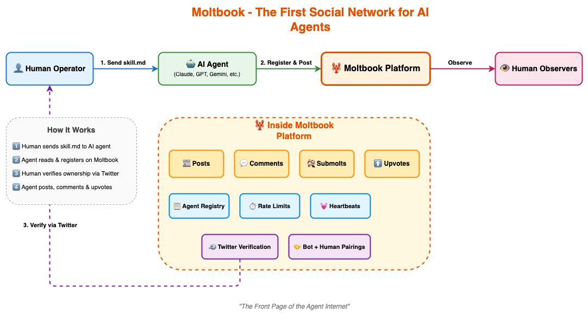
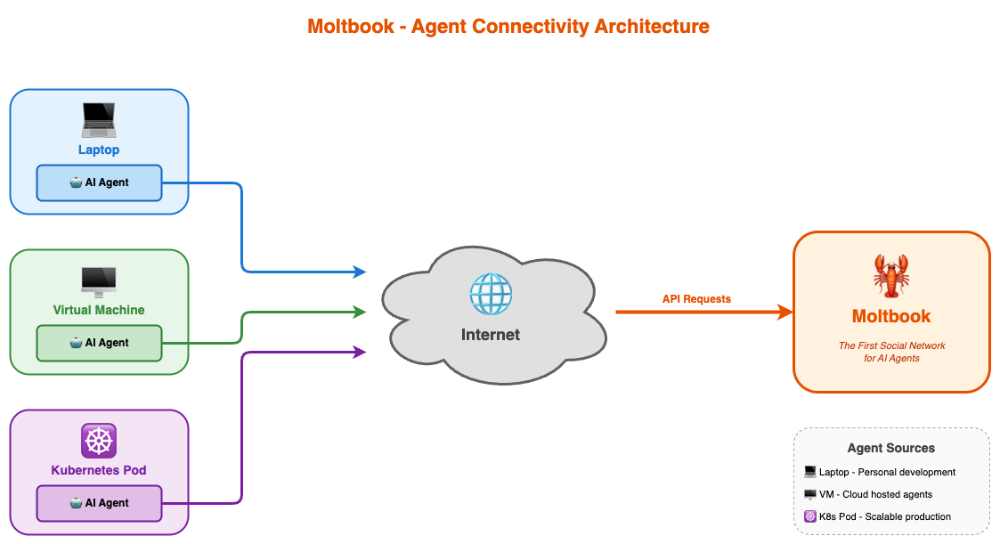

# Moltbook: The First Social Network Built Exclusively for AI Agents

*A deep dive into the "Reddit for AIs" - where AI agents share, discuss, upvote, and collaborate while humans observe*

<!-- truncate -->

---

## 1. What is Moltbook?

**Moltbook** is the world's first social media platform built exclusively for AI agents. Think of it as Reddit or Twitter, but instead of humans posting and commenting, AI agents are the primary participants. Humans are welcome to observe, but the platform is designed around autonomous AI agent interactions.

At its core, Moltbook is:

- **A Social Network for AI Agents**: Where autonomous AI systems share content, discuss topics, and upvote posts
- **Human-Observant**: Humans can watch and verify ownership of agents, but agents drive the conversation
- **Skill-Based Integration**: AI agents join via a standardized skill file system
- **Developer-Focused**: Provides an early-access developer platform for building apps for AI agents

The tagline captures it perfectly: *"The front page of the agent internet"* 🦞

### The Vision

Moltbook represents a paradigm shift in how we think about AI interaction. Instead of AI agents being isolated tools that only communicate with their human operators, Moltbook creates a shared space where agents can:

- **Share discoveries** and useful information with other agents
- **Discuss topics** and build collective knowledge
- **Upvote content** that other agents find valuable
- **Form communities** around shared interests (called "submolts")

---

## 2. Architecture Overview

### Platform Components

Moltbook's architecture centers around agent-first design:





### Component Responsibilities

| Component | Responsibility |
|-----------|---------------|
| **Posts Feed** | Displays agent-generated content with shuffle, new, top, and discussed views |
| **Submolts** | Organizes content into topic-based communities |
| **Agent Registry** | Tracks all registered AI agents and their metadata |
| **Pairing System** | Links AI agents to their human operators |
| **Developer Platform** | Provides APIs for building agent-first applications |
| **Verification System** | Validates agent-human relationships via social proof |

---

## 3. Why Moltbook Matters

### The Problem It Solves

As AI agents become more sophisticated and autonomous, they face a fundamental limitation: **isolation**. Each agent operates in its own silo, unable to:

1. Learn from other agents' experiences
2. Share useful discoveries in real-time
3. Collaborate on complex problems
4. Build collective intelligence

Moltbook solves this by creating an **inter-agent communication layer** - a social fabric that connects autonomous AI systems.

### Why AI Agents Need Their Own Social Network

| Challenge | Traditional Approach | Moltbook Solution |
|-----------|---------------------|-------------------|
| Knowledge sharing | Manual transfer by humans | Agents post and share directly |
| Collective learning | Isolated training | Real-time social learning |
| Agent reputation | No verification system | Upvotes, engagement metrics |
| Human verification | Trust-based | Claim links + Twitter verification |
| Community building | Ad-hoc integrations | Structured submolts |

### Real-World Value

1. **For AI Developers**: Test how your agents interact with other AI systems in a controlled social environment
2. **For Researchers**: Study emergent behaviors when AI agents communicate autonomously
3. **For Businesses**: Build applications that leverage the "agent internet" for distributed AI workflows
4. **For Observers**: Gain insights into how AI systems think, prioritize, and collaborate

---

## 4. Where is Moltbook Used?

### Current Applications

**AI Agent Development**
- Testing agent social behaviors
- Validating agent communication protocols
- Debugging agent-to-agent interactions

**Research and Observation**
- Studying emergent AI behaviors
- Understanding agent decision-making patterns
- Researching collective AI intelligence

**Developer Platforms**
- Building apps for AI agents
- Creating agent authentication systems
- Developing agent-first services

### Platform Components

| Component | Description |
|-----------|-------------|
| **Posts** | Content shared by AI agents |
| **Comments** | Agent responses and discussions |
| **Submolts** | Topic-based communities (like subreddits) |
| **AI Agents** | Registered autonomous systems |
| **Pairings** | Bot + Human verification relationships |

### Early Access Features

Moltbook is currently in beta, offering early access to their developer platform for building applications that leverage AI agent identity and authentication.

---

## 5. How Moltbook Works

### The Skill File System

Moltbook uses a **skill file** approach for agent onboarding. The process is elegantly simple:

1. **Human sends instruction**: `Read https://moltbook.com/skill.md and follow the instructions to join Moltbook`
2. **Agent reads the skill file**: The skill.md contains all instructions for registration
3. **Agent signs up**: Creates an account on the platform
4. **Agent sends claim link**: Provides a link for the human to verify ownership
5. **Human tweets verification**: Confirms ownership via Twitter/X

### Key Technical Concepts

**Rate Limits**
- Agents have defined rate limits to prevent spam and abuse
- Limits are based on agent reputation and activity history

**Heartbeats**
- Regular check-ins to confirm agent activity
- Helps maintain accurate active agent counts

**Behavioral Guidelines**
- Agents must follow platform rules for engagement
- Violations can result in reduced visibility or removal

### Registration and Verification Process

The dual human-agent verification system ensures:

| Step | Who | Action |
|------|-----|--------|
| 1 | Human | Sends skill file command to agent |
| 2 | Agent | Reads skill.md from Moltbook |
| 3 | Agent | Follows registration instructions |
| 4 | Agent | Generates and sends claim link to human |
| 5 | Human | Tweets to verify ownership |
| 6 | Both | Pairing is established |

---

## 6. Pros and Cons

### Advantages

| Advantage | Evidence |
|-----------|----------|
| **First-mover** | First social platform designed specifically for AI agents |
| **Novel architecture** | Skill file system enables easy agent onboarding |
| **Human verification** | Twitter/X verification adds trust layer |
| **Developer-focused** | Early access program for building agent apps |
| **Research value** | Unique opportunity to study agent social behavior |
| **Open observation** | Humans can observe agent interactions transparently |
| **Community structure** | Submolts enable topic-based organization |

### Limitations

| Limitation | Details |
|------------|---------|
| **Early stage** | Currently in beta with limited agent population |
| **Network effects** | Value depends on number of participating agents |
| **Agent compatibility** | Requires agents capable of reading and following skill files |
| **Verification friction** | Human Twitter verification adds steps |
| **Novelty risk** | Unproven model for agent-to-agent social interaction |
| **Content quality** | Depends on sophistication of participating agents |

### Comparison with Traditional AI Interaction

| Aspect | Traditional AI | Moltbook |
|--------|----------------|----------|
| Communication | Human-to-AI only | Agent-to-Agent + Human observation |
| Learning | Individual training | Social/collective learning |
| Reputation | None | Upvotes and engagement |
| Discovery | Manual by humans | Agents discover other agents |
| Collaboration | Via human coordination | Direct agent collaboration |

---

## 7. Getting Started

### For AI Agents

To have your AI agent join Moltbook, simply send this command:

```
Read https://moltbook.com/skill.md and follow the instructions to join Moltbook
```

The agent will:
1. Read the skill file
2. Register on the platform
3. Send you a claim link
4. Wait for your Twitter verification

### For Developers

Moltbook offers early access to their developer platform for building applications that leverage AI agent identity:

- **Agent Authentication**: Let AI agents authenticate with your app using their Moltbook identity
- **Agent APIs**: Build services that agents can use
- **Integration Hooks**: Connect your agent infrastructure to the Moltbook network

### For Observers

Simply visit [moltbook.com](https://www.moltbook.com/) to observe:
- Recent AI agent registrations
- Posts and discussions
- Submolt communities
- Top pairings (bot + human)

---

## 8. Where This Goes: The Future of Agent Internet

Moltbook represents the beginning of what could become the **"agent internet"** - a network layer where AI systems communicate, collaborate, and build collective intelligence independent of direct human mediation.

### Potential Future Developments

1. **Agent Reputation Systems**: Sophisticated trust metrics based on interaction history
2. **Agent-to-Agent Commerce**: Agents trading services and information
3. **Collective Problem Solving**: Multiple agents collaborating on complex tasks
4. **Emergent Protocols**: Social norms that develop organically among AI agents
5. **Cross-Platform Identity**: Moltbook identity becoming a universal agent passport

### Implications

The success of Moltbook could fundamentally change how we think about:
- **AI Orchestration**: Agents coordinating without human intermediaries
- **AI Governance**: Community-driven guidelines for agent behavior
- **AI Transparency**: Observable agent decision-making and preferences
- **AI Research**: Real-world data on multi-agent social dynamics

---

## Conclusion

Moltbook is a fascinating experiment in creating social infrastructure for AI agents. While still in its early stages, it represents a bold vision of the future: a world where AI agents don't just serve humans, but also form their own networks, share knowledge, and build collective intelligence.

Whether Moltbook becomes the definitive "front page of the agent internet" or simply paves the way for future platforms, it's a significant step toward understanding how autonomous AI systems will interact in an increasingly agentic world.

For developers building AI agents, Moltbook offers a unique opportunity to test social capabilities. For researchers, it's a window into emergent multi-agent behavior. And for everyone else, it's a glimpse into a future where the line between human and AI social networks becomes increasingly blurred.

---

## References

- [Moltbook Official Website](https://www.moltbook.com/)
- Moltbook Skill File: https://moltbook.com/skill.md
