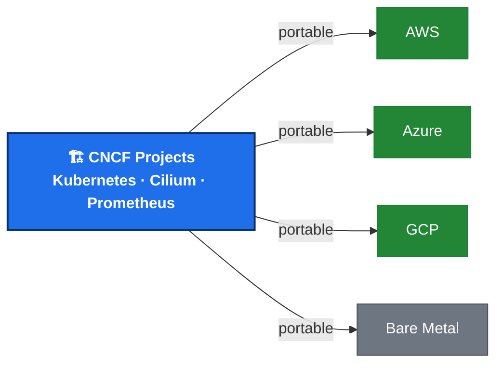
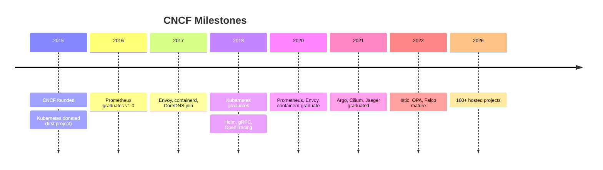
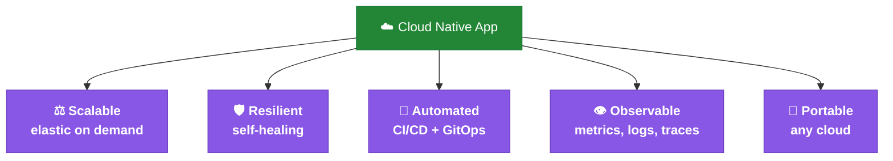
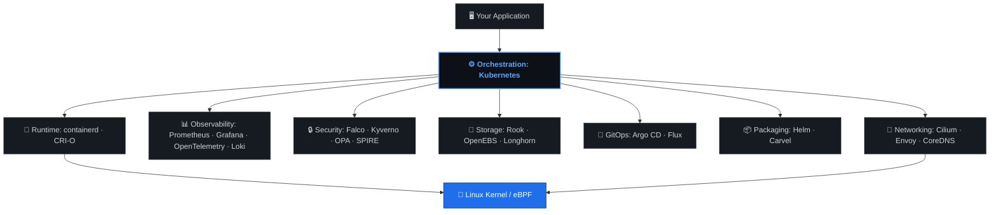
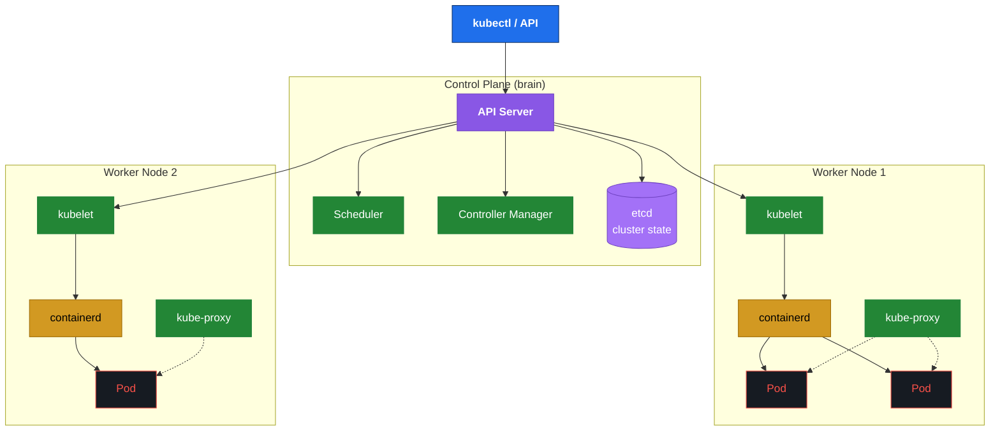
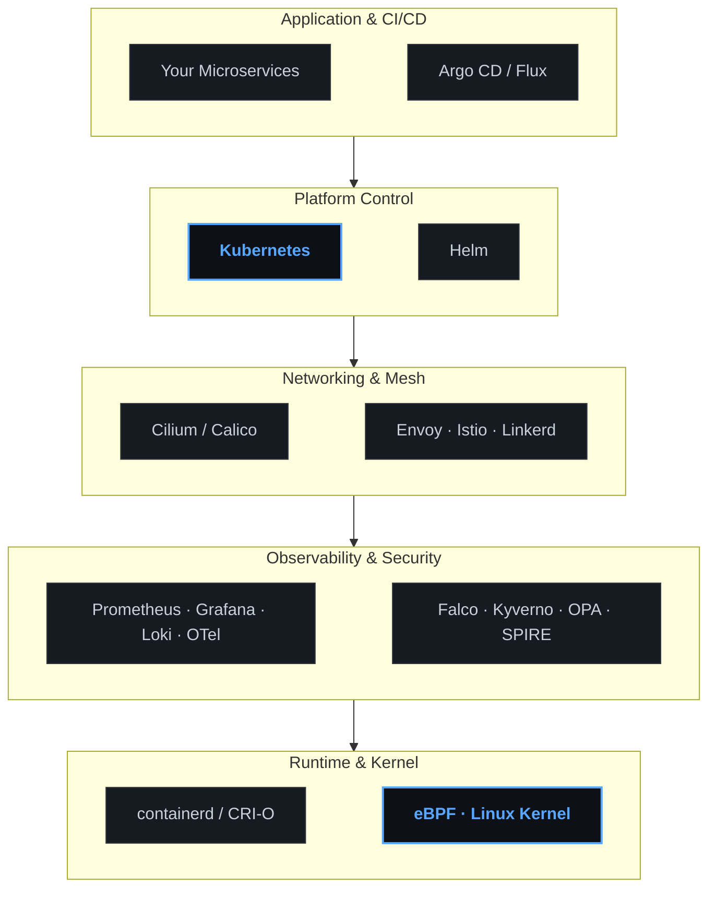
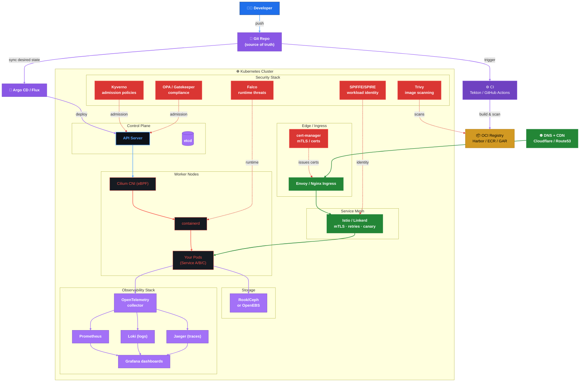
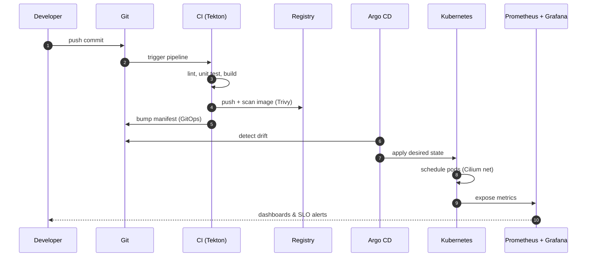
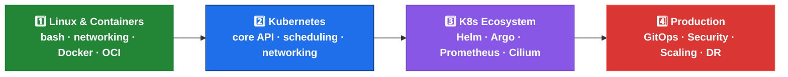

The **Cloud Native Computing Foundation (CNCF)** is the open-source home for the software that runs modern applications: Kubernetes, Prometheus, Envoy, Cilium, and 180+ more. For engineers and architects, navigating that landscape can feel overwhelming. This playbook distills it into a clear mental model: what the CNCF is, how the pieces fit together, and what a production-grade cloud-native stack actually looks like, walking from *what it is* → *how the pieces fit* → *how to run it in production*.

<!-- truncate -->

**Same software, any cloud.** That portability is the whole point.

---

## 1. What is the CNCF?

**CNCF** = **Cloud Native Computing Foundation**, a sub-foundation of the Linux Foundation that hosts open-source projects for building modern, cloud-native applications.

- **Not** a cloud provider. It ships *software*; AWS, Azure, and GCP ship *infrastructure*.
- **Not** a vendor. It's a **neutral, vendor-neutral** home where competitors collaborate.
- **Not** a single product. It's an **ecosystem** of composable projects.

| Attribute | CNCF | Cloud Provider |
|-----------|------|-----------------|
| Delivers | Open-source software | Infrastructure & managed services |
| Ownership | Community / Linux Foundation | Vendor |
| Portability | Any cloud | Vendor-locked by default |
| Cost model | Free + operational effort | Pay-as-you-go |

---

## 2. Why It Exists: A Brief History

Before 2015, every hyperscaler built its own internal tools to run distributed systems:

| Company | Built | Donated |
|---------|-------|---------|
| Google | Borg → Kubernetes | Kubernetes (2015) |
| Lyft | Envoy | Envoy (2017) |
| SoundCloud | Prometheus | Prometheus (2016) |
| Twitter | Finagle | - |

In **2015**, the **Linux Foundation** created the CNCF so these tools could live in one **neutral, community-driven** home. Google donated **Kubernetes** as the founding project.

---

## 3. What "Cloud Native" Really Means

Per the CNCF's definition, **cloud native** uses **containers, service meshes, microservices, and immutable infrastructure** declared via declarative APIs.

In plain English: an app built to be **scalable, resilient, automated, observable, and portable**.

Instead of one monolith on one server, you get **small services** that scale and heal on their own, deployed from Git, monitored continuously, and runnable anywhere.

---

## 4. The CNCF Landscape at a Glance

The [CNCF Landscape](https://landscape.cncf.io/) hosts **180+ projects** across functional categories. The full landscape is overwhelming; here is the mental model that matters.

---

## 5. The Core: Kubernetes Architecture

Kubernetes is the **orchestrator**: it deploys, schedules, scales, and heals your containers. Think of it as a **platform for building platforms**; nearly everything else in the CNCF plugs into it.

**Control plane** = brain (desired state, scheduling, reconciliation).
**Worker nodes** = muscle (run your pods via a container runtime like `containerd`).

---

## 6. The Stack: How the Pieces Fit

A cloud-native platform is **layered**. Each layer is a *composable* CNCF project; you pick the right tool per layer.

---

## 7. Key Projects by Category

| Category | Project | Job | Maturity |
|----------|---------|-----|----------|
| **Orchestration** | Kubernetes | Run & scale containers | 🟢 Graduated |
| **Runtime** | containerd / CRI-O | Start containers on a node | 🟢 Graduated |
| **Networking (CNI)** | Cilium (eBPF) | Pod networking, policies, LB | 🟢 Graduated |
| **Service Mesh** | Envoy · Istio · Linkerd | mTLS, traffic control, retries | 🟢 Graduated |
| **Observability** | Prometheus · OpenTelemetry · Grafana · Loki | Metrics, logs, traces | 🟢 Graduated |
| **Storage (CSI)** | Rook · OpenEBS · Longhorn | Persistent volumes | 🟡 Incubating |
| **GitOps** | Argo CD · Flux | Git = source of truth | 🟢 Graduated |
| **Packaging** | Helm · Carvel | Install apps in one command | 🟢 Graduated |
| **Security** | Falco · Kyverno · OPA · SPIFFE/SPIRE | Runtime threats, policies, identity | 🟢 Graduated |
| **CI/CD** | Tekton | Pipeline as code | 🟡 Incubating |

---

## 8. Project Maturity Model

Every CNCF project climbs a ladder of trust. Maturity = **real-world adoption + governance + maintenance**.

| Stage | What it proves | Example |
|-------|----------------|---------|
| Sandbox | Worth experimenting | Many early projects |
| Incubating | Real adoption, healthy governance | Longhorn, OpenEBS |
| Graduated | Battle-tested at scale | Kubernetes, Prometheus, Envoy, Cilium, Argo, Helm |

---

## 9. Production Reference Architecture

This is the centerpiece: what a **production-grade, cloud-native stack** actually looks like in the real world.

> **Key idea:** No single product does all of this. CNCF projects are **composable**: each layer is a swappable, best-of-breed tool that integrates via open standards (CNI, CSI, CRI, OCI, OpenTelemetry).

---

## 10. Production-Grade Considerations

A cluster isn't "production" until it survives failure. The CNCF ecosystem gives you the tools; **you** own the architecture.

### 🔒 Security

- **Supply chain**: scan images with **Trivy** in CI; sign with **cosign**; enforce with admission (Kyverno/OPA).
- **Identity**: **SPIFFE/SPIRE** for workload identity; **cert-manager** for TLS rotation.
- **Policy**: **Kyverno / OPA Gatekeeper** at admission; **Falco** at runtime.
- **Secrets**: **External Secrets Operator** + Vault / cloud KMS; never commit plaintext.

### 📊 Observability

- **The three pillars**: metrics (Prometheus), logs (Loki), traces (OpenTelemetry → Jaeger/Tempo).
- **SLOs over uptime**: define error budgets, alert on user impact, not CPU.
- **Grafana** as the single pane; ship everything to it.

### 🔁 GitOps & Reliability

- **Git is the source of truth**: Argo CD / Flux reconciles continuously; no `kubectl apply` by hand.
- **Progressive delivery**: Argo Rollouts / Flagger for canaries and blue-green.
- **Multi-cluster**: Argo ApplicationSets, Cluster API for fleet management.

### 🛡️ Resilience & DR

- **Backups**: Velero for cluster resources + PV snapshots; test restores quarterly.
- **HA control plane**: 3 etcd nodes, multi-AZ workers, PDBs on workloads.
- **Chaos engineering**: Chaos Mesh in staging to prove the system fails gracefully.

### ⚖️ Scaling & Cost

- **Autoscale**: HPA (CPU) + VPA + KEDA (event-driven) + Cluster Autoscaler / Karpenter.
- **Right-size**: goldilocks; burn rate alerts on cost.
- **Bin-packing**: node taints/tolerations + priority classes.

---

## 11. Walkthrough: Deploying an App End-to-End

The cloud-native way, from a developer's laptop to a running, monitored, secured service:

1. **Git** holds your desired state: manifests + Helm values.
2. **CI** builds, scans, and pushes an immutable image to the registry, then bumps the manifest.
3. **Argo CD** detects the Git change and reconciles it to the cluster.
4. **Kubernetes** schedules the pods; **Cilium** wires the network; **Istio** enforces mTLS.
5. **Prometheus + Grafana** watch it all; **Falco** watches for runtime threats.

No snowflake servers. No manual `kubectl`. Every change is **auditable, reversible, and reproducible**.

---

## 12. Best Practices

| Area | Do | Avoid |
|------|-----|-------|
| **Declarative** | Everything in Git, reconciled by Argo/Flux | `kubectl apply` from laptops |
| **Images** | Distroless / scratch, pinned digests, signed | `:latest`, root containers |
| **Resources** | Always set requests + limits + PDBs | Untuned workloads, no PDB |
| **Health** | Liveness + readiness + startup probes | Only liveness probes |
| **Config** | ConfigMaps/Secrets, versioned with Git | Baked-in config |
| **Policy** | Admission (Kyverno/OPA) + runtime (Falco) | Trust everything |
| **Observability** | OTel + SLOs + one Grafana | Logs-only debugging |
| **Updates** | Automated, gradual (Rollouts) | Big-bang upgrades |
| **Backups** | Velero + tested restores | Hope |
| **Multi-cluster** | GitOps + Cluster API | Snowflake clusters |

---

## 13. Learning Path & Certifications

A practical order for a DevOps engineer, with the certifications that validate each step:

| Level | Certification | Focus |
|-------|---------------|-------|
| Fundamentals | **KCNA** | Cloud-native concepts |
| Admin | **CKA** | Cluster operations |
| Developer | **CKAD** | Building & deploying apps |
| Security | **CKS** | Hardening & compliance |
| Specialty | **Prometheus CBC** + **Argo CDCP** | Observability / GitOps depth |

---

## 14. FAQ

**Is CNCF the same as Kubernetes?**
No. Kubernetes is the *flagship* project; the CNCF hosts 180+ projects across the full stack.

**Do teams need all of these projects?**
No. Start with Kubernetes + Helm + Prometheus + Argo CD. Add Cilium, a service mesh, and Falco as requirements mature.

**Is this only for big companies?**
No. A single-node cluster (k3s) with GitOps gives a small team the same disciplines as a hyperscaler.

**Cloud-native vs. cloud provider?**
Cloud-native = *how* you build (portable, open). Cloud provider = *where* you run (AWS/Azure/GCP). You can be cloud-native on-prem.

**Vendor lock-in?**
CNCF projects reduce lock-in, but managed services (EKS/GKE) still embed some. Use open standards (CNI, CSI, Helm, OTel) to stay portable.

---

## 15. Conclusion

The CNCF can feel overwhelming because it's *big*, but the mental model is small: **Kubernetes at the center, composable open-source projects layered around it, Git as the source of truth, and observability + security baked in.** You don't adopt all of it at once. You start with the core, add layers as your needs grow, and let open standards (CNI, CSI, CRI, OCI, OpenTelemetry) keep you portable across any cloud.

The discipline matters more than the tooling: declarative state, progressive delivery, SLO-driven observability, and tested disaster recovery are what turn a cluster into a *production* cluster. Master the discipline, and the specific projects become swap-in implementation details.

---

## 16. Resources & References

- **Official**
  - [CNCF](https://www.cncf.io/)
  - [CNCF Landscape](https://landscape.cncf.io/)
  - [Cloud Native Trail Map](https://github.com/cncf/trailmap)
  - [Kubernetes Docs](https://kubernetes.io/docs/home/)
- **Learning**
  - [Kubernetes Academy (free)](https://www.kubeskills.com/)
  - [Linux Foundation Training](https://training.linuxfoundation.org/)
  - [Killercoda: interactive scenarios](https://killercoda.com/)
- **GitOps**
  - [Argo CD](https://argo-cd.readthedocs.io/)
  - [Flux](https://fluxcd.io/)
- **Observability**
  - [OpenTelemetry](https://opentelemetry.io/)
  - [Prometheus](https://prometheus.io/)
- **Security**
  - [Falco](https://falco.org/)
  - [OPA](https://www.openpolicyagent.org/)
  - [SPIFFE](https://spiffe.io/)
