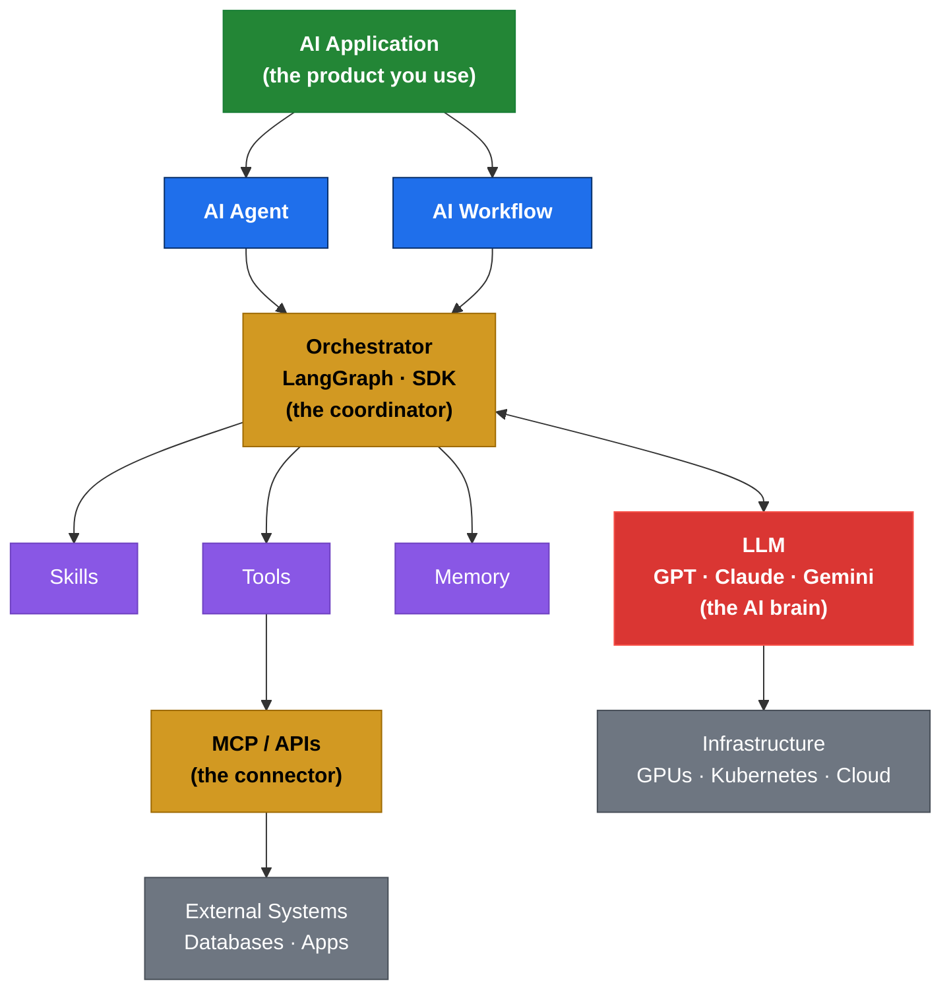
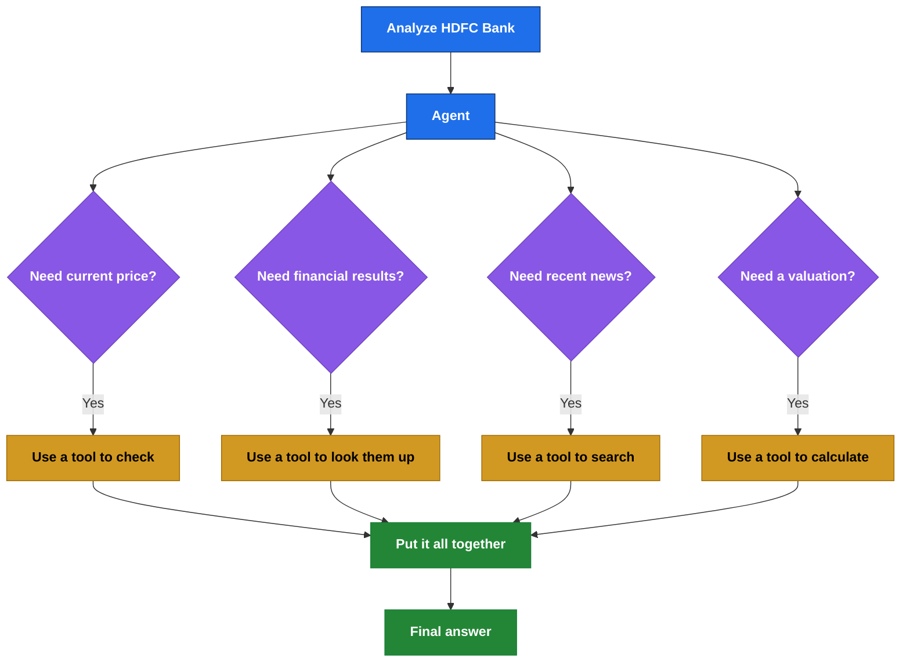
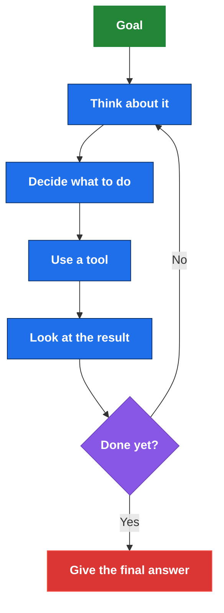
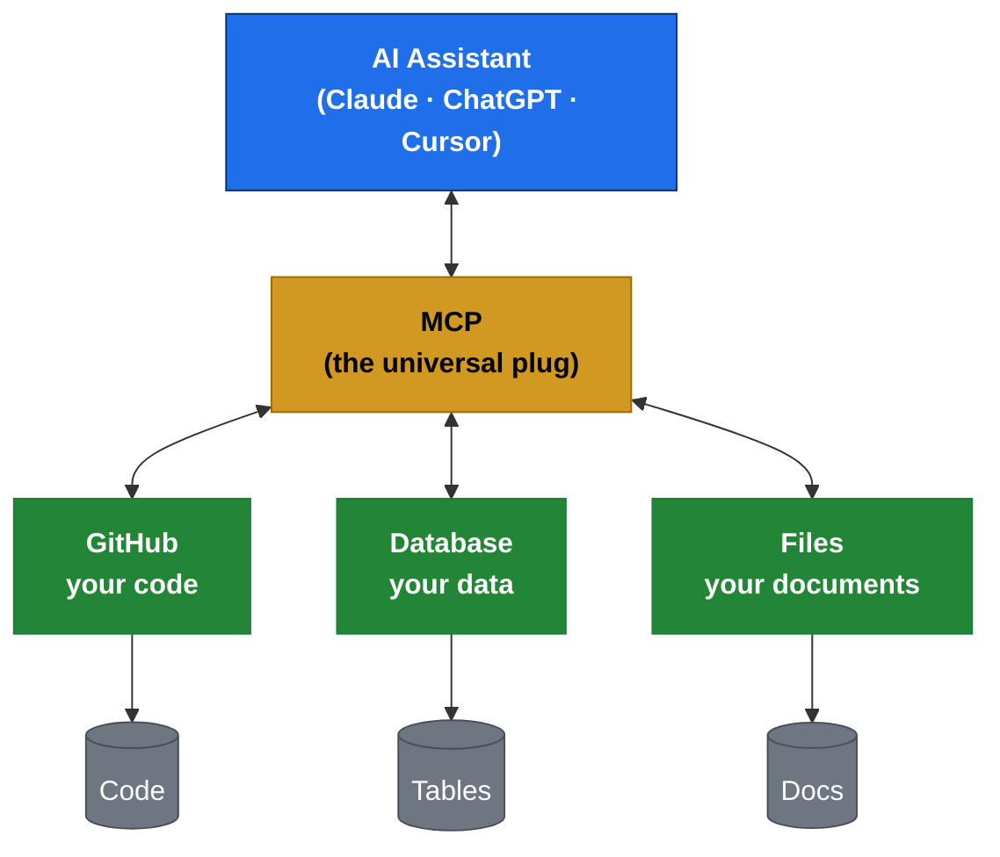
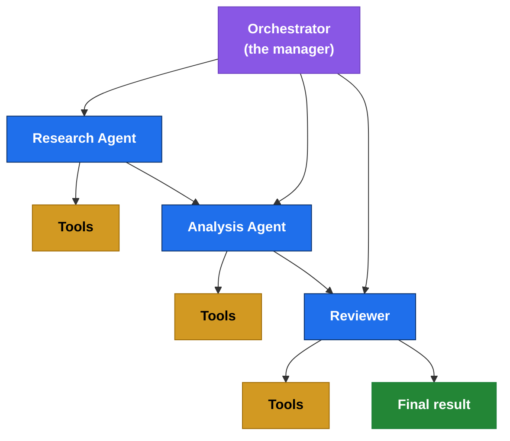
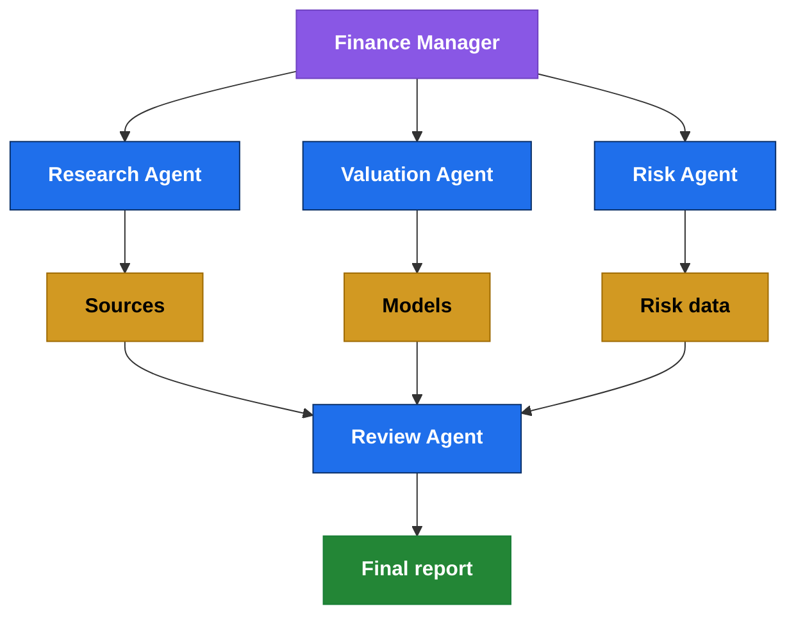
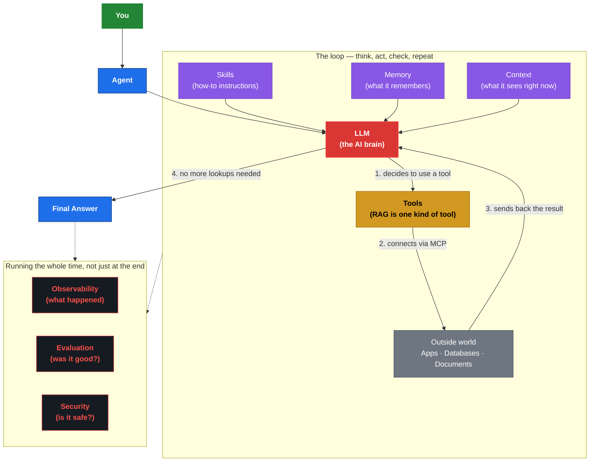
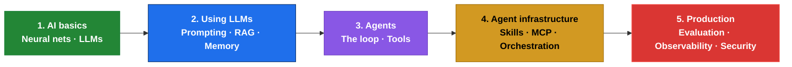

AI is moving incredibly fast.

A few years ago, AI basically meant this:

> **"Ask a question → get an answer."**

Today, AI can search the internet, read your documents, call other apps, write and run code, remember things about you, and even work together with other AIs. That's a lot more moving parts — and a lot more new words to learn.

You've probably seen terms like:

**LLM, RAG, Agent, Agentic AI, Skill, Tool, MCP, Memory, Workflow, Orchestration, Multi-Agent, Guardrails, Evaluation...**

None of these are actually hard ideas. They just sound intimidating because of the jargon. This article explains each one in plain English, with simple pictures, so by the end you'll understand how they all fit together — no computer science degree required.

<!-- truncate -->

---

## 1. Start with the Big Picture

Here's the whole thing at a glance. Don't try to memorize it yet — just notice the shape. We'll explain every box one at a time.



**The model provides the intelligence. Everything around it provides context, capability, and control.** Note that the orchestrator sits at the center, calling the LLM back and forth — it's not a one-way trip from top to bottom. That is the whole story of the AI ecosystem.

---

## 2. What is an LLM?

Let's start with the foundation.

**LLM = Large Language Model**

Examples include GPT, Claude, Gemini, Llama, and Qwen. An LLM is essentially the **reasoning and language engine** behind many modern AI applications.

```text
User: "Explain what a stock dividend is."

             ↓

           LLM

             ↓

"A dividend is a portion of a company's
 profits distributed to shareholders..."
```

But here's the catch: on its own, an LLM is like a smart person locked in a room with no phone, no internet, and no filing cabinet. It can't look anything up. So by itself, it has no way to know:

- what's in your database
- your stock portfolio
- today's stock price
- what's in your GitHub account
- your company's internal files
- today's news
- anything from any outside app

That's where the rest of the AI ecosystem comes in.

---

## 3. What is a Tool?

A **tool is anything the AI can use to take an action or fetch information it doesn't already have.** If the LLM is the brain, tools are its hands — they let it actually *do* things in the real world instead of just talking.

```text
search_web()
get_stock_price()
get_weather()
query_database()
read_pdf()
run_python()
send_email()
create_ticket()
call_api()
```

Suppose you ask: *"What's the current price of HDFC Bank?"*

The AI thinks:

```text
I don't know that off the top of my head.
        ↓
Let me use a tool: get_stock_price("HDFCBANK")
```

The tool goes and fetches the number, hands it back, and now the AI can answer you correctly. In short:

> **The LLM does the thinking. Tools do the action.**

**Quick heads up on two terms you'll hear a lot — RAG and MCP:** They both sound like separate, fancy things, but they're not peers of "Tools." **RAG is just a specific kind of tool** — one that searches through documents. And **MCP isn't a tool at all — it's more like a universal power cord** that lets tools plug into the AI in a standard way. We'll explain both properly in sections 7 and 9, but keep that framing in mind so it clicks later.

---

## 4. What is a Skill?

A **skill is basically a written "how-to guide" that teaches the AI how to do a specific kind of task well** — like a checklist an experienced employee would follow.

```text
Skill: Stock Research

1. Identify the company
2. Get the latest financial results
3. Get current valuation
4. Analyze revenue growth
5. Analyze profitability
6. Analyze debt
7. Compare competitors
8. Analyze risks
9. Check recent news
10. Produce an investment thesis
11. Cite sources
12. Assign confidence
```

Notice: the skill itself doesn't go fetch anything. It's not a doer. It's more like a recipe. The AI reads the recipe, then uses **tools** to actually go get the ingredients (the data).

So here's the difference in one line each:

```text
Skill  = the "how-to" instructions
Tool   = the thing that does the fetching/acting
Agent  = the one who decides what to do next
```

---

## 5. Agent vs LLM: What's the Difference?

This is one of the most important ideas in the whole article, so let's slow down.

A plain LLM just answers whatever you ask, using only what it already knows:

```text
You: "Analyze HDFC Bank."
       ↓
      LLM
       ↓
   Answer (from memory only)
```

An **agent** is different. An agent can stop, think about what it's missing, go get that information using tools, and *then* answer:



*(This picture draws the four questions side by side to keep it simple. In real life, the agent usually asks them one at a time — check something, look at the result, then decide what to check next. That step-by-step process is what section 6 is about.)*

So in one line: **an LLM answers. An agent decides, acts, and then answers.**

---

## 6. What is Agentic AI?

You will hear the term **Agentic AI** everywhere. The easiest way to understand it is:

> **Agentic AI is AI that can pursue a goal through multiple steps, make decisions, use tools, observe results, and continue until the task is completed.**

The technical name for this repeat-until-done cycle is **ReAct** (short for "Reason + Act"), and it looks like this:



That's the basic idea behind many agentic systems: **think, act, check, repeat — until the goal is met.**

**This little circle is the single most important idea in this whole article.** Every complicated-looking diagram you'll see later (including the "full system" one in section 17) is really just this same circle, drawn bigger with more labels. If you only remember one shape, remember this one — a loop, not a straight line.

---

## 7. What is RAG?

**RAG stands for Retrieval-Augmented Generation** — a scary-sounding name for a very simple idea.

Instead of letting the AI guess an answer from memory, we first go **fetch** the actual relevant information, and hand that to the AI before it answers.

```text
Question
   ↓
"What's our company's leave policy?"
   ↓
Search company documents
   ↓
Find the relevant page
   ↓
Hand that page to the AI
   ↓
AI writes the answer using it
```

In one line:

> **RAG = look it up first, then answer — instead of guessing.**

RAG is especially useful for things that change often, or things the AI was never trained on: your company's internal documents, PDFs, financial reports, legal contracts, or technical manuals.

**Where RAG fits in the bigger picture:** RAG isn't its own separate category next to "Tools" — it *is* a tool. Specifically, it's the "go search my documents" tool. Every time the AI decides "I should look this up," that's just one more step inside the think-act-check loop from section 6.

---

## 8. What is Memory?

Memory and "context" sound similar but they're not exactly the same.

Imagine talking to an AI assistant. You tell it: *"I prefer long-term investments."* Later you ask: *"Analyze this company."* If the system remembers your preference, it can consider that information.

Memory can hold things like:

```text
Your preferences
Past conversations
Decisions you've made before
Your portfolio
Ongoing projects
Important facts about you
Your long-term goals
```

The simplest way to tell the two apart:

```text
Context = what the AI has in front of it right now

Memory = what it remembers for later, from before
```

Here's a fact that explains a lot: the AI brain (the LLM) actually has **zero memory of its own** between conversations — it forgets everything the second it's done responding. So Skills, Memory, and Context aren't things the AI "creates" and passes down a chain. They're the ingredients that get assembled and fed *into* the LLM fresh, every single time, so it has what it needs to think clearly.

---

## 9. What is MCP?

You'll hear **MCP** thrown around constantly these days. It stands for **Model Context Protocol** — but don't worry about the name, focus on what it does.

> **MCP is just a standard, universal way to plug an AI into outside tools and data.**

Without it, every company would have to build its own custom, one-off wiring to connect an AI to GitHub, or a database, or their files. MCP fixes that with one shared standard. Think of it like a **USB-C port**: instead of every device needing its own special cable, one plug works everywhere.



This matters more and more as you add more tools and more AI apps — one shared plug beats a pile of custom wiring for each one.

**Simple summary:** MCP isn't a capability the AI "has," like a tool is. It's the plug that lets tools (including a RAG-style search tool) reach the outside world in a standard way.

---

## 10. What is an AI Workflow?

Not every job needs a thinking, deciding AI agent. Sometimes the steps are already known and never change — that's called a **workflow**.

```text
Receive invoice
      ↓
Extract data
      ↓
Validate fields
      ↓
Calculate tax
      ↓
Store in database
      ↓
Send confirmation
```

That's just a fixed recipe. No real decision-making needed.

An agent becomes genuinely useful when you *don't* already know the steps in advance:

```text
"Investigate why our production
 service is running slowly."

             ↓

Where do I even start?

   Check metrics? Logs? Traces?
   Recent deployments? Servers?
   The database? The network?

             ↓

Pick an investigation path and go
```

That's the kind of open-ended problem where an agent earns its keep.

---

## 11. Workflow vs Agent — Which Do You Need?

A simple side-by-side:

| Workflow | Agent |
|----------|-------|
| Steps are already known | Steps can change depending on what it finds |
| Predictable | Flexible |
| Follows fixed rules | Makes its own decisions |
| Easier to test | Harder to test |
| Usually cheaper to run | Can cost more to run |
| Great for repetitive tasks | Great for messy, open-ended problems |

Most real systems actually mix both:

```text
Workflow → Agent → Tool → Workflow → Agent → Final Result
```

You don't have to make everything "agentic." Often the best design uses fixed steps where the path is predictable, and hands things off to an agent only where real decisions are needed.

---

## 12. What is Orchestration?

Once you've got multiple steps, tools, and maybe multiple agents, something needs to keep it all coordinated. That job is called **orchestration**.

Think of an orchestra: lots of musicians, but someone has to keep everyone in sync. That "someone" here is called the **orchestrator**.

*(Quick note before the diagram: there are two different flavors of "orchestration," and it's easy to mix them up. One flavor is a single agent running its own think-act-check loop by itself — that's section 6. The diagram below shows the other flavor: one orchestrator coordinating several separate, specialized agents. This is sometimes called the "Manager" pattern.)*



Popular frameworks like **LangGraph, OpenAI's Agents SDK, and Google's ADK** are tools built specifically to help you set this kind of coordination up.

**One thing worth remembering:** the orchestrator isn't just one box sitting between "memory" and "tools" in a chain. It's more like the stage manager running the *whole show* — calling the AI brain, running whatever tool it asks for, handing back results, and deciding when the job is finished. You'll see it drawn that way in section 17.

Bottom line: understand *why* you need coordination before you pick a framework to do it.

---

## 13. What is Multi-Agent AI?

Sometimes one agent trying to do everything gets overwhelmed. The fix: split the work across several specialized agents, each with its own narrow job.

Here's what that could look like for financial research:



Each agent sticks to one job and does it well. This can make a complicated system much easier to manage.

But a word of caution: don't reach for multiple agents just because it sounds impressive. If a single, well-designed agent can already solve the problem reliably, adding more agents usually just adds more complexity and more ways for things to go wrong.

---

## 14. Guardrails and Security

This part matters a lot, so pay attention.

An AI agent can potentially send emails, run code, touch your database, modify files, spend money, or create things in the cloud. That's a lot of power to hand over — which means you need real boundaries around it.

Here's the key idea: security isn't one checkpoint at the very end. It has to be **checked at every point** where the AI touches the outside world — when a request first comes in, every time it tries to use a tool, whenever it accesses data, and again right before it sends its final answer out.

```text
Agent wants to execute a trade
        ↓
Check: is this allowed?
        ↓
Ask a human to confirm
        ↓
Only then, execute
```

Other common guardrails include things like:

```text
Never expose secrets or passwords
Never access data it's not allowed to see
Never run dangerous commands
Never use stale or outdated financial data
Always double-check its sources
Always ask a human before high-stakes actions
```

As AI agents get more capable, security stops being an afterthought — it becomes something you build in from the start, wrapped around every single step, not bolted on at the end.

---

## 15. Evaluation

Here's a mistake beginners often make: they only ask, "does my AI work?" That's not specific enough. You actually need to ask:

```text
Is the answer correct?
Are its sources trustworthy?
Did it pick the right tool?
Did it follow the instructions properly?
Did it make something up (hallucinate)?
Did it make the right call?
How often does it get it wrong?
How much does each run cost?
How long does it take?
```

For a stock research agent specifically, you might grade it on:

```text
Accuracy of the data
Quality of its sources
Correctness of any math
Quality of its reasoning
Whether citations are correct
How fresh the information is
Whether it flagged real risks
Overall quality of its recommendation
```

This grading process is called **evaluation**, and it's one of the most important (and most skipped) parts of building AI systems. Importantly, it isn't something you do once at the very end. Good teams evaluate *before* they ship (testing on known examples) and *continuously* afterward (spot-checking a sample of real, live results), so problems get caught quickly instead of piling up unnoticed.

---

## 16. Observability

Regular software already has logs and error tracking. AI agents need the same thing — but with an extra twist: you also want to know *why* the AI made the choices it made, not just what happened.

```text
What did the agent decide to do?
Which skill did it pick?
Which tools did it call?
What information did it fetch?
How many steps did it take?
Where exactly did it go wrong?
How much did it cost?
How long did each step take?
```

So a full trace of one request might look like this:

```text
User's request
     ↓
Agent starts
     ↓
Skill picked: Stock Research
     ↓
Tool: Market Data
     ↓
Tool: Financial Statements
     ↓
Tool: Web Search
     ↓
Skill: Valuation
     ↓
Tool: Python calculation
     ↓
Reviewer checks it
     ↓
Final Answer
```

This kind of visibility is called **observability**, and it's what saves you when something breaks in production — without it, a misbehaving agent is just a mysterious black box. And just like security and evaluation, observability isn't a one-time report card. It's turned on continuously, capturing what happens at every single step, the whole way through.

---

## 17. Putting Everything Together

Now let's build one full picture of a complete AI system. Here's the most important thing to understand about it: **this is a loop, not a straight line.** It's tempting to imagine information flowing neatly from top to bottom, ending with an answer. That's not how it actually works.



Here's how to read it in plain English:

- **You → Agent:** you ask something.
- **Skills, Memory, Context → the AI brain:** these aren't things the agent "produces." They're fresh notes handed to the AI brain every single time it thinks, so it has what it needs.
- **The AI brain ↔ Tools ↔ Outside world, all inside the loop:** the AI brain decides if it needs a tool (which might be a search, an API call, or a database lookup), the tool runs — reaching the outside world through MCP where needed — and the result goes straight back to the AI brain. This can happen several times in a row, not just once.
- **The AI brain → Final Answer:** only once the AI brain feels it has everything it needs does it stop the loop and give you an answer.
- **Observability, Evaluation, and Security wrap around the whole thing:** they're drawn as a layer around the loop, not a checklist tacked onto the end — because in a well-built system, they're running continuously the entire time, not just once at the finish line.

---

## 18. A Real-World Example: A Finance AI Agent

Let's make this concrete with a real question:

> **"Should I buy HDFC Bank stock for the long term?"**

A basic chatbot would just answer from what it already "knows" — which might be outdated or just plain wrong. A real finance agent can do something much smarter.


### Step 1 — Understand what's being asked

```text
Goal: figure out if this is a good long-term investment
```

### Step 2 — Pick the right skills

```text
Stock research
Checking the fundamentals
Valuation
Risk analysis
```

### Step 3 — Use tools

```text
Market data API
Financial statements
Company filings
News search
Competitor comparison
A calculator (Python)
```

### Step 4 — Gather the actual data

```text
Revenue, profit, return on equity/assets,
bad-loan levels, capital reserves,
valuation, growth, recent news
```

### Step 5 — Analyze it

```text
Combine fundamentals + valuation + growth + risks + industry trends
```

### Step 6 — Double-check the work

A review step asks: Is this data current? Are the sources reliable? Is the math right?

### Step 7 — Write the final report

```text
Company overview
Fundamentals
Growth
Valuation
How it compares to competitors
Risks
The bull case (why it could go up)
The bear case (why it could go down)
Overall investment thesis
Confidence level
Sources
```

One honest note: steps 3 and 4 rarely happen just once. In real life the agent loops through them several times — use a tool, look at the result, realize it needs one more piece of the puzzle, use another tool — before it has enough to move on to Step 5. This is what separates a real research agent from a simple chatbot.

---

## 19. The Most Important Mental Model

If you only remember one table from this whole article, make it this one:

| Concept | In simple terms |
|---------|---------------|
| **LLM** | The AI brain — sits at the center, gets consulted over and over |
| **Skill** | A written "how-to guide" for a task |
| **Tool** | Something the AI uses to actually do or fetch something |
| **Memory** | What the AI remembers from before |
| **RAG** | A tool that looks things up before answering |
| **Agent** | The part that decides what to do next |
| **Agentic AI** | AI that works toward a goal, in a loop, using tools |
| **Workflow** | A fixed, predictable set of steps |
| **Orchestrator** | The coordinator running the whole loop |
| **MCP** | The universal plug connecting tools/data — not a tool itself |
| **Multi-Agent** | Several specialized agents working together |
| **Guardrails** | Safety rules enforced at every step |
| **Evaluation** | Ongoing grading of whether the AI is actually doing well |
| **Observability** | An ongoing record of what the AI actually did and why |

And here's the whole idea, in one sentence:

> **An AI application is a loop, built around an AI brain, that thinks using Skills, Memory, and Context, takes action through Tools (including RAG, connected via MCP) to reach the outside world, and keeps repeating until it's done — all while Evaluation, Observability, and Security quietly watch over the whole process, coordinated by an Orchestrator.**

---

## 20. Where Should You Start Learning?

Don't try to learn everything at once — that's a fast path to burnout. Here's a sensible order:



### Phase 1 — Understand AI at a basic level

What neural networks and transformers are, how LLMs work, tokens, embeddings, context windows.

### Phase 2 — Learn to use LLMs well

Good prompting, structured outputs, function calling, RAG, vector databases, memory.

### Phase 3 — Understand agents

The think-act-check loop, tool calling, planning, and keeping a human in the loop.

### Phase 4 — Understand the infrastructure around agents

Skills, MCP, orchestration, multi-agent setups, permissions, guardrails.

### Phase 5 — Learn to run this in production

Evaluation, observability, security, cost control, reliability, deployment.

---

## 21. My Recommended YouTube Learning Stack

You don't need 50 channels. Start with these:

### Andrej Karpathy — AI & LLM Foundations

Great for actually understanding what's happening inside neural networks and LLMs. Look for: *Neural Networks: Zero to Hero*, *Let's build GPT*, *Tokenization*, *Transformers*.

### DeepLearning.AI — AI Concepts

Great for LLMs, RAG, agents, and evaluation — a solid bridge from basic ML into agentic AI.

### Codebasics — Agentic AI

Beginner-friendly explanations of agents, LangGraph, tools, and memory.

### AI Engineer — Agent Engineering

Good for seeing how real engineers actually build production AI systems.

### Anthropic — Modern AI

Useful for agents, tool use, context, and AI safety.

### OpenAI — AI Platform

Official technical content on models, agents, tools, and APIs.

### LangChain — Agent Orchestration

Good for LangGraph, orchestration, and tool calling.

### 3Blue1Brown — Visual Understanding

Excellent for building real intuition about neural networks and transformers, visually.

---

## 22. One Final Piece of Advice

If you're getting into AI right now, try not to think of it as:

> "I need to learn LangChain."

Instead, think of it as:

> **"I need to understand how these systems are actually put together."**

Frameworks come and go. Today it's one agent framework, tomorrow it might be another. But the underlying ideas stick around:

```text
Models
Context
Skills
Tools
Memory
Agents
Workflows
Protocols
Orchestration
Evaluation
Security
Observability
```

Once these ideas actually click, you'll be able to look at almost any new AI product or framework and immediately understand **where it fits into the bigger picture.**

And really, that's the whole point:

> **Don't just learn how to use AI tools. Learn how the AI ecosystem actually works.**

---

## 23. Resources & References

- **Protocols & standards**
  - [Model Context Protocol](https://modelcontextprotocol.io/) — official docs
  - [Anthropic: Introducing MCP](https://www.anthropic.com/news/model-context-protocol)
- **Foundations (learn first)**
  - [Andrej Karpathy — YouTube](https://www.youtube.com/@AndrejKarpathy) — LLM internals from scratch
  - [3Blue1Brown — YouTube](https://www.youtube.com/@3blue1brown) — neural networks, attention, visually
  - [DeepLearning.AI — YouTube](https://www.youtube.com/@Deeplearningai) — LLM/agent ecosystem
- **Agents & orchestration**
  - [Anthropic — YouTube](https://www.youtube.com/@anthropic-ai) — agents, tool use, context, safety
  - [OpenAI — YouTube](https://www.youtube.com/@OpenAI) — models, agents, APIs
  - [LangChain — YouTube](https://www.youtube.com/@LangChain) — LangGraph orchestration
- **Production AI**
  - [AI Engineer — YouTube](https://www.youtube.com/@aiDotEngineer) — real architectures, AI Engineer conference talks
  - [Codebasics — YouTube](https://www.youtube.com/@codebasics) — beginner-friendly agent tutorials