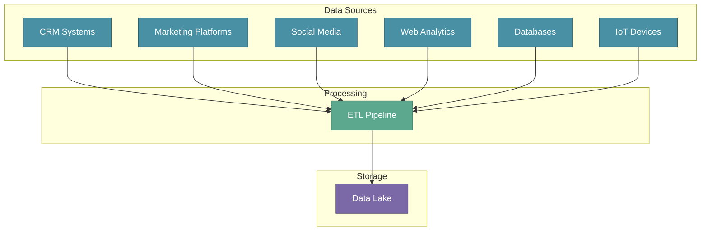

# Getting Started

In the MLOps Fundamentals section, we explored the complete lifecycle of ML systems. Now we dive deeper into the first and most critical phase — **Data Collection and Preparation**. This phase typically consumes 30-40% of project time, yet it determines whether your model succeeds or fails in production.

:::tip Key Insight
A model is only as good as the data it learns from. Investing time in proper data collection and preparation prevents costly failures downstream.
:::

---

## XYZShopSmart: The Vision

XYZShopSmart wants to build a product recommendation system that delivers personalized homepage experiences for each user, value-based offers tailored to individual customers, and ultimately increased revenue growth. To achieve this, they need an ML model that understands customer behavior — but first, they need the right data.

The challenge? Relevant data is scattered across multiple backend systems, stored in various databases and spreadsheets. Before any model training can begin, this data must be consolidated and preprocessed.

---

## Why Data Collection Matters

Building an ML model requires three foundational elements:

**Relevant Data** is the raw material for learning. Without data that captures the patterns you want to predict, no algorithm can help. For XYZShopSmart, this means user behavior, purchase history, and product interactions.

**Accessible Data** must be retrievable from wherever it lives. Data spread across backend systems, databases, and spreadsheets needs to be brought together into a unified location.

**Clean Data** is processed and validated for model consumption. Raw data contains noise, missing values, and inconsistencies that must be addressed before training.

---

## The Data Landscape in Organizations

Before collecting data, you need to understand where it lives. Modern organizations store data across multiple systems:

- **Customer Relationship Management (CRM) Systems** store information about customers, their interactions, and sales opportunities. 
- **Marketing Automation Platforms** track leads, email campaigns, and website analytics. 
- **Social Media Platforms** capture customer sentiment, brand mentions, and engagement metrics.
- **Website and Mobile App Analytics** record user behavior, traffic sources, and conversion data. 
- **Databases** hold structured and unstructured data for analysis and reporting.
- **Internet of Things (IoT) Devices** stream sensor data from connected devices.

---

## The Goal: ML-Ready Data

The objective of data collection and preparation is straightforward: consolidate data from disparate sources and preprocess it for model training.

This involves three key activities:

1. **Extract** data from various source systems
2. **Transform** data into a consistent, clean format
3. **Load** data into a centralized storage system

This process is known as **ETL (Extract, Transform, Load)** — the crucial data integration process that makes ML possible.

---

## XYZShopSmart's Data Strategy

XYZShopSmart identified six primary data sources for their recommendation system:

| Source | Data Type | Purpose |
|--------|-----------|---------|
| CRM | Customer profiles | User segmentation |
| Web Analytics | Clickstream data | Behavior patterns |
| Order Database | Purchase history | Preference learning |
| Product Catalog | Item attributes | Content-based features |
| Marketing Platform | Campaign responses | Engagement signals |
| Mobile App | In-app behavior | Cross-platform activity |

Their goal: build automated pipelines that continuously collect, process, and prepare this data for model training and retraining.

---

## Common Mistakes

- **Underestimating data complexity** — Data spread across systems requires significant effort to consolidate
- **Skipping data quality checks** — Garbage in, garbage out applies directly to ML
- **Manual data collection** — One-time manual exports don't scale for production systems
- **Ignoring data freshness** — Stale data leads to models that don't reflect current behavior
- **Starting model development too early** — Building models before understanding your data wastes time

---

## Key Takeaways

- **Data collection and preparation is foundational.** This phase takes 30-40% of project time and determines model success.
- **Organizational data is fragmented.** Modern companies store data across CRM, marketing platforms, analytics, databases, and IoT devices.
- **ETL is the integration mechanism.** Extract, Transform, Load pipelines consolidate data from multiple sources into ML-ready formats.
- **Automation is essential.** Production ML requires continuous data pipelines, not one-time manual exports.

---

## What's Next?

With an understanding of why data collection matters and where data lives, we'll explore the mechanics of getting data out of source systems. The next section covers **Data Ingestion and ETL** — the Extract phase that pulls data from diverse sources.

:::info Up Next
We'll dive into **ETL pipelines** — understanding how to extract data from CRM systems, databases, APIs, and other sources that power ML systems.
:::
