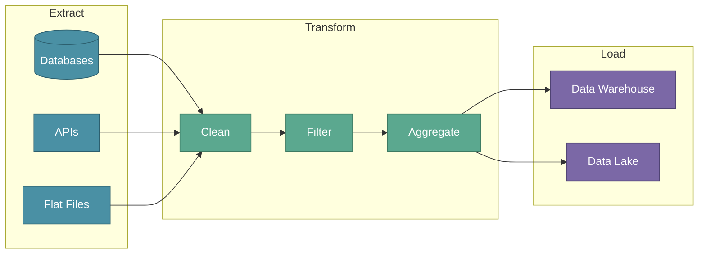
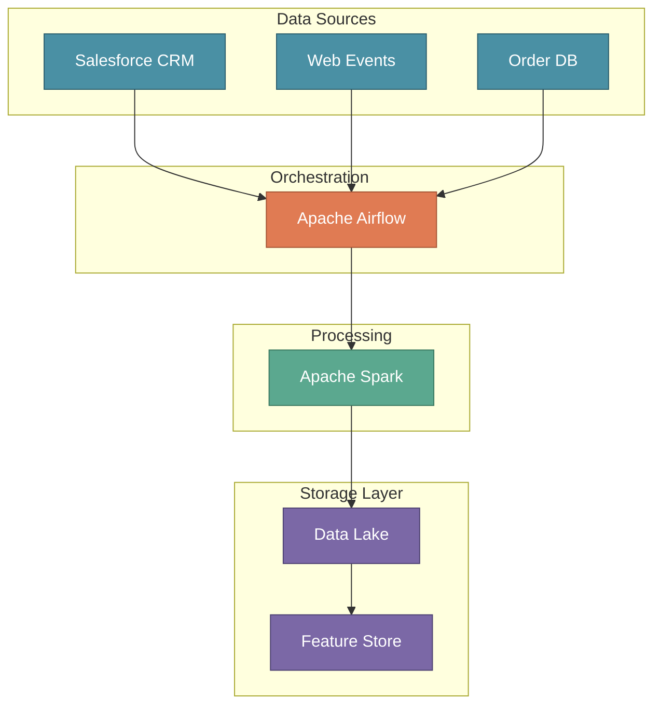

# Data Ingestion and ETL

In the previous section, we explored why data collection matters and where organizational data lives. Now we focus on the mechanics — **how to actually get that data** from various sources and prepare it for ML consumption. This is where ETL (Extract, Transform, Load) becomes essential.

:::tip Key Insight
ETL is the backbone of ML data pipelines. Without reliable data ingestion, even the best models will fail due to missing, stale, or inconsistent data.
:::

---

## XYZShopSmart: The Integration Challenge

XYZShopSmart's recommendation system needs data from six different sources — CRM, web analytics, order database, product catalog, marketing platform, and mobile app. Each system uses different formats, APIs, and update schedules. The data engineering team faces a fundamental question: how do we bring all this data together reliably and continuously?

The answer is ETL — a systematic process that extracts data from sources, transforms it into a consistent format, and loads it into a centralized storage system.

---

## Understanding ETL

ETL stands for **Extract, Transform, Load** — three distinct phases that form the data integration pipeline.

---

## Phase 1: Extract

The Extract phase gathers raw data from source systems. Data can come from three primary source types:

- **Databases** store structured data in tables with defined schemas. SQL queries pull customer records, transaction history, and product information. 
- **APIs** provide programmatic access to external systems and services. REST endpoints return JSON data from CRM, marketing platforms, and analytics tools. 
- **Flat Files** contain data in CSV, JSON, or XML formats, often exported from legacy systems or third-party services.

### Extraction Patterns

- **Full extraction** pulls all data from a source — simple but inefficient for large datasets. 
- **Incremental extraction** pulls only new or changed records since the last run — efficient but requires tracking state. 
- **Change Data Capture (CDC)** monitors database logs for real-time changes — ideal for streaming use cases.

### XYZShopSmart's Extraction Strategy

| Source | Extraction Method | Frequency |
|--------|-------------------|-----------|
| CRM (Salesforce) | REST API | Daily |
| Web Analytics | Event streaming | Real-time |
| Order Database | CDC | Near real-time |
| Product Catalog | Full extract | Weekly |
| Marketing Platform | API | Daily |
| Mobile App | Event streaming | Real-time |

---

## Phase 2: Transform

The Transform phase converts raw data into a format suitable for analysis and ML. This involves three key operations:

- **Cleaning** removes errors and inconsistencies from raw data. This includes handling missing values, removing duplicates, correcting data types, and standardizing formats. 
- **Filtering** removes irrelevant records that don't contribute to the analysis. This includes excluding test data, filtering by date ranges, and removing outliers. 
- **Aggregating** combines records to create meaningful features. This includes computing totals, averages, counts, and other summary statistics.

### Common Transformations for ML

| Transformation | Purpose | Example |
|----------------|---------|---------|
| Null handling | Complete records | Fill missing prices with median |
| Deduplication | Unique records | Remove duplicate user events |
| Type casting | Consistent formats | Convert strings to timestamps |
| Normalization | Scale features | Scale prices to 0-1 range |
| Encoding | Categorical handling | One-hot encode product categories |

### XYZShopSmart's Transformation Pipeline

1. **Clean**: Remove duplicate events, handle null user IDs, standardize timestamps to UTC
2. **Filter**: Exclude internal test accounts, filter events older than 2 years
3. **Aggregate**: Compute user-level features like purchase frequency, average order value, category preferences

---

## Phase 3: Load

The Load phase moves transformed data into a target storage system. Two primary destinations exist:

- **Data Warehouses** store structured, processed data optimized for analytics queries. They use columnar storage for fast aggregations and support SQL-based analysis. 
- **Data Lakes** store raw and processed data in various formats. They accommodate structured, semi-structured, and unstructured data at scale.

### Loading Strategies

- **Batch loading** processes data in scheduled intervals — hourly, daily, or weekly. It's simpler to implement but introduces latency. 
- **Streaming loading** processes data continuously as it arrives. It's more complex but enables real-time features. 
- **Micro-batch loading** combines both approaches — processes small batches at frequent intervals, typically every few minutes.

---

## XYZShopSmart's Complete ETL Pipeline

XYZShopSmart's pipeline operates as follows:

1. **Airflow** orchestrates extraction from all sources on defined schedules
2. **Spark jobs** perform transformations — cleaning, filtering, aggregating
3. **Data Lake** stores processed data in Parquet format for efficient querying
4. **Feature Store** materializes ML-ready features for model training and serving

---

## Common Mistakes

- **No data validation** — Skipping quality checks allows corrupt data to pollute downstream systems
- **Ignoring schema evolution** — Source schemas change; pipelines must handle new fields gracefully
- **Over-extracting data** — Pulling more data than needed wastes resources and slows pipelines
- **Tight coupling to sources** — Direct dependencies on source schemas make pipelines fragile
- **Missing monitoring** — Without alerts, pipeline failures go unnoticed until models degrade

---

## Key Takeaways

- **ETL has three distinct phases.** Extract gathers raw data, Transform cleans and prepares it, Load stores it in target systems.
- **Extraction sources vary widely.** Databases, APIs, and flat files each require different extraction approaches.
- **Transformation prepares data for ML.** Cleaning, filtering, and aggregating convert raw data into useful features.
- **Loading destinations serve different purposes.** Data Warehouses support analytics; Data Lakes accommodate diverse data types at scale.

---

## What's Next?

We've covered the ETL process that moves data from sources to storage. But where exactly should this processed data live? The next section explores **Data Lakes** — the scalable, flexible storage solution that has become the standard for ML data management.

:::info Up Next
We'll explore **Data Lakes** — understanding their features, benefits, and why they've become the preferred storage solution for ML model data.
:::
