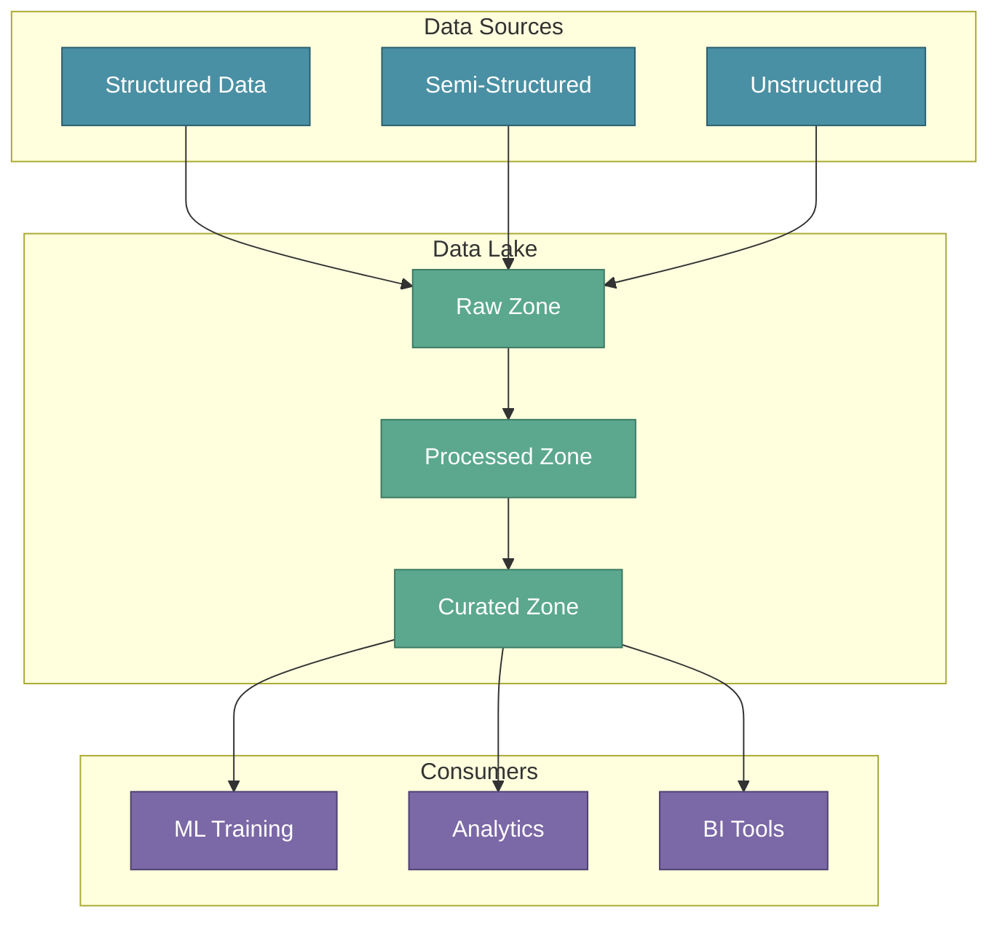

# Data Lakes

In the previous section, we covered ETL pipelines that extract, transform, and load data from various sources. Now we address a fundamental question: **where should all this processed data live?** The answer for modern ML systems is the Data Lake — a centralized repository that has become the standard for storing ML model data.

:::tip Key Insight
Data Lakes provide the scalability, flexibility, and cost-effectiveness that ML systems require. They've proven effective across ML development processes and remain the dominant storage solution today.
:::

---

## XYZShopSmart: The Storage Decision

After building their ETL pipelines, XYZShopSmart's data engineering team faced a critical decision. They had data flowing from six sources — structured customer records, semi-structured clickstream events, and unstructured social media mentions. Traditional databases couldn't handle this variety efficiently. They needed a storage solution that could:

- Handle terabytes of diverse data types
- Scale as data volumes grow
- Enable both batch training and real-time inference
- Keep storage costs manageable

The answer was a Data Lake — a single, scalable location for all their ML data.

---

## What is a Data Lake?

A Data Lake is a centralized repository that stores structured, semi-structured, and unstructured data at any scale. Unlike traditional databases with rigid schemas, Data Lakes accept data in its raw form and apply structure when reading (schema-on-read).



---

## Key Features of Data Lakes

Data Lakes provide seven capabilities that make them ideal for ML workloads:

### Centralized Data Repository

A Data Lake serves as a single, scalable location for both structured and unstructured data. Instead of maintaining separate storage systems for different data types, everything lives in one place. This eliminates data silos and simplifies data discovery.

### Scalability and Flexibility

Data Lakes easily accommodate growing volumes and diverse data types. As XYZShopSmart's user base grows, storage scales automatically. Adding new data sources requires no schema changes or infrastructure modifications.

### Support for Diverse Data Types

Data Lakes handle text, images, audio, video, and streaming data equally well. For ML applications, this means:

| Data Type | Example | ML Use Case |
|-----------|---------|-------------|
| Structured | Customer records | Feature engineering |
| Semi-structured | JSON event logs | Behavior analysis |
| Unstructured | Product images | Computer vision |
| Streaming | Real-time clicks | Online learning |

### Cost-Effective Storage

Data Lakes use object storage (like S3 or GCS) that provides scalable solutions at affordable prices. Storage tiers automatically move cold data to cheaper options. For XYZShopSmart, this means storing years of historical data without prohibitive costs.

### Advanced Data Processing

Data Lakes enable in-depth analytics and insights generation. Query engines like Spark, Presto, and Trino run directly against lake data. This supports exploratory analysis during feature engineering and large-scale training data preparation.

### Data Security and Governance

Enterprise Data Lakes ensure compliance, security, and integrity with robust policies. Features include:

- **Access controls** that restrict data by role and sensitivity
- **Encryption** for data at rest and in transit
- **Audit logging** that tracks all data access
- **Data lineage** that traces data from source to consumption

### Seamless BI Integration

Data Lakes easily integrate with analytics platforms for decision making. Tools like Tableau, Looker, and Power BI connect directly, enabling business stakeholders to explore data alongside ML teams.

---

## Data Lake Architecture

Modern Data Lakes organize data into zones that reflect processing stages:

**Raw Zone** stores data exactly as it arrives from sources. No transformations are applied. This preserves the original data for auditing and reprocessing.

**Processed Zone** contains cleaned and standardized data. ETL pipelines have removed duplicates, handled nulls, and applied consistent formats.

**Curated Zone** holds ML-ready datasets and features. Data scientists and ML engineers consume data primarily from this zone.

### XYZShopSmart's Lake Structure

```
s3://xyzshopsmart-data-lake/
├── raw/
│   ├── crm/
│   ├── web_events/
│   └── orders/
├── processed/
│   ├── customers/
│   └── transactions/
└── curated/
    ├── training_data/
    └── features/
```

---

## Why Data Lakes Dominate ML Storage

Data Lakes have proven effective across the ML development process for several reasons:

**Training requires large datasets.** Data Lakes store petabytes efficiently, making them ideal for training data-hungry models.

**Experimentation needs flexibility.** Schema-on-read allows data scientists to explore data without waiting for schema changes.

**Feature engineering is iterative.** Raw data preservation enables reprocessing when feature requirements change.

**Cost scales linearly.** Object storage pricing makes storing historical data economically viable.

Future solutions may emerge, but Data Lakes remain the dominant choice for ML data management today.

---

## XYZShopSmart's Data Lake Implementation

XYZShopSmart implemented their Data Lake on AWS S3 with the following components:

1. **Storage**: S3 buckets organized by zone (raw, processed, curated)
2. **Format**: Parquet files for columnar efficiency, partitioned by date
3. **Catalog**: AWS Glue maintains metadata and enables SQL queries
4. **Processing**: Spark jobs transform data between zones
5. **Security**: IAM policies restrict access by team role
6. **Governance**: Lake Formation manages permissions and lineage

This architecture supports both their recommendation system training and ad-hoc analytics needs.

---

## Common Mistakes

- **Treating the lake as a data dump** — Without organization and governance, lakes become swamps of unusable data
- **Skipping the raw zone** — Not preserving original data prevents reprocessing when requirements change
- **Ignoring data quality** — Lakes accept any data; validation must happen in pipelines
- **Over-complicating architecture** — Start simple with basic zones; add complexity as needs emerge
- **Neglecting access controls** — Sensitive data requires proper security from day one

---

## Key Takeaways

- **Data Lakes centralize diverse data.** They store structured, semi-structured, and unstructured data in a single, scalable location.
- **Seven features make lakes ideal for ML.** Centralization, scalability, flexibility, cost-effectiveness, processing power, governance, and BI integration.
- **Zone architecture organizes data.** Raw, Processed, and Curated zones reflect data maturity and use cases.
- **Lakes dominate ML storage today.** Their flexibility and scale make them the standard for ML data management.

---

## What's Next

With data stored in the Data Lake, the next critical step is ensuring data quality and transforming raw data into formats suitable for ML models. Raw data in mixed formats needs cleaning, validation, and standardization before it can power effective machine learning.

:::info Up Next
We'll explore **Data Cleaning and Transformation** — understanding data quality analysis, improvement strategies, and the tools that transform raw data into ML-ready datasets.
:::
