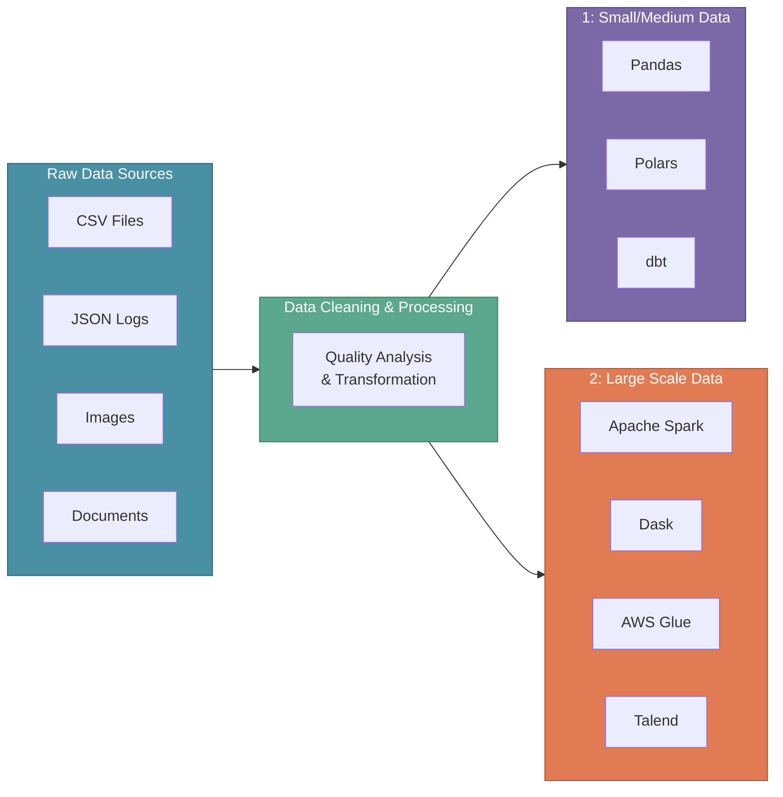
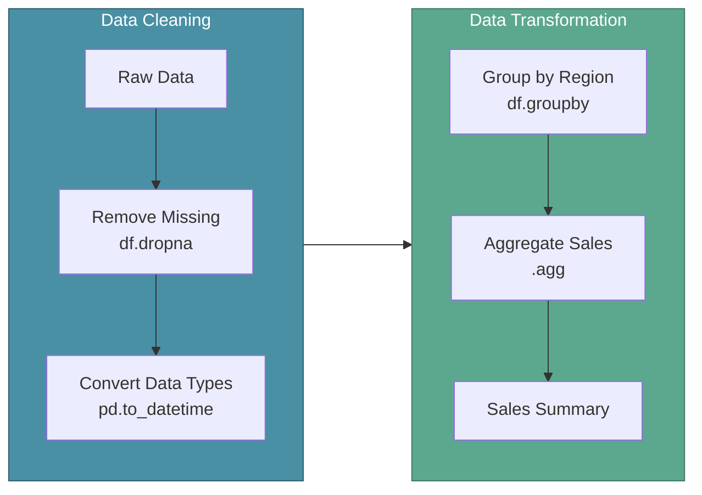

# Data Cleaning and Transformation

In the previous section, we explored Data Lakes as the centralized storage for ML data. Now let's dive into what happens after data lands in the lake: **cleaning and transforming raw data** into a format suitable for machine learning.

Once data is extracted from various sources, it arrives in the data lake—often in mixed formats like CSV, JSON, documents, and images. Before ML models can use this data, it must be validated for quality and transformed into a consistent structure.

:::tip Key Insight
Data quality issues discovered during model training are expensive to fix. Investing in thorough data cleaning and transformation upfront prevents debugging headaches later.
:::

---

## XYZShopSmart: The Format Problem

After setting up their data lake, XYZShopSmart's data engineering team faced a challenge. User behavior data arrived as JSON from the web app, purchase records came as CSV exports from the legacy system, and product images were stored as PNGs. Maya couldn't train her recommendation model until all this data spoke the same language. The team needed a systematic approach to clean, validate, and transform everything into a unified format.

---

## Data Quality Analysis

Before transforming data, teams must assess its quality. Data Quality Analysis answers critical questions: Is the data accurate? Does it cover all required data points? Are there gaps that could mislead the model?

Quality analysis happens **before and during transformation**—not after. Catching issues early prevents bad data from propagating through the pipeline.

### Key Quality Questions

- **Completeness**: Does the dataset cover all necessary data points and time periods?
- **Accuracy**: Are values correct and free from entry errors?
- **Consistency**: Do related fields align across different sources?
- **Timeliness**: Is the data recent enough for current predictions?

### XYZShopSmart's Quality Assessment

1. Data engineers run profiling scripts on incoming data batches
2. Completeness checks verify all expected user segments are represented
3. Cross-source validation confirms purchase totals match between systems
4. Staleness alerts flag data older than 24 hours

---

## Data Quality Improvement Strategies

Improving data quality requires systematic strategies applied consistently across all data sources.

### Ensure Data Accuracy

Eliminate errors and inconsistencies to enhance insight quality. 
- **Validation rules** catch typos, out-of-range values, and impossible combinations. 
- **Deduplication** removes duplicate records that would skew model training.

### Remove Redundancies

Streamline data by eliminating duplicates for efficient processing. Duplicate records waste storage, slow processing, and—most importantly—bias models toward over-represented examples.

### Standardize Formats

Maintain consistency in data structure for seamless integration. 
- **Date formats** should follow a single standard (ISO 8601). 
- **Text fields** need consistent casing and encoding. 
- **Categorical values** require unified naming conventions.

### Handle Missing Values

Address gaps in data to prevent misinterpretation and improve model accuracy. Options include **imputation** (filling with mean, median, or predicted values), **flagging** (adding indicator columns), or **removal** (when missing data is minimal).

### Optimize Data for Analysis

Transform raw data into usable formats for effective decision-making. This includes **type casting** (converting strings to numbers), **normalization** (scaling values to comparable ranges), and **encoding** (converting categories to numerical representations).

---

## Data Processing Tools and Technologies

Different tools serve different data scales. Choosing the right tool depends on data volume, team expertise, and infrastructure constraints.



---

## Small to Medium Data Processing

For datasets that fit in memory on a single machine, efficiency and simplicity are key. Tools like Pandas and Polars offer rapid development cycles ideal for tasks like cleaning sales data for retail insights or preparing survey results for research projects.

### Pandas vs Polars

Both are powerful Python libraries for data manipulation and transformation—ideal for small to medium datasets.

| Aspect | Pandas | Polars |
|--------|--------|--------|
| **Strength** | Flexibility and versatility | Optimized for performance and efficiency |
| **Best For** | Cleaning messy customer feedback data for insights | Lightning-fast computation for real-time data |
| **Memory** | Higher memory usage | Memory-efficient with lazy evaluation |

### Pandas

A versatile Python library for data manipulation and transformation. **DataFrame operations** handle filtering, joining, and aggregating data with minimal code. **Memory efficiency** techniques like chunked reading enable processing of moderately large files.

#### Key Functions in Pandas

**Handling Missing Values**: Use `dropna()` to remove rows with missing values or `fillna()` to replace them with defaults.

```python
df.dropna(inplace=True)  # Remove rows with missing values
df.fillna(0, inplace=True)  # Replace missing values with 0
```

**Removing Duplicates**: Use `drop_duplicates()` to eliminate duplicate records that would skew model training.

```python
df.drop_duplicates(inplace=True)  # Drop duplicate rows
```

**Data Type Conversion**: Use `astype()` to convert columns to appropriate types.

```python
df['age'] = df['age'].astype(int)  # Converting string age to int
```

**Filtering and Sorting**: Use `filter()` to select specific columns and `sort_values()` to order data.

```python
df_filtered = df.filter(['name', 'age'])
df_sorted = df.sort_values(by='age')
```

**Aggregation**: Use `groupby()` and `agg()` to summarize data by categories.

```python
df_grouped = df.groupby('region').agg({'sales': 'sum'})
```

**Merging and Joining**: Use `merge()` or `join()` to combine datasets.

```python
df_merged = pd.merge(df1, df2, on='id')
```

#### Pandas in Action: XYZShopSmart Workflow



### dbt (data build tool)

A development framework for transforming data inside data warehouses. **SQL-based transformations** let analysts write familiar queries. **Version control** and **testing** bring software engineering practices to data transformation.

### When to Use Small-Scale Tools

- Dataset fits in memory (typically under 10GB)
- Transformations run on a single machine
- Development speed matters more than processing speed
- Team has strong Python or SQL skills

---

## Large-Scale Data Processing

When data exceeds single-machine capacity, distributed computing frameworks distribute work across clusters.

### Why Distributed Processing?

Consider a single 50MB file—easy to process on any machine. But in real-time production environments, teams deal with thousands of files totaling 500GB or more. One server simply cannot handle this volume efficiently. This is where **distributed data processing** solves the problem.

### Apache Spark (PySpark)

Apache Spark leverages distributed computing for large-scale data processing and transformation. It excels at handling datasets that would overwhelm single-machine tools.

**Key Capabilities**:
- **Parallel task execution** reduces processing time by distributing work across cluster nodes
- **Handles data transformation efficiently** through optimized execution plans
- **Processes millions of events per second** for real-time insights

**Why Apache Spark Excels**:

| Capability | Benefit |
|-----------|---------|
| **Distributed Processing** | Leverages cluster computing for parallel data processing |
| **Fault Tolerance** | Recovers automatically from node failures using Resilient Distributed Datasets (RDDs) |
| **In-Memory Computation** | Processes data in memory to reduce disk I/O bottlenecks |
| **Unified API** | Supports multiple programming languages and workloads seamlessly |

**Resilient Distributed Datasets (RDDs)** and **DataFrames** enable parallel processing across hundreds of nodes. **PySpark** provides a Python API familiar to data scientists, making Spark accessible without learning Scala or Java.

### Dask

A flexible parallel computing library for Python that scales Pandas-like workflows. **Lazy evaluation** builds computation graphs before execution. **Familiar API** mirrors Pandas, reducing the learning curve for Python developers.

### AWS Glue

A serverless service for extracting, transforming, and loading (ETL) data. **Automatic schema discovery** simplifies working with semi-structured data. **Job bookmarking** tracks processed data to avoid reprocessing.

### Talend

An ETL tool offering drag-and-drop functionality for data integration and transformation. **Visual workflows** reduce coding requirements. **Pre-built connectors** integrate with hundreds of data sources.

### When to Use Large-Scale Tools

- Dataset exceeds single-machine memory
- Processing must complete within time constraints
- Data arrives continuously and requires streaming processing
- Infrastructure supports distributed computing

---

## XYZShopSmart's Transformation Workflow

1. **Ingestion**: Raw data lands in the data lake's raw zone in original formats
2. **Quality Check**: Great Expectations validates incoming batches against defined rules
3. **Small Data Path**: Pandas processes product catalog updates (small, infrequent)
4. **Large Data Path**: Spark processes user clickstream data (large, continuous)
5. **Standardization**: All data converts to Parquet format with unified schema
6. **Curated Zone**: Transformed data moves to the lake's curated zone
7. **Validation**: Final quality checks confirm transformation success

---

## Choosing Your Processing Approach

| Factor | Small/Medium Tools | Large-Scale Tools |
|--------|-------------------|-------------------|
| Data Size | Under 10GB | 10GB to petabytes |
| Processing Time | Minutes | Minutes (distributed) |
| Infrastructure | Single machine | Cluster required |
| Team Skills | Python, SQL | Spark, distributed systems |
| Cost | Low | Higher (compute clusters) |

Most teams use both approaches—Pandas for exploration and prototyping, Spark or Glue for production pipelines.

---

## Common Mistakes

- **Skipping quality analysis**: Transforming data without validation propagates errors downstream
- **Over-engineering small datasets**: Using Spark for 1GB files adds unnecessary complexity
- **Inconsistent transformations**: Applying different rules to training vs. production data causes model drift
- **Ignoring data lineage**: Without tracking transformations, debugging issues becomes impossible
- **One-size-fits-all tooling**: Forcing all data through the same pipeline regardless of scale wastes resources

---

## Key Takeaways

**Data quality analysis must happen before transformation.** Validating completeness, accuracy, and consistency prevents bad data from reaching models.

**Quality improvement strategies are systematic, not ad-hoc.** Accuracy checks, deduplication, standardization, missing value handling, and format optimization form a complete toolkit.

**Tool selection depends on data scale.** Pandas, Polars, and dbt serve small to medium datasets; Spark, Dask, AWS Glue, and Talend handle large-scale distributed processing.

**Apache Spark solves the distributed processing problem.** When single-machine tools cannot handle data volume, Spark's parallel execution, fault tolerance, and in-memory computation provide the necessary scale.

**Most organizations need both approaches.** Small-scale tools for exploration and prototyping, large-scale tools for production pipelines.

---

## What's Next

So far, we've focused on batch data—processing data at scheduled intervals. But what happens when XYZShopSmart needs to react to user behavior in real-time? The next section explores streaming datasets—how to capture and process continuous event flows using Apache Kafka and Apache Flink.

:::info Up Next
We'll explore **Streaming Datasets**—understanding how Apache Kafka and Apache Flink enable real-time data pipelines that complement batch processing for ML systems.
:::
