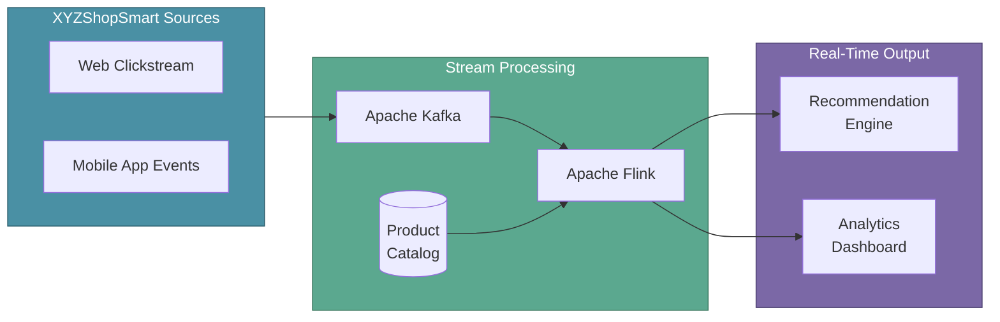
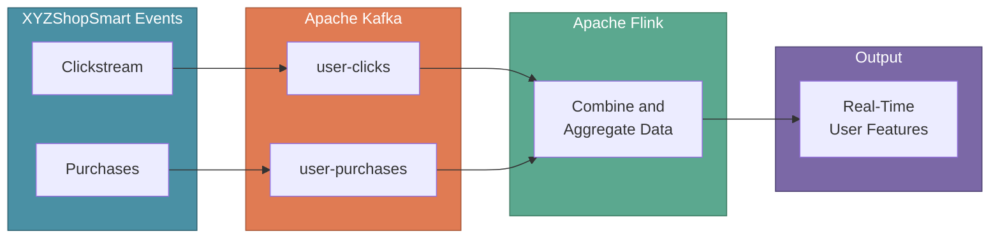

# Streaming Datasets

In the previous section, we explored data cleaning and transformation for batch data. Now let's dive into **streaming datasets**—data that arrives continuously in real-time rather than in fixed batches.

Modern ML systems often need to process data as it happens. User clicks, sensor readings, and transaction events flow continuously and require immediate processing to deliver timely insights. Streaming platforms like Apache Kafka and Apache Flink enable this real-time data flow.

:::tip Key Insight
Batch processing handles data at rest; stream processing handles data in motion. Many production ML systems combine both approaches—batch for training, streaming for inference.
:::

---

## XYZShopSmart: The Real-Time Challenge

XYZShopSmart's recommendation system worked well with nightly batch updates, but Maya noticed a problem. When a customer purchased a laptop at 10 AM, they continued seeing laptop recommendations until the next morning's batch refresh. Customers complained about irrelevant suggestions, and the team suspected they were missing cross-sell opportunities for accessories.

The data engineering team analyzed the issue. Their ETL pipelines processed clickstream and purchase data once daily—extracting from web analytics, transforming in Spark, and loading to the Data Lake. By the time Maya's model retrained, customer intent had already shifted. They needed a streaming architecture to capture and process user behavior in real-time, feeding fresh signals to the recommendation engine within seconds of each interaction.

---

## Why Streaming Matters for ML

Streaming datasets power scenarios where immediate insights drive business value. For XYZShopSmart, real-time processing means:

- Updating recommendations instantly after a purchase
- Detecting abandoned carts before customers leave
- Personalizing homepage content based on current session behavior
- Triggering alerts when unusual patterns emerge

A streaming architecture captures user events via Apache Kafka, processes them through Apache Flink (enriched with product data from the existing catalog), and delivers real-time signals to both the recommendation engine and analytics dashboards.

---

## Apache Kafka

Apache Kafka is a distributed streaming platform for building real-time data pipelines and applications. It acts as a high-throughput message broker that reliably transports data between systems at scale.

### Key Features of Kafka

- **High-Throughput Data Streaming**: Manages real-time data streams with low-latency processing, handling millions of events per second
- **Scalability for Massive Workloads**: Easily scales horizontally by adding more brokers to the cluster
- **Fault-Tolerant Messaging**: Ensures reliable message delivery with replication and durability across multiple nodes
- **Distributed Architecture for Flexibility**: Decouples producers and consumers, making it flexible for diverse use cases

### Kafka Architecture

| Component | Purpose |
|-----------|---------|
| **Producers** | Applications that publish messages to Kafka topics |
| **Topics** | Named channels that organize messages by category |
| **Brokers** | Servers that store data and serve client requests |
| **Consumers** | Applications that subscribe to topics and process messages |
| **Consumer Groups** | Coordinate multiple consumers for parallel processing |

### XYZShopSmart's Kafka Setup

XYZShopSmart configured Kafka to handle their real-time event flow:

| Topic | Source | Events |
|-------|--------|--------|
| `user-clicks` | Web Analytics | Page views, product clicks, search queries |
| `user-purchases` | Order Database | Completed transactions, cart additions |
| `user-sessions` | Mobile App | App opens, session duration, navigation paths |

Multiple consumer groups process these topics independently. The recommendation service consumes from all three topics to update user preferences. The analytics pipeline aggregates events for real-time dashboards. Kafka retains events for 7 days, enabling Maya to replay data when debugging model issues.

---

## Apache Flink

Apache Flink is a stream processing framework for real-time event-driven applications and batch processing. While Kafka handles data transport, Flink handles data computation—transforming, aggregating, and analyzing streams in real-time.

### Key Features of Flink

- **Event-Driven Processing**: Processes data as events occur with millisecond-level latency
- **Stateful Stream Processing**: Maintains state during stream processing for complex data flows and aggregations
- **Exactly-Once Semantics**: Guarantees each event is processed exactly once for accurate results, even during failures
- **Seamless Integration with Big Data**: Works with data sources like Kafka, Hadoop, and NoSQL databases for real-time analytics
- **Unified Batch and Stream Processing**: Handles both streaming and batch workloads with a single API

### Flink Processing Capabilities

| Capability | Benefit |
|------------|---------|
| **Windowing** | Groups events by time or count for aggregation |
| **Complex Event Processing** | Detects patterns across event sequences |
| **State Management** | Maintains computation state with fault tolerance |
| **Watermarks** | Handles out-of-order events in distributed systems |

---

## How Kafka and Flink Work Together

Kafka and Flink serve complementary roles in streaming architectures. Kafka handles **data ingestion and messaging**—reliably capturing and transporting events. Flink handles **data processing and analysis**—transforming streams into insights.

**Apache Kafka** captures events from XYZShopSmart's web and mobile applications, organizing them into dedicated topics. **Apache Flink** consumes from these topics, joins streams with product catalog data, and computes real-time user features for the recommendation engine.

---

## XYZShopSmart's Streaming Pipeline

XYZShopSmart implemented their streaming architecture alongside the existing batch ETL:

1. **Event Capture**: Web and mobile apps publish user actions to Kafka topics as they occur
2. **Topic Routing**: Events flow to appropriate topics—`user-clicks`, `user-purchases`, `user-sessions`
3. **Stream Consumption**: Flink jobs subscribe to multiple topics simultaneously
4. **Stateful Aggregation**: Flink maintains rolling windows of user behavior—clicks in the last 10 minutes, purchases in the last hour
5. **Catalog Enrichment**: Flink joins streaming events with product attributes from the curated zone of the Data Lake
6. **Feature Updates**: Computed features write to the Feature Store, making them available to the recommendation model
7. **Dashboard Metrics**: Aggregated statistics stream to real-time dashboards for monitoring

This streaming layer complements their batch pipeline. Spark continues to process historical data nightly for model retraining, while Flink handles real-time feature updates for inference.

---

## Choosing Between Streaming and Batch

XYZShopSmart's data engineering team uses both approaches for different purposes:

| Factor | Batch (Spark + Data Lake) | Streaming (Kafka + Flink) |
|--------|---------------------------|---------------------------|
| **Use Case** | Model training, historical analysis | Real-time features, live recommendations |
| **Latency** | Hours (nightly jobs) | Seconds (continuous) |
| **Data Sources** | CRM, order history, product catalog | Clickstream, session events |
| **Output** | Training datasets in curated zone | Feature Store updates |
| **Complexity** | Simpler orchestration | Requires state management |

Most ML systems use **hybrid architectures**. XYZShopSmart runs Spark for nightly model retraining using historical data from the Data Lake, while Flink computes real-time features that update the recommendation engine throughout the day.

---

## Common Mistakes

- **Treating streams like batches**: Applying batch-oriented thinking to streaming systems leads to latency issues and missed events
- **Ignoring exactly-once semantics**: Without proper guarantees, duplicate or missing events corrupt downstream data
- **Underestimating state management**: Stateful stream processing requires careful checkpointing and recovery planning
- **Over-partitioning Kafka topics**: Too many partitions add coordination overhead without proportional benefits
- **Skipping backpressure handling**: When consumers fall behind, systems must handle the pressure gracefully or risk data loss

---

## Key Takeaways

- **Apache Kafka handles data transport.** As a distributed streaming platform, it provides high-throughput, fault-tolerant messaging that scales horizontally for massive event volumes.

- **Apache Flink handles data computation.** As a stream processing framework, it provides stateful processing with exactly-once semantics and millisecond latencies.

- **Kafka and Flink complement each other.** Kafka captures and organizes real-time events; Flink processes and analyzes them—together they form a complete streaming architecture.

- **Streaming enables real-time ML features.** For XYZShopSmart, streaming transforms recommendations from stale nightly updates to fresh, real-time personalization.

---

## What's Next

With batch ETL pipelines feeding the Data Lake and streaming pipelines delivering real-time features, XYZShopSmart has a complete data foundation. The next step is understanding how to engineer meaningful features from this data—transforming raw events and records into inputs that help Maya's recommendation model learn patterns and make accurate predictions.

:::info Up Next
We'll explore **Feature Engineering**—the art of creating meaningful input variables from both batch and streaming data that help ML models discover patterns and make accurate predictions.
:::
