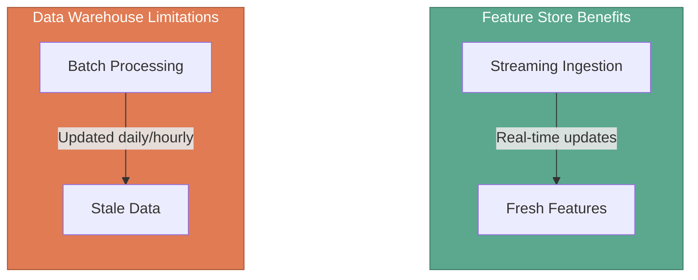
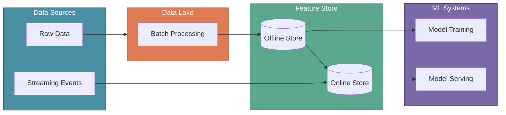

# Feature Stores

In the previous section, we explored streaming datasets and how Kafka and Flink enable real-time data processing. Now let's understand **Feature Stores**—a specialized way of storing and serving features that addresses the limitations of traditional data systems for ML inference.

Machine learning models generate predictions for new examples through inference. While Data Lakes excel at storing and processing large volumes of data, they were not designed for the real-time, low-latency requirements of serving ML models in production. Feature Stores bridge this gap by providing optimized storage and retrieval of features specifically designed for ML workloads.

:::tip Key Insight
A Feature Store is not a tool—it's a different approach to storing and serving features in backend systems like databases and caches, designed to address challenges that traditional data warehouses cannot solve efficiently.
:::

---

## XYZShopSmart: The Recommendation Latency Problem

XYZShopSmart's recommendation system needed to serve personalized suggestions to millions of users. Maya's team had a working model, but the infrastructure struggled. Their data warehouse updated features daily through batch processing, meaning the "user purchase frequency" feature was often stale—if a customer bought three items today, the warehouse wouldn't reflect this until tomorrow's batch run. When users browsed the site, the ML model retrieved features from the warehouse, but complex queries caused high latency—sometimes taking seconds instead of the milliseconds needed for a responsive experience.

The team needed a solution that could provide fresh, up-to-date features with low-latency access while maintaining consistency between training and serving environments.

---

## Data Lakes for ML Inference: Key Benefits

Feature Stores solve five critical challenges that traditional data warehouses struggle with:

1. **Data Freshness and Real-Time Access**: Up-to-date features for accurate predictions
2. **Low-Latency Serving for Real-Time Inference**: Millisecond response times for user-facing applications
3. **Consistency Between Training and Serving Environments**: Same feature computations prevent skew
4. **Advanced Feature Transformation and Preprocessing**: Pipelines for complex feature engineering
5. **Scalability and Performance Under ML Workloads**: Horizontal scaling for high-throughput requests

---

## Data Freshness and Real-Time Access

Traditional data warehouses process data in batches—updating periodically on daily or hourly schedules. This batch processing leads to stale data and missed recent changes. For XYZShopSmart's "user purchase frequency" feature, the warehouse might miss recent purchases made that day, providing outdated values to the recommendation model and missing cross-sell opportunities.

| Challenge | Data Warehouse | Feature Store |
|-----------|----------------|----------------|
| **Update Frequency** | Batch updates run daily or hourly | Real-time streaming updates as events happen |
| **Data Freshness** | Features become stale between batch runs | Features stay current with latest user activity |
| **XYZShopSmart Example** | "User purchase frequency" misses today's purchases | Captures every purchase instantly for accurate recommendations |

Feature Stores capture data in real-time through streaming ingestion, ensuring the recommendation model always has access to the most current user behavior and transaction data.

---

## Low-Latency Serving for Real-Time Inference

Data warehouse queries can be slow due to complex datasets and analytical query patterns. High latency leads to slow response times, creating poor user experiences for real-time applications like recommendations, fraud detection, or personalization.

| Challenge | Data Warehouse | Feature Store |
|-----------|----------------|----------------|
| **Query Speed** | Complex analytical queries take seconds | Optimized lookups return in milliseconds |
| **User Experience** | Slow page loads frustrate customers | Fast responses keep users engaged |
| **XYZShopSmart Example** | Recommendation takes 2-3 seconds to load | Personalized suggestions appear instantly |

When users browse XYZShopSmart, the ML model retrieves "user purchase frequency" in milliseconds for personalized recommendations. Feature Stores achieve this through optimized storage formats and caching layers designed specifically for point lookups rather than analytical queries.

---

## Consistency Between Training and Serving Environments

A common source of model degradation is training-serving skew—when features are computed differently during training versus inference. Traditional systems often have separate pipelines for batch training and online serving, leading to inconsistencies from differing feature computations. These inconsistencies lead to skew and reduced model performance.

| Challenge | Data Warehouse | Feature Store |
|-----------|----------------|----------------|
| **Feature Computation** | Training and serving use different code paths | Single definition used everywhere |
| **Model Accuracy** | Inconsistent features cause prediction errors | Consistent features maintain model performance |
| **XYZShopSmart Example** | Training calculates "purchase frequency" one way, serving another | Same calculation logic in both environments |

Varying calculations for "user purchase frequency" during training versus serving harm performance. Feature Stores prevent this by providing a single source of truth for feature definitions and computations, ensuring Maya's model sees identical feature values in both environments.

---

## Advanced Feature Transformation and Preprocessing

Data warehouses lack native support for complex feature engineering and provide no real-time transformations for ML models. Data scientists often write custom code for transformations, leading to duplicated logic and maintenance challenges.

| Challenge | Data Warehouse | Feature Store |
|-----------|----------------|----------------|
| **Feature Engineering** | Manual, scattered transformation scripts | Centralized pipelines for complex transformations |
| **Real-Time Processing** | No support for on-the-fly transformations | Transforms data as it streams in |
| **XYZShopSmart Example** | Normalization code duplicated across projects | One reusable pipeline for all models |

Normalization or encoding for "user purchase frequency" is streamlined through Feature Store pipelines, providing properly formatted data to Maya's ML model. Feature Stores centralize transformation logic, making it reusable across multiple models and ensuring consistency.

---

## Scalability and Performance Under ML Workloads

Data warehouses are not designed for high-frequency concurrent access patterns typical of ML inference. Multiple models requesting features simultaneously create performance bottlenecks in ML model serving.

| Challenge | Data Warehouse | Feature Store |
|-----------|----------------|----------------|
| **Concurrent Access** | Slows down when many models request data | Handles thousands of simultaneous requests |
| **Traffic Spikes** | Performance degrades during peak hours | Scales horizontally to meet demand |
| **XYZShopSmart Example** | Black Friday traffic overwhelms the system | Adds capacity automatically during sales events |

Feature Stores are purpose-built for ML workloads, using techniques like read replicas, caching, and horizontal sharding to handle thousands of concurrent feature requests without degradation.

---

## How Feature Stores Work

A Feature Store integrates with the existing data infrastructure to provide optimized feature serving:

Feature Stores typically have two components:

- **Offline Store**: Optimized for batch access, storing historical feature values for model training. Connected to the Data Lake's batch processing pipelines.
- **Online Store**: Optimized for low-latency access, storing the latest feature values for real-time inference. Updated via streaming pipelines.

---

## XYZShopSmart's Feature Store Implementation

XYZShopSmart implemented a Feature Store to address their recommendation system challenges:

1. **Feature Definition**: Maya's team defines features like "user purchase frequency" with transformation logic stored centrally
2. **Batch Ingestion**: Historical purchase data flows from Spark jobs into the offline store for training
3. **Streaming Ingestion**: Real-time purchase events flow from Flink into the online store
4. **Training Access**: Model training jobs read historical features from the offline store
5. **Serving Access**: The recommendation API retrieves current features from the online store in milliseconds
6. **Consistency Guarantee**: Both stores use identical transformation logic, preventing training-serving skew
7. **Monitoring**: Feature freshness and latency metrics alert the team to potential issues

---

## Common Mistakes

- **Using Feature Stores for all data storage**: Feature Stores complement, not replace, Data Lakes and warehouses—use them specifically for ML feature serving
- **Ignoring feature freshness requirements**: Not all features need real-time updates; some batch-updated features are sufficient and simpler to maintain
- **Overlooking training-serving consistency**: Having separate pipelines for offline and online features defeats the purpose of centralized feature management
- **Underestimating operational complexity**: Feature Stores add infrastructure to manage; ensure the ML workload justifies the investment
- **Skipping feature monitoring**: Without tracking feature distributions and latencies, silent failures corrupt model predictions

---

## Key Takeaways

- **Feature Stores address Data Lake limitations for ML inference.** Traditional batch-oriented systems cannot meet the real-time, low-latency, and consistency requirements of production ML systems.

- **Data freshness and low-latency serving are critical for real-time ML.** Streaming ingestion and optimized storage enable millisecond feature retrieval for user-facing applications.

- **Training-serving consistency prevents model degradation.** Centralized feature definitions ensure identical computations across training and inference environments.

- **Scalability under ML workloads requires purpose-built infrastructure.** Feature Stores handle high-frequency concurrent access patterns that overwhelm traditional data warehouses.

---

## What's Next

With Data Lakes handling batch storage, streaming pipelines providing real-time data flow, and Feature Stores serving features to ML models, XYZShopSmart has built a complete data infrastructure for their recommendation system. The next step is understanding how to version, track, and manage this data throughout the ML lifecycle.

:::info Up Next
We'll explore **Data Versioning and Management**—understanding how to track data changes, maintain reproducibility, and manage datasets throughout the ML model lifecycle.
:::
