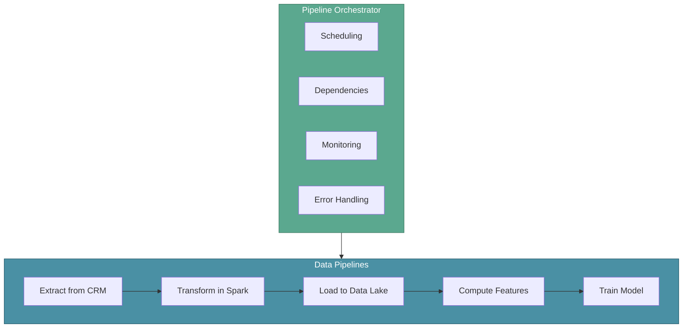
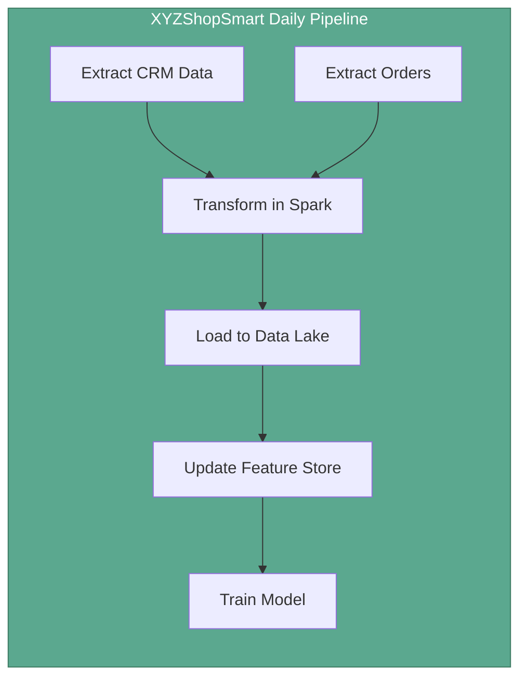

# Data Pipeline Orchestration

In the previous section, we explored Feature Stores and how they solve data serving challenges for ML inference. Now let's understand **Data Pipeline Orchestration**—the practice of automating, scheduling, and managing complex data workflows that power ML systems.

As ML systems grow, they involve multiple interconnected data pipelines: ETL jobs feeding Data Lakes, streaming processes updating Feature Stores, and batch jobs preparing training datasets. Managing these pipelines manually becomes unsustainable. Orchestration tools like Apache Airflow and Prefect automate this complexity, ensuring pipelines run reliably and in the correct order.

:::tip Key Insight
Orchestration is not just about scheduling—it's about defining dependencies, handling failures, and providing visibility into complex data workflows that span multiple systems.
:::

---

## XYZShopSmart: The Pipeline Chaos

XYZShopSmart's data infrastructure had grown organically. Sonu's team ran multiple pipelines: an ETL job extracting data from the CRM, a Spark job transforming purchase history, a script loading data into the Data Lake, and a training job that depended on all of them completing successfully. Initially, they scheduled these using cron jobs on different servers.

The problems became apparent quickly. The training job would fail silently because the ETL hadn't finished. When the Spark job failed at 2 AM, no one noticed until morning. Backfilling data after an outage required manually running scripts in the correct order. The team spent more time debugging pipeline failures than building ML features.

They needed a centralized way to define pipeline dependencies, monitor execution, and handle failures gracefully.

---

## Why Pipeline Orchestration Matters

Data pipelines in ML systems rarely operate in isolation. They form directed acyclic graphs (DAGs) of dependent tasks:

- ETL extracts raw data before transformation can begin
- Feature engineering depends on cleaned, transformed data
- Model training requires completed feature pipelines
- Model deployment waits for successful training and validation

Without orchestration, teams face common challenges:

- **Pipeline setup complexity**: Defining all pipelines and their relationships in one place
- **Monitoring gaps**: No single dashboard to track all pipeline executions
- **Backfill difficulties**: Manually re-running failed pipelines with correct dependencies
- **Dependency management**: Ensuring downstream tasks wait for upstream completion

An orchestrator manages the entire workflow—scheduling tasks, tracking dependencies, monitoring progress, and handling failures automatically.

---

## Key Benefits of Pipeline Orchestration

Pipeline orchestration transforms chaotic manual processes into reliable automated workflows:

1. **Automated Task Scheduling and Dependencies**: Define when tasks run and what they depend on, eliminating manual coordination
2. **Robust Error Handling and Retries**: Built-in mechanisms catch failures and retry automatically, reducing 2 AM wake-up calls
3. **Scalable, Parallel Processing**: Execute independent tasks concurrently, reducing total pipeline runtime
4. **Monitoring and Logging for Visibility**: Real-time dashboards track execution status and detailed logs aid debugging
5. **Seamless System Integration**: Connect to databases, cloud services, APIs, and data platforms through extensible operators

---

## Apache Airflow

Apache Airflow is an open-source platform for programmatically authoring, scheduling, and monitoring workflows. Originally developed at Airbnb, it has become the industry standard for data pipeline orchestration.

### How Airflow Works

Airflow represents workflows as **Directed Acyclic Graphs (DAGs)**—Python code that defines tasks and their dependencies. The scheduler triggers tasks based on time intervals or external events, while the executor runs tasks on workers.

| Component | Purpose |
|-----------|---------|
| **DAG** | Python file defining the workflow structure and task dependencies |
| **Task** | A single unit of work (e.g., run a Spark job, execute SQL) |
| **Operator** | Template for common task types (BashOperator, PythonOperator, SparkOperator) |
| **Scheduler** | Monitors DAGs and triggers task execution based on schedules |
| **Executor** | Runs tasks on workers (local, Celery, Kubernetes) |
| **Web UI** | Dashboard for monitoring, triggering, and debugging workflows |

### Airflow Capabilities

- **Workflow Orchestration**: Define complex multi-step workflows with branching, conditionals, and dynamic task generation
- **Task Scheduling and Dependency Management**: Schedule by time or events, with automatic dependency resolution
- **Scalability and Performance**: Scales horizontally with distributed executors handling large workloads
- **Extensibility and Integration**: Hundreds of pre-built operators connect to AWS, GCP, databases, and ML platforms
- **Monitoring and Logging**: Web interface provides real-time visibility into task status, logs, and execution history
- **Error Handling and Retry Mechanisms**: Configurable retries, timeouts, and alerting for failed tasks
- **Community Support and Documentation**: Large, active community with extensive documentation and third-party integrations
- **Wide Industry Adoption**: Mature platform trusted by thousands of organizations for production workloads

---

## Prefect

Prefect is a modern workflow orchestration platform designed for data-intensive applications. It offers a more Pythonic approach to workflow definition and handles dynamic, data-dependent workflows more naturally than traditional DAG-based systems.

### How Prefect Works

Prefect uses Python decorators to transform regular functions into workflow tasks. Flows define the overall workflow, while tasks represent individual units of work. The Prefect server (or cloud service) handles scheduling, monitoring, and execution.

| Component | Purpose |
|-----------|---------|
| **Flow** | Python function decorated with `@flow` that defines the workflow |
| **Task** | Python function decorated with `@task` representing a unit of work |
| **Deployment** | Configuration for scheduling and running flows in production |
| **Work Pool** | Infrastructure for executing flows (local, Docker, Kubernetes) |
| **Server/Cloud** | Central orchestration layer for monitoring and scheduling |

### Prefect Capabilities

- **Workflow Orchestration**: Native Python workflows with automatic dependency inference from function calls
- **Task Scheduling and Dependency Management**: Schedule flows with flexible triggers and automatic task ordering
- **Scalability and Performance**: Scales horizontally with distributed work pools for parallel execution
- **Extensibility and Integration**: Integrations with major cloud providers, databases, and data tools
- **Monitoring and Logging**: Modern dashboard with real-time execution tracking and detailed task logs
- **Error Handling and Retry Mechanisms**: Configurable retries, caching, and state handlers for resilient workflows
- **Community Support and Documentation**: Growing community with comprehensive documentation and examples
- **Modern Approach and Ease of Use**: Python-native design reduces boilerplate and simplifies workflow development

---

## Airflow vs Prefect: Choosing the Right Tool

Both tools solve pipeline orchestration, but they differ in approach:

| Factor | Apache Airflow | Prefect |
|--------|----------------|---------|
| **Workflow Definition** | DAGs defined in Python files | Python decorators on functions |
| **Dynamic Workflows** | Requires workarounds for runtime-dependent tasks | Native support for dynamic task generation |
| **Learning Curve** | Steeper, more concepts to learn | Gentler, feels like regular Python |
| **Maturity** | Battle-tested since 2014 | Modern design, newer ecosystem |
| **Deployment** | Self-hosted or managed (Astronomer, MWAA) | Self-hosted or Prefect Cloud |
| **Best For** | Complex, stable production pipelines | Flexible, data-dependent workflows |

For XYZShopSmart, Airflow's maturity and extensive operator library made it suitable for their established ETL pipelines, while Prefect's simpler approach appealed to the ML team for experimentation workflows.

---

## XYZShopSmart's Orchestration Implementation

XYZShopSmart implemented Apache Airflow to manage their data pipelines:

1. **DAG Definition**: The team defined a main DAG with tasks for CRM extraction, Spark transformation, Data Lake loading, and feature computation
2. **Dependency Setup**: Tasks specify upstream dependencies, ensuring the training job waits for feature computation
3. **Scheduling Configuration**: The DAG runs daily at midnight, with hourly incremental updates during business hours
4. **Retry Policies**: Failed tasks automatically retry three times with exponential backoff before alerting
5. **Backfill Capability**: When the CRM was offline for maintenance, backfilling two days of data required a single command
6. **Monitoring Dashboard**: The team monitors all pipelines from one interface, with Slack alerts for failures
7. **Resource Management**: Spark jobs run on larger worker instances while lightweight tasks use standard workers

With orchestration in place, the team shifted from firefighting pipeline failures to proactively improving data quality.

---

## Common Mistakes

- **Over-engineering simple workflows**: Not every script needs a full orchestration platform; start simple and add complexity as needed
- **Ignoring idempotency**: Tasks should produce the same result when re-run, enabling safe retries and backfills
- **Tight coupling between tasks**: Passing large data between tasks instead of using external storage creates bottlenecks
- **Skipping alerting configuration**: Orchestration without notifications means failures still go unnoticed
- **Underestimating resource requirements**: Scheduler and worker processes need adequate compute resources to avoid becoming bottlenecks

---

## Key Takeaways

- **Pipeline orchestration automates complex data workflows.** Instead of manual coordination, orchestrators handle scheduling, dependencies, and execution across interconnected pipelines.

- **Apache Airflow provides mature, production-grade orchestration.** With extensive operators, strong community support, and wide industry adoption, it handles complex workflows at scale.

- **Prefect offers a modern, Python-native approach.** Its simpler design and native support for dynamic workflows appeal to teams wanting less boilerplate.

- **Both tools provide essential capabilities.** Error handling, monitoring, scalability, and system integration transform unreliable pipelines into robust data infrastructure.

---

## What's Next

With orchestration managing pipeline execution, XYZShopSmart has reliable, automated data workflows feeding their ML systems. However, tracking changes to datasets over time—understanding what data trained which model and reproducing past results—requires dedicated data versioning strategies.

:::info Up Next
We'll explore **Data Versioning and Management**—understanding how to track data changes, maintain reproducibility, and manage datasets throughout the ML model lifecycle.
:::
