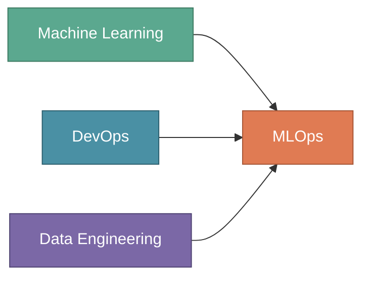
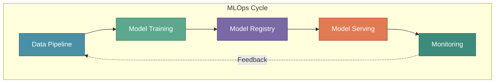

# Getting Started with MLOps

Every Data Scientist eventually faces the same question: "My model works great in Jupyter — how do I get it to production?" This question marks the boundary between experimental ML and production ML. **MLOps** is the discipline that bridges this gap.

This tutorial series will take you from understanding what MLOps is to building production-ready ML systems. We'll follow a real-world project at XYZShopSmart, an e-commerce platform, as they build and deploy a recommendation system from scratch.

:::tip Key Insight
MLOps isn't just about deploying models — it's about building systems that continuously learn, adapt, and deliver value. The difference between a successful ML project and a failed one often comes down to operational practices, not model sophistication.
:::

---

## The Problem: Models That Never Leave Notebooks

Consider what happens at most organizations. A Data Scientist spends weeks building a model that achieves impressive accuracy on test data. Stakeholders are excited. But then reality sets in.

The model was trained in a Jupyter notebook on the Data Scientist's laptop. It uses packages with version conflicts. The training data was manually downloaded and preprocessed. Nobody documented which features matter or how to reproduce the results. When asked to deploy it, the team discovers there's no clear path from notebook to production.

This scenario repeats across the industry. Research suggests that only 20% of ML models ever reach production. The remaining 80% stay trapped in notebooks, delivering no business value despite the time and resources invested in building them.

The problem isn't the models — it's the absence of systematic practices for deploying and maintaining them. This is exactly what MLOps addresses.

---

## What is MLOps?

**MLOps (Machine Learning Operations)** is a set of practices that combines Machine Learning, DevOps, and Data Engineering to deploy and maintain ML systems in production reliably and efficiently.

Think of MLOps as the operational backbone that transforms experimental models into production services. Just as DevOps revolutionized software delivery by bridging development and operations, MLOps brings the same transformation to machine learning.

MLOps enables organizations to:

- **Deploy models reliably** through automated pipelines that handle packaging, testing, and rollout
- **Version everything** including data, code, models, and configurations for complete reproducibility
- **Monitor continuously** tracking model performance, data drift, and system health in production
- **Retrain automatically** when performance degrades or new data becomes available
- **Scale infrastructure** to handle variable workloads without manual intervention

---

## Why MLOps Matters

Traditional software engineering solved the deployment problem decades ago. CI/CD pipelines, automated testing, and infrastructure-as-code transformed how teams ship software. But machine learning introduces new challenges that traditional DevOps practices don't fully address.

**Models depend on data, not just code.** A code change is explicit and version-controlled. Data changes are often implicit, continuous, and difficult to track. The same model code trained on different data produces different behavior. Without proper data versioning and validation, you can't reproduce or debug production issues.

**Model performance degrades silently.** Unlike application bugs that crash immediately, model accuracy erodes gradually. User behavior shifts. Product catalogs change. Seasonality affects patterns. Without continuous monitoring, you discover problems only when business metrics decline — often weeks after the degradation began.

**Experiments must become reproducible systems.** Data Scientists optimize for learning and iteration. They try hundreds of experiments quickly. But production systems require reproducibility, reliability, and maintainability. The gap between experimental code and production code is substantial.

**The feedback loop is complex.** Improving a traditional application is straightforward: identify bugs, fix code, deploy updates. Improving an ML system requires understanding whether problems stem from the model architecture, training data, feature engineering, or shifting user behavior. The debugging surface is much larger.

MLOps provides the practices, tools, and culture to address each of these challenges systematically.

---

## Core Components of MLOps

MLOps encompasses five interconnected components. Each addresses a specific aspect of the ML lifecycle, and together they form a complete system for production ML.

### Data Pipeline

Every ML system begins with data. The Data Pipeline manages the flow of information from raw sources through processing to the formats required for training and serving.

**Data ingestion** collects information from databases, APIs, streaming systems, and files. **Data validation** ensures quality by checking for missing values, schema changes, and statistical anomalies. **Data transformation** converts raw data into features suitable for model training. **Data versioning** tracks changes over time, enabling reproducibility and debugging.

Without reliable data pipelines, models train on stale, incomplete, or incorrect data. The "garbage in, garbage out" principle applies with full force — no amount of model sophistication can overcome data quality issues.

### Model Training

Model Training automates the process of building and improving ML models. This component transforms data and algorithms into trained model artifacts.

**Experiment tracking** records hyperparameters, metrics, and artifacts for every training run. **Hyperparameter optimization** systematically searches for the best model configurations. **Distributed training** scales computation across multiple machines for large models. **Reproducibility** ensures that any experiment can be recreated exactly.

Automated training pipelines enable teams to iterate quickly while maintaining the rigor needed for production systems. When new data arrives or performance degrades, retraining can happen automatically.

### Model Registry

The Model Registry serves as version control for ML models. It tracks every model version with complete metadata about its origin and performance.

**Model versioning** assigns unique identifiers to each trained model. **Metadata tracking** records training data, hyperparameters, evaluation metrics, and lineage. **Stage management** tracks models through development, staging, and production phases. **Artifact storage** preserves model files for deployment and rollback.

The Model Registry answers critical questions: Which model is running in production? What data was it trained on? How does it compare to previous versions? This visibility is essential for governance, debugging, and continuous improvement.

### Model Serving

Model Serving deploys trained models to handle prediction requests. This component bridges the gap between offline training and online inference.

**Containerization** packages models with their dependencies for consistent deployment. **Scaling** adjusts compute resources based on request volume. **Latency optimization** ensures predictions return quickly enough for user-facing applications. **Deployment strategies** like canary releases and A/B testing enable safe rollouts.

Serving infrastructure must handle production realities: traffic spikes, hardware failures, and the need for zero-downtime deployments. Good serving systems make these challenges manageable.

### Monitoring

Monitoring tracks the health of ML systems in production. Unlike traditional applications, ML systems require monitoring at multiple levels.

**System metrics** track latency, throughput, error rates, and resource utilization. **Model metrics** track prediction accuracy, confidence distributions, and business outcomes. **Data metrics** track input distributions to detect drift from training data. **Alerting** notifies teams when metrics cross thresholds requiring attention.

Monitoring closes the feedback loop. Without visibility into production behavior, teams operate blind. With comprehensive monitoring, they can detect problems early, understand root causes, and continuously improve.

---

## How Components Work Together

These five components don't operate in isolation. They form an integrated system where each component's output feeds the next, creating a continuous cycle of improvement.

At XYZShopSmart, this cycle operates continuously for their recommendation system:

1. **Data Pipeline** ingests user behavior events from Kafka, validates them, and generates features stored in Feast
2. **Model Training** runs weekly on the latest features, logging experiments to MLflow
3. **Model Registry** stores validated models with complete lineage information
4. **Model Serving** deploys approved models to Kubernetes via Seldon Core
5. **Monitoring** tracks recommendation click-through rates and detects data drift
6. When monitoring identifies degradation, it triggers a new cycle starting with data validation

This continuous loop enables the system to adapt to changing user behavior without manual intervention. The infrastructure handles routine maintenance while the team focuses on improvements.

---

## Common Mistakes to Avoid

**Treating deployment as a one-time event** ignores the reality that models require ongoing maintenance. Plan for continuous monitoring, retraining, and improvement from the start.

**Skipping data versioning** makes debugging production issues nearly impossible. When a model misbehaves, you need to know exactly what data it trained on.

**Ignoring the gap between training and serving** leads to subtle bugs. Features computed differently at training and inference time cause training-serving skew that degrades accuracy.

**Monitoring only system metrics** misses model-specific problems. A service can be healthy by traditional metrics while serving increasingly poor predictions.

**Over-engineering initial deployments** delays value delivery. Start with simple, working systems and add sophistication as needs become clear.

**Underestimating data pipeline complexity** focuses attention on models while neglecting the data that powers them. Data pipelines often have more failure modes than models themselves.

---

## Key Takeaways

**MLOps bridges experimental and production ML.** The practices, tools, and culture of MLOps transform promising notebook experiments into reliable production systems that deliver business value.

**Five components form the foundation.** Data Pipelines, Model Training, Model Registry, Model Serving, and Monitoring work together as an integrated system. Each component addresses specific challenges while enabling the others.

**Continuous operation is essential.** Unlike traditional software that changes only when developers modify code, ML systems must continuously adapt to changing data and user behavior. MLOps provides the infrastructure for this continuous operation.

**Start simple and iterate.** The goal isn't to implement every practice immediately. Begin with basic automation, add monitoring, then layer in sophistication as your needs grow and your team gains experience.

---

## What's Next?

Understanding MLOps concepts is the foundation, but great systems are built by great teams. A successful Machine Learning project isn't just about algorithms and data — it's about **people working together** toward a common goal.

In the next section, we'll explore the human side of MLOps by introducing the key roles in an ML team. You'll meet the four pillars of a successful ML organization and follow XYZShopSmart as they assemble the team that will build their recommendation system.

:::info Up Next
In the next section, we'll meet the **four pillars of an ML team** — Product, Data Science, Data Engineering, and MLOps — and follow XYZShopSmart as they structure their organization for success.
:::
