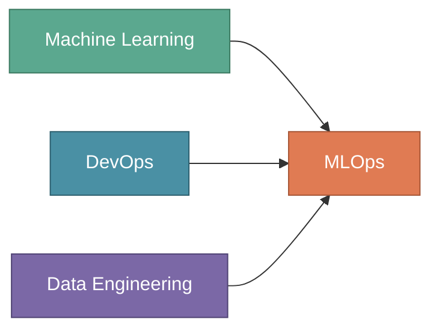
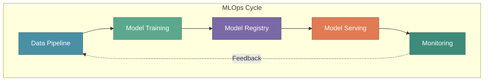

# Getting Started

Every Data Scientist eventually faces the same question: "My model works great in Jupyter — how do I get it to production?" **MLOps** is the discipline that bridges this gap.

This tutorial series will take you from understanding MLOps to building production-ready ML systems, following XYZShopSmart as they build a recommendation system.

:::tip Key Insight
MLOps isn't just about deploying models — it's about building systems that continuously learn, adapt, and deliver value.
:::

---

## The Problem: Models That Never Leave Notebooks

A Data Scientist spends weeks building a model with impressive accuracy. But the model lives in a Jupyter notebook with version conflicts, manually downloaded data, and no documentation. When deployment time comes, there's no clear path forward.

Research suggests only 20% of ML models reach production. The remaining 80% stay trapped in notebooks. The problem isn't the models — it's the absence of systematic practices for deploying and maintaining them.

---

## What is MLOps?

**MLOps (Machine Learning Operations)** combines Machine Learning, DevOps, and Data Engineering to deploy and maintain ML systems in production reliably.

MLOps enables organizations to:

- **Deploy models reliably** through automated pipelines
- **Version everything** — data, code, models, and configurations
- **Monitor continuously** — tracking performance and data drift
- **Retrain automatically** when performance degrades
- **Scale infrastructure** to handle variable workloads

---

## Why MLOps Matters

Traditional DevOps solved software deployment decades ago. But ML introduces challenges that traditional practices don't fully address:

**Models depend on data, not just code.** Data changes are implicit and continuous. The same code trained on different data produces different behavior. Without data versioning, you can't reproduce or debug issues.

**Model performance degrades silently.** Unlike bugs that crash immediately, accuracy erodes gradually as user behavior shifts. Without monitoring, you discover problems weeks after they begin.

**Experiments must become reproducible systems.** Data Scientists optimize for quick iteration. Production requires reproducibility and maintainability. The gap is substantial.

**The feedback loop is complex.** Problems may stem from model architecture, training data, feature engineering, or shifting behavior. The debugging surface is much larger than traditional software.

---

## Core Components of MLOps

MLOps encompasses five interconnected components that form a complete system for production ML.

### Data Pipeline

Manages data flow from raw sources through processing. **Data ingestion** collects from databases and APIs. **Data validation** checks for quality issues. **Data transformation** creates training-ready features. **Data versioning** enables reproducibility.

### Model Training

Automates building and improving models. **Experiment tracking** records hyperparameters and metrics. **Hyperparameter optimization** searches for best configurations. **Distributed training** scales across machines. **Reproducibility** ensures experiments can be recreated.

### Model Registry

Version control for ML models. **Model versioning** assigns unique identifiers. **Metadata tracking** records lineage and metrics. **Stage management** tracks models through dev, staging, and production. **Artifact storage** preserves files for deployment and rollback.

### Model Serving

Deploys models to handle predictions. **Containerization** packages models consistently. **Scaling** adjusts resources based on demand. **Latency optimization** ensures fast responses. **Deployment strategies** like canary releases enable safe rollouts.

### Monitoring

Tracks ML system health at multiple levels. **System metrics** cover latency and throughput. **Model metrics** track accuracy and outcomes. **Data metrics** detect distribution drift. **Alerting** notifies teams of issues.

---

## How Components Work Together

These components form an integrated cycle where each output feeds the next.

At XYZShopSmart, this cycle operates continuously:

1. **Data Pipeline** ingests user events from Kafka, validates them, and stores features in Feast
2. **Model Training** runs weekly, logging experiments to MLflow
3. **Model Registry** stores validated models with lineage information
4. **Model Serving** deploys to Kubernetes via Seldon Core
5. **Monitoring** tracks click-through rates and detects drift
6. When degradation occurs, a new cycle triggers automatically

---

## Common Mistakes to Avoid

- **Treating deployment as one-time** — plan for continuous monitoring and retraining
- **Skipping data versioning** — makes debugging production issues impossible
- **Ignoring training-serving skew** — features computed differently cause accuracy loss
- **Monitoring only system metrics** — miss model-specific problems
- **Over-engineering initially** — start simple, add sophistication as needed

---

## Key Takeaways

**MLOps bridges experimental and production ML.** It transforms notebook experiments into reliable production systems.

**Five components form the foundation.** Data Pipelines, Model Training, Model Registry, Model Serving, and Monitoring work together as an integrated system.

**Continuous operation is essential.** ML systems must adapt to changing data and behavior. MLOps provides the infrastructure for this.

**Start simple and iterate.** Begin with basic automation, add monitoring, then layer in sophistication as needs grow.

---

## What's Next?

Great systems are built by great teams. In the next section, we'll explore the key roles in an ML team and follow XYZShopSmart as they assemble their team.

:::info Up Next
We'll meet the **four pillars of an ML team** — Product, Data Science, Data Engineering, and MLOps — and see how XYZShopSmart structures their organization for success.
:::
