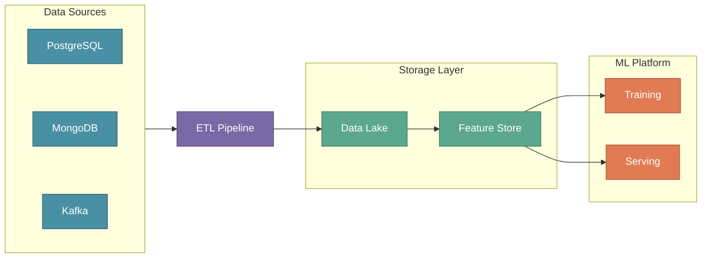
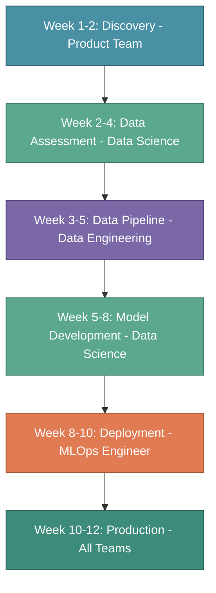

# Building an ML Engineering Team

In the previous section, we explored what MLOps is and why it matters. But great systems are built by great teams. A successful Machine Learning project isn't just about algorithms and data — it's about **people working together** toward a common goal.

Understanding team structure is essential because most ML projects fail not due to technical limitations, but due to organizational gaps. Without clear ownership, smooth handoffs, and effective collaboration, even the most sophisticated models never reach production.

:::tip Key Insight
Machine Learning is a team sport. The most successful ML projects are those where Product, Data Science, Data Engineering, and MLOps work as a unified team with shared goals and clear responsibilities.
:::

---

## Introducing XYZShopSmart: Our Running Example

Throughout this tutorial series, we'll follow **XYZShopSmart** — an e-commerce platform serving 5 million active customers. Their users are abandoning shopping carts at alarming rates because they struggle to find relevant products. The solution? Build a product recommendation system that increases conversion rate by 15% and average order value by 20%.

We'll trace XYZShopSmart's journey from business problem to production ML system across all tutorials. Each team role will be illustrated through their specific contributions to this real-world scenario, making abstract concepts tangible and actionable.

---

## Why Team Structure Matters

When XYZShopSmart first attempted to build a recommendation system, the project stalled for months. A data scientist built a promising model in a notebook, but nobody knew how to deploy it. The data engineer built pipelines, but they didn't match the features the model needed. The product manager kept asking for status updates but couldn't get clear answers about when users would see recommendations.

The problem wasn't technical skill — it was organizational structure. Without defined roles, clear handoffs, and shared understanding, the team operated in silos. Each person optimized for their own work without considering how the pieces fit together.

ML projects commonly fail due to three organizational gaps:

**Lack of clear ownership** leaves critical tasks unassigned. When nobody is responsible for model deployment, it doesn't happen. When nobody owns data quality, models train on garbage. Ambiguous ownership leads to dropped balls and finger-pointing.

**Poor communication between teams** creates misalignment. Technical teams build what they think is needed rather than what the business actually needs. Product teams set unrealistic expectations without understanding technical constraints. The gap between what's built and what's needed widens with each sprint.

**Missing expertise in critical areas** creates bottlenecks. A team with strong data science but weak infrastructure skills can build models that never reach production. A team with strong engineering but weak domain expertise builds systems that solve the wrong problems.

A well-structured ML team addresses each of these gaps through clear responsibilities, defined handoffs, and complementary expertise.

---

## The Four Pillars of an ML Team

Every successful ML project requires four key teams working together. Each team answers a different fundamental question, and together they transform business problems into production ML systems.

**The Product Team** defines WHAT to build and WHY it matters. They translate business objectives into technical requirements and ensure the project delivers measurable value. Their key question: "What problem are we solving?"

**The Data Science Team** figures out HOW to solve the problem using ML. They explore data, design experiments, and build models that address the business need. Their key question: "Which ML approach works best?"

**The Data Engineering Team** builds the data infrastructure that powers everything. They ensure clean, reliable data flows to training pipelines and serving systems. Their key question: "How do we get the right data where it needs to be?"

**The MLOps Engineer** deploys and maintains models in production. They bridge the gap between notebook experiments and reliable production systems. Their key question: "How do we run this reliably at scale?"

Let's examine how each team contributes to XYZShopSmart's recommendation system.

---

## Product Team

The Product Team serves as the bridge between business strategy and technical execution. They don't write code, but their work determines whether the ML project solves a real problem worth solving.

### Core Responsibilities

**Identifying use cases** requires understanding which business problems are suitable for ML solutions. Not every problem needs machine learning, and pursuing the wrong use cases wastes resources. The Product Team evaluates potential projects based on data availability, business impact, and technical feasibility.

**Setting business goals** translates vague aspirations into measurable success criteria. "Make the app smarter" means nothing; "Increase conversion rate by 15% within six months" provides a clear target. These metrics guide every technical decision and determine whether the project succeeds.

**Establishing milestones** creates realistic timelines and intermediate checkpoints. ML projects are inherently uncertain, so milestones must balance ambition with pragmatism. Regular checkpoints ensure the team stays on track and can course-correct when needed.

### How It Works at XYZShopSmart

The Product Manager at XYZShopSmart began by analyzing business data and customer feedback. Cart abandonment rates had climbed to 68%, significantly above industry average. User feedback consistently mentioned difficulty finding relevant products. These signals pointed to a clear opportunity.

Rather than immediately requesting a recommendation system, the Product Manager first validated the opportunity. Analysis showed that users who engaged with the existing "Popular Products" section converted at 3.2x the average rate. This suggested that better product discovery could meaningfully impact conversion.

The Product Manager then defined specific, measurable goals:

- Increase conversion rate from 2.3% to 2.65% (a 15% improvement) within six months
- Increase average order value from $45 to $54 (a 20% improvement) within six months
- Increase click-through rate on product suggestions from 1.2 to 2.5 per session within three months

These goals anchored every subsequent technical decision. When the Data Science team proposed complex deep learning models, the Product Manager pushed back — the simpler collaborative filtering approach could ship faster and still hit the targets. When engineering wanted to delay for infrastructure improvements, the Product Manager negotiated a phased rollout that delivered value earlier.

The project timeline reflected this pragmatic approach:

1. **MVP (Weeks 1-4)**: Basic recommendation model deployed to the homepage only
2. **Beta (Weeks 5-8)**: A/B testing with 10% of users, measuring actual impact on metrics
3. **Production (Weeks 9-12)**: Full rollout to all users with continuous monitoring

This structure enabled early learning while managing risk. If the MVP underperformed, the team could adjust before investing in full deployment.

---

## Data Science Team

The Data Science Team transforms business requirements into ML solutions. They combine domain expertise, statistical knowledge, and programming skills to build models that address specific problems.

### Core Responsibilities

**Understanding business context** ensures the technical solution addresses the actual problem. Data scientists who build models without understanding the business often optimize for the wrong metrics. Close collaboration with the Product Team prevents this misalignment.

**Exploring and validating data** determines whether the required information exists and whether it's suitable for modeling. Data quality issues caught early save months of wasted effort. This assessment often reveals gaps that require Data Engineering support.

**Selecting and building models** applies appropriate ML techniques to the problem. The best data scientists start simple and add complexity only when needed. They understand that a deployed simple model outperforms an abandoned complex one.

### How It Works at XYZShopSmart

The Data Science team at XYZShopSmart began with a requirements session alongside the Product Manager. This conversation surfaced critical constraints that shaped every modeling decision.

The team learned that recommendations must load in under 100 milliseconds to avoid degrading user experience. They learned the system must handle 5 million users and 500,000 products. They learned that the business prioritized conversion rate improvements over click-through rate gains. Each constraint eliminated certain approaches and favored others.

Next came data assessment — the critical question of whether the required information existed. The team audited available data sources:

**User purchase history** included three years of data covering 50 million transactions. This rich history could power collaborative filtering approaches that identify patterns in user behavior.

**Product catalog** contained 500,000 products with category hierarchies, attributes, and descriptions. This structured data enabled content-based filtering that could handle new products without purchase history.

**User browsing behavior** captured clickstream data showing which products users viewed, how long they spent on each page, and what sequences they followed. This implicit feedback complemented explicit purchase signals.

**User profiles** included demographic information and stated preferences. While less predictive than behavioral data, this information could help personalize recommendations for users with limited history.

**User review sentiment** was notably absent. The team flagged this gap to Data Engineering as a future enhancement opportunity, but proceeded without it for the MVP.

With data assessed, the team evaluated modeling approaches. Collaborative filtering offered a strong baseline — fast to implement and proven effective for e-commerce recommendations. Content-based filtering would help with new products that lacked purchase history. Deep learning approaches promised better accuracy but required more compute and longer development time.

The team recommended starting with collaborative filtering for the MVP. This approach could ship within the timeline, meet the latency requirements, and likely achieve the business targets. If results warranted, they would add complexity in subsequent phases.

---

## Data Engineering Team

The Data Engineering Team builds and maintains the infrastructure that makes ML possible. Without reliable data pipelines, feature stores, and data quality processes, even the best models fail in production.

### Core Responsibilities

**Gathering data** from diverse sources requires understanding where information lives and how to access it reliably. Enterprise data often spans multiple databases, streaming systems, and external services. The Data Engineering team creates unified access to these disparate sources.

**Building ETL pipelines** transforms raw data into formats suitable for ML training and serving. These pipelines must handle data validation, transformation, deduplication, and loading. They run on schedules or respond to events, ensuring fresh data reaches the ML system.

**Maintaining the data lakehouse** provides organized storage for raw and processed data. The lakehouse architecture combines the flexibility of data lakes with the reliability of data warehouses. This foundation supports both experimentation and production workloads.

**Enabling real-time data** sets up streaming infrastructure for features that require low-latency updates. Some models need features computed from events that happened seconds ago. The Data Engineering team builds the streaming systems that make this possible.

### How It Works at XYZShopSmart

The Data Engineering team at XYZShopSmart faced the challenge of unifying data from four distinct sources, each with different characteristics and update patterns.

**The Orders Database** in PostgreSQL contained the historical purchase data essential for collaborative filtering. The team implemented daily batch extraction, loading transactions into the data lake while preserving referential integrity and handling schema evolution.

**The Event Stream** in Kafka captured real-time user interactions — clicks, page views, add-to-cart events, and searches. This high-volume stream (approximately 1,000 events per second) required careful handling to extract meaningful features without overwhelming downstream systems.

**The Product Service** in MongoDB held the product catalog with hierarchical categories and attributes. Hourly synchronization ensured the ML system saw new products promptly while minimizing load on the production database.

**The User Service** in PostgreSQL maintained user profiles and preferences. Daily batch extraction captured the relatively stable demographic and preference information.

The team designed a pipeline architecture that balanced freshness, reliability, and cost:

Beyond building pipelines, the team established data quality standards. Automated checks validated that data met expectations:

- Data freshness: Features must be no more than one hour old
- Data completeness: Less than 1% null values in critical fields
- Schema stability: Alerts when upstream schemas change unexpectedly
- Referential integrity: Foreign key relationships must resolve correctly

These quality gates prevented garbage data from reaching models. When violations occurred, the pipeline halted and alerted the team rather than propagating errors downstream.

---

## MLOps Engineer

The MLOps Engineer ensures ML models work in production — not just in notebooks. This role bridges the gap between Data Science experimentation and reliable, scalable production systems.

An MLOps Engineer is fundamentally a DevOps engineer with specialized expertise in ML workflows. They bring infrastructure, automation, and reliability practices to the unique challenges of deploying and maintaining ML systems.

### Core Responsibilities

**Deploying models** packages trained models and deploys them to serve predictions. This involves containerization, versioning, and configuring inference infrastructure. The goal is making deployment routine rather than heroic.

**Setting up infrastructure** builds the platform that supports ML workflows. Kubernetes clusters, model registries, feature stores, and monitoring stacks form the foundation. This infrastructure must be reliable, scalable, and cost-efficient.

**Building CI/CD pipelines** automates the path from code commit to production deployment. These pipelines handle training, validation, testing, and deployment with minimal manual intervention. Automation enables rapid iteration while maintaining quality.

**Monitoring and maintaining** tracks performance and responds to issues. Model accuracy degrades over time, data distributions shift, and systems fail. The MLOps Engineer establishes observability and responds proactively to problems.

### How It Works at XYZShopSmart

The MLOps Engineer at XYZShopSmart took the data science team's trained model and built the infrastructure required for production operation.

**Infrastructure setup** began with a Kubernetes cluster configured for both training and serving workloads. The team deployed a model registry using MLflow to version models with complete lineage information. A feature store using Feast ensured that training and serving used identical feature definitions. A monitoring stack with Prometheus and Grafana provided visibility into system and model health.

**Deployment strategy** followed a staged approach that minimized risk:

1. **Train**: Execute training pipeline on latest data with full reproducibility
2. **Validate**: Compare candidate model against baseline metrics, rejecting regressions
3. **Stage**: Deploy to staging environment for integration testing
4. **Canary**: Release to 10% of production traffic, monitoring for issues
5. **Rollout**: Gradual expansion to full production deployment
6. **Monitor**: Continuous tracking of latency, accuracy, and business metrics

**Key metrics monitored** reflected both system health and model effectiveness:

- Prediction latency (p99) targeting under 100 milliseconds
- Model accuracy maintaining above 60%
- Recommendation click rate exceeding 8%
- System uptime meeting 99.9% availability

These metrics drove alerting and informed when retraining was needed. When click rate dropped, it signaled model degradation before users complained.

---

## How Teams Collaborate

Successful ML projects require continuous collaboration rather than sequential handoffs. The XYZShopSmart teams worked together throughout the project, with overlapping phases and constant communication.

**Weeks 1-2** focused on discovery. The Product Team defined the use case and business goals. Data Science participated in these discussions to understand constraints. Data Engineering began inventorying available data sources.

**Weeks 2-4** centered on data assessment. Data Science evaluated data availability and quality. Data Engineering confirmed access to required sources and identified integration challenges. The Product Team refined requirements based on what was feasible.

**Weeks 3-5** prioritized data pipeline development. Data Engineering built ETL pipelines and the Feature Store. Data Science provided requirements for feature transformations. The MLOps Engineer began infrastructure planning.

**Weeks 5-8** emphasized model development. Data Science trained and validated models using the newly available feature pipelines. Data Engineering supported feature engineering iterations. The MLOps Engineer prepared deployment infrastructure.

**Weeks 8-10** concentrated on deployment. The MLOps Engineer containerized models and deployed to Kubernetes. Data Science validated that production predictions matched development results. Data Engineering monitored data pipeline performance under production load.

**Weeks 10-12** marked production operation. All teams participated in A/B testing analysis. The results showed an 18% conversion rate improvement, exceeding the 15% target. Continuous monitoring and improvement became the new normal.

This overlapping structure enabled rapid iteration. When Data Science needed different features, Data Engineering could respond quickly because they were already engaged. When deployment revealed issues, fixes flowed back through the pipeline without formal handoff ceremonies.

---

## Technology Stack Overview

XYZShopSmart's ML platform uses tools that we'll explore in depth throughout this tutorial series. Each component serves a specific purpose within the overall architecture:

**Data Storage** uses Delta Lake on S3 to store raw and processed data. The lakehouse architecture supports both batch analytics and streaming workloads while providing ACID transactions and time travel capabilities.

**Data Processing** combines Apache Spark for large-scale transformations with Apache Airflow for orchestration. Spark handles the heavy lifting of feature engineering while Airflow manages dependencies and scheduling.

**Streaming** uses Apache Kafka for real-time events. User interactions flow through Kafka to enable near-real-time feature updates and event-driven pipeline triggers.

**Feature Store** uses Feast to manage features for training and inference. Feast ensures that models train on the same features they receive during serving, eliminating training-serving skew.

**Experiment Tracking** uses MLflow to track experiments and model versions. Every training run records hyperparameters, metrics, and artifacts, enabling reproducibility and comparison.

**Model Serving** uses Seldon Core to deploy and scale models. Seldon provides advanced deployment patterns like canary releases and A/B testing out of the box.

**Infrastructure** runs on Kubernetes via Amazon EKS. Container orchestration enables consistent deployments across environments and automatic scaling based on demand.

**CI/CD** combines GitHub Actions for automation with ArgoCD for GitOps-based deployment. Code changes trigger automated pipelines that test, validate, and deploy without manual intervention.

**Monitoring** uses Prometheus for metrics collection and Grafana for visualization. Custom dashboards track both system health and model performance metrics.

---

## Common Mistakes to Avoid

**Starting without clear business goals** leads teams to build impressive technology that doesn't solve real problems. Ensure the Product Team defines measurable success criteria before Data Science writes a single line of code.

**Treating data as an afterthought** dooms projects before they start. Data Engineering must be involved early to assess feasibility and build reliable pipelines. Garbage in, garbage out applies especially to ML.

**Building in silos** creates handoff friction and misalignment. Teams that optimize locally often create global problems. Regular cross-team communication prevents integration surprises.

**Over-engineering the first version** delays value delivery and increases risk. Start with simple approaches that can ship quickly. Add complexity only when data proves it's needed.

**Underestimating MLOps complexity** treats deployment as a one-time event rather than an ongoing practice. Production ML requires continuous monitoring, retraining, and maintenance. Plan for this from the start.

**Ignoring feedback loops** prevents learning and improvement. Without mechanisms to measure production performance and feed insights back to development, teams can't know if their work is succeeding.

---

## Key Takeaways

**Team structure determines project success.** The four pillars — Product, Data Science, Data Engineering, and MLOps — each contribute essential capabilities. Missing any pillar creates gaps that ultimately cause failure. XYZShopSmart succeeded because they built a complete team with clear responsibilities.

**Start with business value.** The Product Team's work defining clear goals (15% conversion improvement) before any code was written focused every subsequent decision. Without measurable targets, teams optimize for the wrong things.

**Data is the foundation.** Data Engineering's pipelines and quality processes enabled everything that followed. The Data Science team could only build effective models because reliable data infrastructure existed. Invest early in data.

**Start simple and iterate.** XYZShopSmart began with collaborative filtering rather than deep learning. This pragmatic choice enabled faster delivery while still meeting business targets. Complexity can be added later if needed.

**Production requires MLOps.** Notebooks are not production systems. The MLOps Engineer's infrastructure, automation, and monitoring transformed a promising model into a reliable service. Plan for operations from day one.

---

## What's Next?

We've introduced the four pillars of an ML team, but the **MLOps Engineer** role deserves deeper exploration. This role sits at the intersection of multiple disciplines and is often the difference between models that stay in notebooks and models that deliver production value.

In the next section, we'll explore:

- The unique skills required for MLOps Engineers
- Core responsibilities across DevOps, ML, and Data Engineering
- Day-to-day tasks and challenges
- How XYZShopSmart's MLOps Engineer built production infrastructure

:::info Up Next
In the next section, we'll take a **deep dive into the MLOps Engineer role** — the critical bridge between Data Science and Operations that transforms notebooks into production systems.
:::
