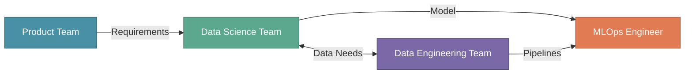
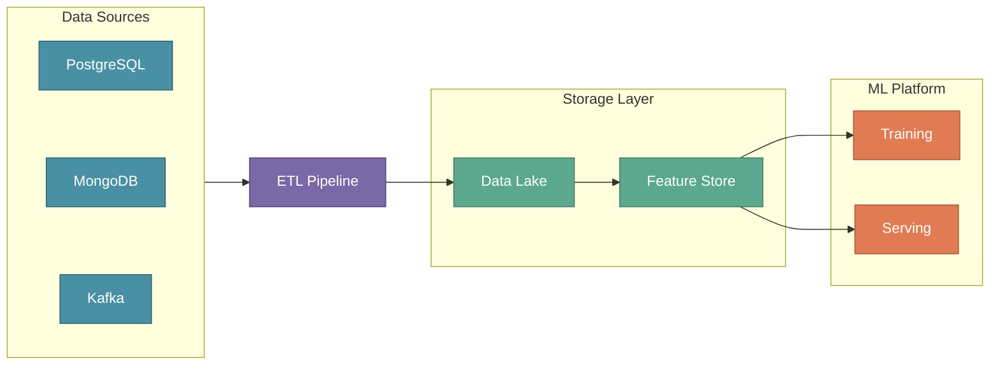
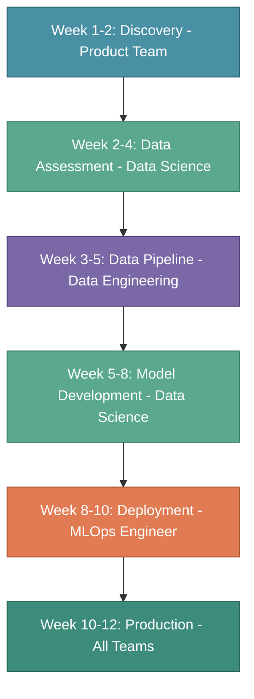

# Building an ML Engineering Team

A successful Machine Learning project isn't just about algorithms and data—it's about **people working together** toward a common goal. In this section, we'll explore the key roles in an ML engineering team and how they collaborate to deliver production ML systems.

---

## Our Running Example: XYZShopSmart

:::info Case Study
Throughout this tutorial series, we'll use **XYZShopSmart** as our running example to explain all MLOps concepts.

| Attribute | Details |
|-----------|---------|
| **Company** | XYZShopSmart — an e-commerce platform |
| **Users** | 5 million active customers |
| **Problem** | Users abandon carts because they can't find relevant products |
| **ML Solution** | Build a product recommendation system |
| **Business Goal** | Increase conversion rate by 15% and average order value by 20% |

We'll follow XYZShopSmart's journey from business problem to production ML system across all tutorials.
:::

---

## Why Team Structure Matters

Machine Learning projects often fail not because of technical limitations, but due to:

- ❌ Lack of clear ownership and accountability
- ❌ Poor communication between technical and business teams  
- ❌ Missing expertise in critical areas (data, infrastructure, or domain knowledge)

A well-structured ML team ensures smooth handoffs between stages and faster time-to-production.

---

## The Four Pillars of an ML Team

Every successful ML project requires four key teams working together:

**Team Roles at a Glance:**

| Team | Role | Key Question |
|------|------|--------------|
| **Product Team** | Define WHAT to build | What problem are we solving? |
| **Data Science Team** | Figure out HOW to solve | Which ML approach works best? |
| **Data Engineering Team** | Build data pipelines | How do we get clean data? |
| **MLOps Engineer** | Deploy & monitor | How do we run this in production? |

Let's see how each team contributes to XYZShopSmart's recommendation system.

---

## 1. Product Team

The **Product Team** is the bridge between business needs and technical solutions. They define *what* to build and *why* it matters.

### Key Responsibilities

| Responsibility | Description |
|----------------|-------------|
| **Identify Use Cases** | Find problems that ML can solve effectively |
| **Set Business Goals** | Define measurable success criteria |
| **Establish Milestones** | Create project timelines and KPIs |

### XYZShopSmart Example

The Product Manager at XYZShopSmart analyzes the business and identifies an opportunity:

**The Problem:**
> "Our users are abandoning carts at a 68% rate. User feedback shows they struggle to find relevant products. We need personalized recommendations."

**Business Goals Defined:**

| Metric | Current | Target | Timeline |
|--------|---------|--------|----------|
| Conversion Rate | 2.3% | 2.65% (+15%) | 6 months |
| Average Order Value | $45 | $54 (+20%) | 6 months |
| Click-through Rate | 1.2/session | 2.5/session | 3 months |

**Project Milestones:**

| Phase | Timeline | Deliverable |
|-------|----------|-------------|
| MVP | Week 1-4 | Basic recommendation model (homepage only) |
| Beta | Week 5-8 | A/B testing with 10% of users |
| Production | Week 9-12 | Full rollout to all users |

:::tip Key Insight
A well-defined use case with clear business metrics is **half the battle won**. Vague requirements like "make the app smarter" lead to project failure.
:::

---

## 2. Data Science Team

The **Data Science Team** figures out *how* to solve the business problem using ML. They explore data, build models, and validate solutions.

### Key Responsibilities

| Responsibility | Description |
|----------------|-------------|
| **Understand Business Context** | Learn the problem, constraints, and success criteria |
| **Explore & Validate Data** | Check if required data exists and assess its quality |
| **Select & Build Models** | Choose the right approach and train the model |

### XYZShopSmart Example

**Step 1: Understanding the Problem**

The Data Science team meets with Product to understand:

| Question | Answer |
|----------|--------|
| What problem are we solving? | Users can't discover relevant products → low conversion |
| What does success look like? | Higher click-through and conversion on recommendations |
| What are the constraints? | Recommendations must load in < 100ms (real-time) |
| Scale? | 5M users, 500K products, 50M monthly page views |

**Step 2: Data Assessment**

The critical question: *Do we have the data we need?*

| Data Required | Available? | Action |
|---------------|------------|--------|
| User purchase history | ✅ Yes (3 years, 50M transactions) | Proceed to modeling |
| Product catalog | ✅ Yes (500K products with categories) | Proceed to modeling |
| User browsing behavior | ✅ Yes (clickstream data) | Proceed to modeling |
| User profiles | ✅ Yes (demographics, preferences) | Proceed to modeling |
| User review sentiment | ❌ No | Request Data Engineering to collect |

**Step 3: Model Selection**

The team evaluates different approaches:

| Approach | When to Use | XYZShopSmart Decision |
|----------|-------------|----------------------|
| Collaborative Filtering | Good baseline, fast to implement | ✅ Use for MVP |
| Content-Based Filtering | Helps with new products | ✅ Add in Phase 2 |
| Deep Learning | Best accuracy, needs more compute | ⏳ Consider for Phase 3 |

**Decision:** Start simple with Collaborative Filtering for MVP, then iterate.

---

## 3. Data Engineering Team

The **Data Engineering Team** builds and maintains the data infrastructure. They ensure clean, reliable data flows to the ML models.

### Key Responsibilities

| Responsibility | Description |
|----------------|-------------|
| **Gather Data** | Collect data required by Data Scientists from various sources |
| **Build ETL Pipelines** | Create automated data transformation workflows |
| **Maintain Data Lakehouse** | Store and manage data for ML training |
| **Enable Real-time Data** | Set up streaming for online predictions |

### XYZShopSmart Example

**Data Sources to Connect:**

| Source | Data | Update Frequency |
|--------|------|------------------|
| Orders Database (PostgreSQL) | Purchase transactions | Daily batch |
| Event Stream (Kafka) | User clicks and browsing | Real-time |
| Product Service (MongoDB) | Product catalog | Hourly sync |
| User Service (PostgreSQL) | User profiles | Daily batch |

**Pipeline Architecture (High-Level):**

**Key Questions They Answer:**
- Is the data fresh? (< 1 hour old)
- Is the data quality acceptable? (< 1% null values)
- Are there any schema changes?

:::warning Common Pitfall
Data pipelines are often an afterthought. Without reliable data infrastructure, ML models are built on a shaky foundation. **Garbage in, garbage out.**
:::

---

## 4. MLOps Engineer

The **MLOps Engineer** ensures ML models work in production—not just in notebooks. They bridge the gap between Data Science and Operations.

> **An MLOps engineer is a seasoned DevOps engineer with expertise in fundamental DevOps tech stacks, extended with ML-specific knowledge.**

### Key Responsibilities

| Responsibility | Description |
|----------------|-------------|
| **Deploy Models** | Package and deploy models to production |
| **Set Up Infrastructure** | Build scalable, reliable ML platform |
| **Build CI/CD Pipelines** | Automate training, testing, and deployment |
| **Monitor & Maintain** | Track performance and retrain when needed |

### XYZShopSmart Example

**Infrastructure Setup:**

| Component | Purpose |
|-----------|---------|
| Kubernetes Cluster | Run training and serving workloads |
| Model Registry | Version control for ML models |
| Feature Store | Serve features for real-time predictions |
| Monitoring Stack | Track latency, accuracy, and drift |

**Deployment Strategy:**

| Stage | Description |
|-------|-------------|
| 1. Train | Train model on latest data |
| 2. Validate | Compare against baseline metrics |
| 3. Stage | Deploy to staging environment |
| 4. Canary | Release to 10% of users |
| 5. Rollout | Full production deployment |
| 6. Monitor | Track performance continuously |

**Key Metrics Monitored:**

| Metric | Target |
|--------|--------|
| Prediction Latency (p99) | < 100ms |
| Model Accuracy | > 60% |
| Recommendation Click Rate | > 8% |
| System Uptime | > 99.9% |

---

## How Teams Collaborate

Here's how XYZShopSmart's teams work together to deliver the recommendation system:

**Timeline Details:**

| Phase | Team | Key Activities |
|-------|------|----------------|
| Week 1-2 | Product Team | Define use case and business goals |
| Week 2-4 | Data Science | Assess data availability, identify gaps |
| Week 3-5 | Data Engineering | Build ETL pipelines and Feature Store |
| Week 5-8 | Data Science | Train model, achieve 68% accuracy |
| Week 8-10 | MLOps Engineer | Deploy to Kubernetes with auto-scaling |
| Week 10-12 | All Teams | A/B test shows +18% conversion |

---

## Tech Stack Overview

Here's the technology stack XYZShopSmart will use (we'll implement each component in later sections):

| Layer | Tools | Purpose |
|-------|-------|---------|
| **Data Storage** | Delta Lake, S3 | Store raw and processed data |
| **Data Processing** | Apache Spark, Airflow | ETL and orchestration |
| **Streaming** | Apache Kafka | Real-time events |
| **Feature Store** | Feast | Serve features for training and inference |
| **Experiment Tracking** | MLflow | Track experiments and model versions |
| **Model Serving** | Seldon Core | Deploy and scale models |
| **Infrastructure** | Kubernetes (EKS) | Container orchestration |
| **CI/CD** | GitHub Actions, ArgoCD | Automate deployments |
| **Monitoring** | Prometheus, Grafana | Observability and alerting |

---

## Key Takeaways

| Lesson | Description |
|--------|-------------|
| 🎯 **Start with Business Value** | XYZShopSmart defined clear goals (+15% conversion) before any code |
| 📊 **Data is the Foundation** | Without quality data pipelines, ML models fail |
| 🚀 **Start Simple, Iterate** | Begin with Collaborative Filtering, add complexity later |
| 🔧 **Production Needs MLOps** | Notebooks ≠ Production; infrastructure matters |
| 🤝 **Collaboration is Key** | No single team can deliver ML alone |

---

## What's Next?

In the upcoming sections, we'll dive deeper into each aspect of XYZShopSmart's ML journey:

| Section | Topic | What You'll Learn |
|---------|-------|-------------------|
| **Data Pipelines** | Building ETL for ML | How to build feature pipelines with Airflow and Spark |
| **Feature Store** | Feast Implementation | How to store and serve features for training and inference |
| **Model Training** | MLflow & Experiment Tracking | How to track experiments and version models |
| **Model Deployment** | Kubernetes & Seldon | How to deploy models at scale |
| **Monitoring** | Observability for ML | How to detect drift and maintain model health |

:::info Up Next
In the next section, we'll start building **XYZShopSmart's data pipeline** — the foundation for our recommendation system.
:::
