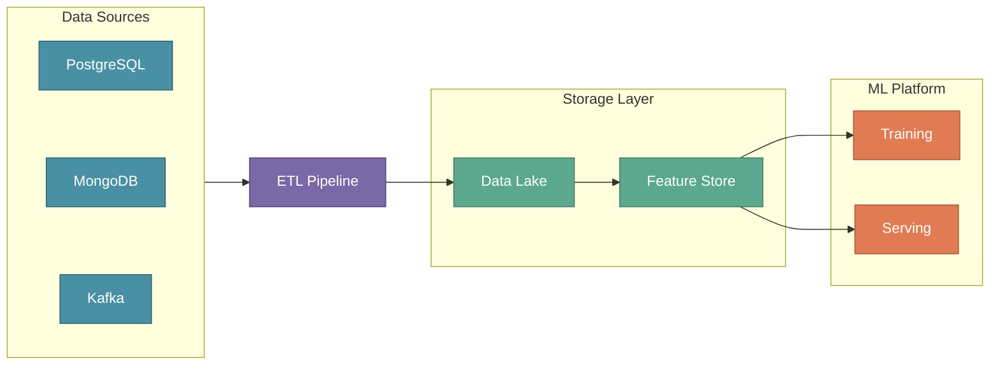

# Building an ML Engineering Team

In the previous section, we explored what MLOps is and why it matters. But great systems are built by great people. A successful ML project depends on teams working together toward shared goals.

Most ML projects fail due to organizational gaps, not technical limitations. Without clear ownership and smooth handoffs, even sophisticated models never reach production.

:::tip Key Insight
Machine Learning is a team sport. Product, Data Science, Data Engineering, and MLOps must work as a unified team with shared goals.
:::

---

## XYZShopSmart: The Challenge

XYZShopSmart, an e-commerce platform with 5 million customers, struggled with cart abandonment. Users left because they couldn't find relevant products. The goal was to build a recommendation system that increases conversion by 15% and order value by 20%.

Their first attempt stalled. A data scientist built a model in a notebook, but nobody knew how to deploy it. Pipelines didn't match the features needed. The problem wasn't skill — it was structure.

---

## The Four Pillars of an ML Team

Every ML project requires four teams working together:

**Product Team** defines what to build and why, translating business objectives into requirements. **Data Science Team** figures out how to solve the problem using ML, exploring data and building models. **Data Engineering Team** builds data infrastructure, ensuring clean and reliable data flows to training and serving systems. **MLOps Engineer** deploys and maintains models in production, bridging notebook experiments and reliable production systems.

---

## Product Team

The Product Team bridges business strategy and technical execution. They determine whether the ML project solves a real problem worth solving.

**Identifying use cases** means evaluating which problems suit ML based on data availability, impact, and feasibility. **Setting business goals** translates vague ideas into measurable targets. **Establishing milestones** creates realistic timelines with checkpoints for course correction.

### At XYZShopSmart

The Product Manager found cart abandonment at 68% — above industry average. Users who engaged with "Popular Products" converted at 3.2x the rate, validating the opportunity.

They defined clear targets: increase conversion from 2.3% to 2.65%, order value from $45 to $54, and click-through on suggestions from 1.2 to 2.5 per session within six months.

The timeline was pragmatic: MVP in weeks 1-4 with basic model on homepage, beta testing with 10% of users in weeks 5-8, and full production rollout with monitoring in weeks 9-12.

---

## Data Science Team

Data Scientists transform business requirements into ML solutions using domain expertise, statistics, and programming.

**Understanding business context** ensures solutions address actual problems. **Exploring and validating data** determines if required information exists and suits modeling. **Selecting and building models** applies appropriate ML techniques, starting simple and adding complexity only when needed.

### At XYZShopSmart

Maya and the team learned key constraints: recommendations must load in under 100ms for 5 million users and 500,000 products. Conversion rate mattered more than click-through.

They assessed available data: user purchase history with 50 million transactions over three years, product catalog with 500,000 items, browsing behavior capturing clicks and views, and user profiles with demographics and preferences.

The team chose collaborative filtering for the MVP — fast to implement, proven for e-commerce, and able to meet latency requirements.

---

## Data Engineering Team

Data Engineers build the infrastructure that makes ML possible. Without reliable pipelines and data quality processes, even the best models fail.

**Gathering data** creates unified access to diverse sources across databases and streaming systems. **Building ETL pipelines** transforms raw data into formats for training and serving. **Maintaining the data lakehouse** provides organized storage for experiments and production. **Enabling real-time data** sets up streaming for low-latency features.

### At XYZShopSmart

The team unified four sources: Orders Database (PostgreSQL) with daily batch extraction, Event Stream (Kafka) processing 1,000 events per second, Product Service (MongoDB) synced hourly, and User Service (PostgreSQL) with daily extraction.

Data quality gates validated freshness under 1 hour, completeness with less than 1% nulls, schema stability, and referential integrity.

---

## MLOps Engineer

The MLOps Engineer ensures ML models work in production. This role combines DevOps practices with specialized ML expertise.

**Deploying models** packages and versions trained models for inference. **Setting up infrastructure** builds platforms with Kubernetes, model registries, and monitoring stacks. **Building CI/CD pipelines** automates training, validation, and deployment. **Monitoring and maintaining** tracks performance and responds to degradation.

### At XYZShopSmart

The MLOps Engineer built a Kubernetes cluster for training and serving, MLflow for model versioning, Feast for feature consistency, and Prometheus with Grafana for monitoring.

Deployment followed a staged approach:
1. **Train**: Execute pipeline on latest data
2. **Validate**: Compare against baseline, reject regressions
3. **Canary**: Release to 10% of traffic
4. **Rollout**: Expand to full production
5. **Monitor**: Track latency, accuracy, and business metrics

Key targets: p99 latency under 100ms, accuracy above 60%, click rate over 8%, uptime at 99.9%.

---

## How Teams Collaborate

XYZShopSmart teams worked in overlapping phases rather than sequential handoffs:

1. **Weeks 1-2**: Product defined goals while Data Science understood constraints
2. **Weeks 2-4**: Data Science evaluated data while Engineering confirmed access
3. **Weeks 3-5**: Engineering built ETL pipelines using feature requirements from Science
4. **Weeks 5-8**: Science trained models while MLOps prepared infrastructure
5. **Weeks 8-10**: MLOps containerized and deployed while Science validated results
6. **Weeks 10-12**: All teams analyzed A/B tests showing 18% conversion improvement

This structure enabled rapid iteration. When Science needed different features, Engineering could respond immediately.

---

## Common Mistakes

- **No clear business goals**: Building impressive technology that doesn't solve real problems
- **Data as afterthought**: Not involving Data Engineering early to assess feasibility
- **Building in silos**: Optimizing locally while creating global integration problems
- **Over-engineering first version**: Adding complexity before data proves it's needed
- **Underestimating MLOps**: Treating deployment as one-time rather than ongoing practice

---

## Key Takeaways

- **Team structure determines success**: Product, Data Science, Data Engineering, and MLOps each contribute essential capabilities that prevent failure.
- **Start with business value**: Clear goals like "15% conversion improvement" focus every decision.
- **Data is the foundation**: Reliable pipelines and quality processes enable effective models.
- **Start simple and iterate**: Collaborative filtering shipped faster than deep learning while meeting targets.

---

## What's Next

The MLOps Engineer role sits at the intersection of multiple disciplines and often determines whether models reach production or stay in notebooks.

:::info Up Next
We'll take a deep dive into the MLOps Engineer role — the critical bridge between Data Science and Operations that transforms experiments into production systems.
:::
