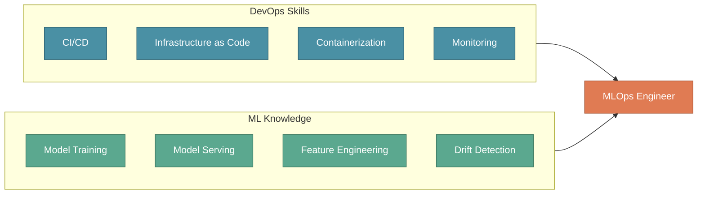
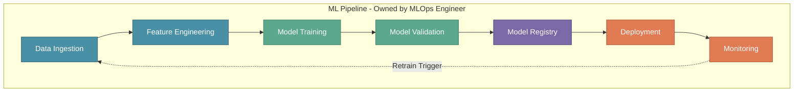
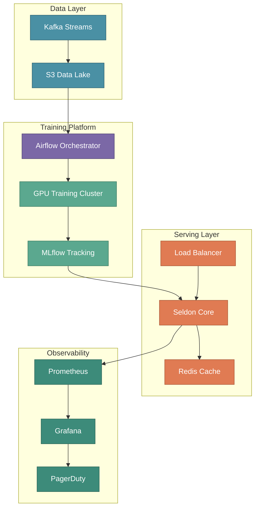

# The MLOps Engineer Role

In the previous section, we introduced the four pillars of an ML team: Product, Data Science, Data Engineering, and MLOps. While each role is essential, the **MLOps Engineer** deserves special attention — this is the role that transforms notebooks into production systems.

Understanding the MLOps Engineer role is critical because this position sits at the intersection of multiple disciplines. Without MLOps expertise, organizations struggle to move beyond proof-of-concept models. With it, they can reliably deploy, scale, and maintain ML systems that deliver real business value.

:::tip Key Insight
The MLOps Engineer is the answer to the question every Data Scientist eventually asks: "The model works on my laptop — now what?" This role ensures that promising experiments become reliable production systems.
:::

---

## The Challenge: From Notebook to Production

When XYZShopSmart's data science team completed their recommendation model, they celebrated achieving 68% accuracy in their Jupyter notebooks. But celebration quickly turned to concern when the Product Manager asked a simple question: "When can users see recommendations?"

The team realized their notebook couldn't handle 5 million users. It had no strategy for serving predictions in under 100ms. There was no plan for handling Black Friday traffic spikes. And nobody had considered what would happen when the model's accuracy inevitably degraded over time.

This gap between "working model" and "production system" is where the MLOps Engineer becomes essential. XYZShopSmart needed someone who understood both the ML workflow and the operational requirements of running software at scale.

---

## What is an MLOps Engineer?

An MLOps Engineer is a DevOps engineer with specialized expertise in Machine Learning workflows. They combine traditional operations skills — infrastructure, automation, monitoring, reliability — with ML-specific knowledge about training pipelines, model serving, feature engineering, and performance tracking.

The role requires understanding three distinct domains. **DevOps foundations** provide the infrastructure and automation skills that keep systems running. **ML domain knowledge** enables understanding of how models work and what they need to perform well. **Data engineering skills** ensure that the data pipelines feeding models are reliable and efficient.



This combination is what distinguishes MLOps Engineers from traditional DevOps or platform engineers. They don't just deploy applications — they deploy systems that learn, adapt, and require continuous attention to data quality and model performance.

---

## Core Responsibilities

An MLOps Engineer wears many hats. Their responsibilities span three key areas, each building on traditional DevOps practices while adapting them for the unique challenges of ML systems.

### Applying DevOps Expertise to ML

The first responsibility is bringing DevOps rigor to the ML world. Traditional software deployments are challenging enough, but ML deployments add complexity through their dependence on data, models, and the intricate relationship between the two.

**Blending DevOps with ML** means applying infrastructure-as-code, automation, and reliability practices to ML systems. At XYZShopSmart, the MLOps Engineer uses Terraform to provision GPU clusters for model training. This ensures that training infrastructure is reproducible, version-controlled, and can scale up for intensive training jobs or scale down to reduce costs.

**Managing Operations** involves handling deployment, scaling, and maintenance of ML workloads. The MLOps Engineer manages Kubernetes deployments for the recommendation service, ensuring pods are properly configured with resource limits, health checks, and auto-scaling policies that respond to traffic patterns.

**Designing Infrastructure** requires building robust, scalable platforms for ML workflows. For XYZShopSmart, this meant designing auto-scaling inference endpoints capable of handling 10,000 requests per second during peak shopping hours, while maintaining cost efficiency during quiet periods.

### Implementing Best Practices

Quality and reliability are non-negotiable in production ML systems. The MLOps Engineer establishes and enforces standards that prevent issues before they reach users.

**Following Industry Standards** ensures that training, deployment, and monitoring follow established practices. The XYZShopSmart team implemented model validation gates that require new models to pass accuracy thresholds, latency tests, and security scans before any production deployment is allowed.

**Maintaining Automated Versioning** tracks every model version with complete metadata and lineage. Using MLflow Model Registry, every recommendation model is versioned with information about training data, hyperparameters, evaluation metrics, and the code commit that produced it. When issues arise, the team can trace exactly what went into any deployed model.

**Enforcing Quality Control** automates testing to catch issues before production. The team runs automated A/B tests comparing new models against baselines, ensuring that every deployment decision is backed by statistical evidence rather than hope.

A deployment checklist illustrates how these practices work together:

```yaml
# Example: Model Deployment Checklist
deployment_checklist:
  pre_deployment:
    - model_validation: "accuracy >= baseline + 2%"
    - data_validation: "no schema drift detected"
    - performance_test: "latency p99 < 100ms"
    - security_scan: "no vulnerabilities found"
  
  deployment:
    - strategy: "canary"
    - initial_traffic: "10%"
    - rollback_trigger: "error_rate > 1%"
  
  post_deployment:
    - smoke_tests: true
    - monitoring_alerts: enabled
    - documentation: updated
```

### Building and Managing ML Pipelines

The MLOps Engineer designs end-to-end automation that connects every stage of the ML lifecycle. This is where the role truly differentiates from traditional DevOps — the pipelines handle not just code, but data and models as well.

**Designing Pipelines** creates workflows from data ingestion to model deployment. At XYZShopSmart, the MLOps Engineer built Airflow DAGs that orchestrate the entire ML workflow. When new data arrives, the pipeline automatically validates it, generates features, trains candidate models, evaluates them against baselines, and promotes successful models for deployment.

**Ensuring Seamless Automation** means every step runs without manual intervention. The team configured automatic retraining triggers that activate when data drift is detected. Rather than waiting for someone to notice degraded recommendations, the system responds autonomously.

**Integrating Disparate Tools** connects specialized tools into a cohesive platform. The XYZShopSmart stack integrates Feast for feature management, MLflow for experiment tracking and model registry, and Seldon for model serving. The MLOps Engineer ensures these tools communicate effectively and that data flows correctly between them.



---

## The Business Value of MLOps

Why invest in MLOps practices and an MLOps Engineer? The benefits extend beyond technical improvements to deliver measurable business impact.

### Operational Excellence

**Streamlined ML Lifecycles** automate repetitive tasks across the entire ML workflow. Teams that previously spent days on manual deployment steps can reduce that effort by 70% or more. At XYZShopSmart, what once required a week of engineer time now happens automatically overnight.

**Enabled CI/CD for ML** adapts continuous integration and deployment practices for models. Rather than deploying new models in weeks-long release cycles, XYZShopSmart can now deploy improvements in hours. This accelerated iteration means the team can respond quickly to changing user behavior or new product categories.

**Facilitated Team Collaboration** provides shared tools and standardized processes that align teams. When Data Scientists and Engineers use the same MLflow instance, speak the same terminology, and follow the same deployment procedures, handoffs become seamless rather than contentious.

### Speed and Automation

**Automated Training and Deployment** triggers training on new data and deploys without manual steps. XYZShopSmart's recommendation model retrains weekly on fresh purchase data. When drift detection identifies significant distribution changes, retraining happens immediately. This automation enables 10x faster iteration cycles compared to manual processes.

**Accelerated Time-to-Market** creates a faster path from experimentation to production. Ideas that once languished in notebooks for months now reach users in weeks. This speed translates directly to competitive advantage through rapid innovation.

### Reliability and Scale

**Continuous Performance Monitoring** tracks model accuracy, latency, and business metrics around the clock. When recommendation quality begins to degrade, the team knows within hours rather than waiting for customer complaints. This proactive approach catches degradation before users notice.

**Ensured Scalability** provides infrastructure that grows with demand. XYZShopSmart's system handles 10x traffic spikes during Black Friday seamlessly. The auto-scaling infrastructure expands automatically when load increases and contracts to reduce costs when traffic subsides.

**Improved Robustness** delivers automated rollbacks, health checks, and self-healing capabilities. The recommendation service maintains 99.9% uptime because problems trigger automatic responses rather than requiring manual intervention.

---

## XYZShopSmart: The MLOps Engineer in Action

Let's see how the MLOps Engineer contributed to XYZShopSmart's recommendation system, transforming the data science team's notebook into a production service.

### The Challenge

The Data Science team built a recommendation model achieving 68% accuracy. Moving to production required meeting demanding requirements:
- Serve 5 million users with predictions in under 100ms
- Retrain weekly on fresh data to combat drift
- Handle Black Friday traffic representing 10x normal load
- Maintain 99.9% uptime for the recommendation service

### The Solution

During weeks 8-10, the MLOps Engineer designed and implemented the production deployment.

**Containerization** packaged the model in Docker with ONNX runtime for optimized inference. This containerization ensures consistent behavior across development, staging, and production environments. The team no longer worries about "it works on my machine" problems.

**Kubernetes Setup** deployed the service to Amazon EKS with Horizontal Pod Autoscaler configured. The deployment automatically scales from 3 pods during quiet periods to 30 pods during peak traffic. Resource requests and limits ensure predictable performance without waste.

**CI/CD Pipeline** connected GitHub Actions to the Model Registry and ArgoCD for GitOps-based deployments. A single merge to main triggers automated testing, model validation, and staged rollout. Rollback capability means any problem can be reversed in minutes rather than hours.

**Monitoring Stack** combined Prometheus and Grafana with custom ML dashboards. Beyond standard metrics like latency and error rates, the team tracks prediction distribution, feature drift, and business metrics like click-through rates. Alerts notify the on-call engineer before problems become incidents.

### Infrastructure Architecture



### Results Achieved

| Metric | Target | Achieved |
|--------|--------|----------|
| Prediction Latency (p99) | < 100ms | 45ms |
| System Uptime | 99.9% | 99.95% |
| Deployment Frequency | Weekly | Daily |
| Mean Time to Recovery | < 30 min | 8 min |
| Black Friday Traffic | 10x scale | Handled seamlessly |

---

## Skills Required for MLOps Engineers

Becoming an effective MLOps Engineer requires a blend of technical expertise and soft skills. The role demands breadth across multiple domains rather than extreme depth in any single area.

### Technical Skills

**DevOps Fundamentals** form the foundation. Expert-level proficiency with Linux, Git, CI/CD pipelines, Docker, and Kubernetes is essential. These aren't optional skills — they're the daily tools of the trade. An MLOps Engineer who struggles with containers will struggle with everything that depends on them.

**Cloud Platforms** require advanced knowledge of AWS, GCP, or Azure, along with infrastructure-as-code tools like Terraform. MLOps Engineers provision training clusters, configure networking, manage secrets, and optimize costs. Understanding cloud-native services for ML (like SageMaker, Vertex AI, or Azure ML) accelerates development.

**Programming** centers on Python, Bash, and SQL at an advanced level. Python is the lingua franca of ML, so reading, modifying, and debugging Data Science code is essential. Bash enables automation. SQL enables data investigation and validation.

**ML Frameworks** require intermediate understanding. While MLOps Engineers don't typically develop models, they must understand how frameworks like TensorFlow and PyTorch work. This knowledge informs decisions about serving infrastructure, resource requirements, and optimization opportunities.

**Data Engineering** skills at an intermediate level enable working with tools like Spark, Airflow, and Kafka. MLOps Engineers often build or maintain data pipelines that feed ML systems, so familiarity with these tools is important.

**MLOps Tools** demand advanced proficiency. MLflow, Kubeflow, Feast, Seldon, and similar tools are the specialized instruments of the role. Deep expertise here distinguishes MLOps Engineers from general DevOps practitioners.

### Soft Skills

**Communication** enables bridging between Data Scientists and Platform Engineers. The MLOps Engineer translates between these groups, explaining infrastructure constraints to scientists and model requirements to platform teams. Clear communication prevents misunderstandings that delay projects.

**Problem Solving** powers debugging of complex distributed ML systems. When predictions slow down, the cause might be in the model, the feature store, the network, or any combination. MLOps Engineers must methodically investigate across system boundaries.

**Systems Thinking** supports understanding how components interact end-to-end. A change to the feature pipeline might affect model accuracy, which might trigger retraining, which might cause resource contention. Seeing these connections prevents unintended consequences.

**Continuous Learning** is non-negotiable because ML tooling evolves rapidly. Tools that didn't exist two years ago are now industry standards. MLOps Engineers must continuously expand their knowledge to remain effective.

---

## A Week in the Life of an MLOps Engineer

Understanding the day-to-day reality helps illustrate what this role involves. Here's a typical week for XYZShopSmart's MLOps Engineer:

**Monday** begins with reviewing model performance dashboards in Grafana. An alert from Evidently indicates potential data drift in the user behavior features. The engineer investigates, confirms the drift is significant, and triggers an early retraining run to address it before accuracy degrades noticeably.

**Tuesday** focuses on updating the training pipeline. The Data Science team wants to include new features from the recently deployed review sentiment model. The engineer updates the Feast configuration to include these features and modifies the Airflow DAG to incorporate the new data source.

**Wednesday** is optimization day. The p99 latency has crept up to 60ms, still within SLA but trending upward. The engineer profiles the inference service, identifies that feature lookup is the bottleneck, and implements a caching strategy that reduces latency to 45ms.

**Thursday** involves setting up A/B test infrastructure for a new model version. The Data Science team believes a new architecture will improve accuracy. The engineer configures Istio traffic splitting to direct 20% of users to the experimental model while logging detailed metrics for comparison.

**Friday** wraps up with documentation and retrospective work. The engineer updates runbooks based on the week's incidents, conducts a brief retrospective on the drift alert response, and reviews upcoming changes from the Data Science team to plan next week's work.

---

## Common Mistakes to Avoid

**Treating MLOps as an afterthought** delays it until after model development is complete. Teams that add MLOps late face painful rework. Involving the MLOps Engineer from the project start ensures infrastructure decisions align with model requirements.

**Over-engineering initial deployments** attempts to build perfect systems before proving value. Start with simple, working deployments and add complexity as needs become clear. XYZShopSmart's first deployment used basic Kubernetes manifests before graduating to Helm charts and ArgoCD.

**Ignoring model-specific requirements** applies generic DevOps patterns without adaptation. ML systems have unique needs around data versioning, experiment tracking, and model validation that generic CI/CD pipelines don't address.

**Neglecting monitoring beyond system metrics** tracks latency and uptime but ignores model performance. A system can be healthy by traditional metrics while serving increasingly poor predictions. Monitor accuracy, drift, and business outcomes alongside infrastructure health.

**Underestimating data pipeline complexity** focuses on model serving while neglecting the data that feeds it. Feature pipelines often have more moving parts and more failure modes than the models themselves. Give them appropriate attention.

**Failing to establish feedback loops** deploys models without mechanisms to learn from production. Without feedback, teams can't know if models are performing well or how to improve them. Build monitoring and retraining triggers from the start.

---

## Key Takeaways

**The MLOps Engineer bridges two worlds.** This role combines DevOps rigor with ML domain knowledge, bringing reliability practices to the unpredictable world of machine learning. Without this bridge, models remain trapped in notebooks while production systems serve stale predictions.

**Best practices prevent production disasters.** Standards for versioning, testing, and monitoring aren't bureaucratic overhead — they're essential safeguards. Every model deployment checklist item exists because someone, somewhere, learned the hard way what happens without it.

**Automation is the key to scale.** Manual processes work for occasional deployments but collapse under the weight of frequent model updates, continuous retraining, and real-time monitoring. Pipelines enable teams to do more with less while maintaining quality.

**Monitoring everything enables continuous improvement.** You can't improve what you can't measure. Comprehensive observability across system health, model performance, and business metrics provides the visibility needed to identify problems and opportunities.

**MLOps Engineers multiply team impact.** By building reliable infrastructure and automated pipelines, a single MLOps Engineer enables multiple Data Scientists to deliver production value. The role is a force multiplier that makes entire ML organizations more effective.

---

## What's Next?

Now that we understand the MLOps Engineer role and responsibilities, it's time to understand the **complete lifecycle** that this role must master. The MLOps lifecycle spans four phases that flow from data exploration through model development, testing and deployment, and into ongoing operations.

In the next section, we'll explore:
- **The Four Phases**: Data Exploration, Model Development, Testing and Deployment, and Operations
- **Phase Transitions**: How smooth handoffs enable continuous iteration
- **Time Allocation**: Why Data Exploration consumes 30-40% of project time
- **The Continuous Loop**: How Operations feeds back into Data Exploration

:::info Up Next
In the next section, we'll explore the **MLOps Lifecycle** — the four phases every MLOps Engineer must master to deliver production ML systems.
:::
