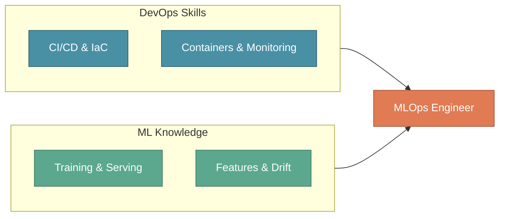
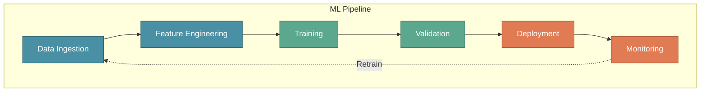

# The MLOps Engineer Role

In the previous section, we explored how Product, Data Science, Data Engineering, and MLOps form the four pillars of an ML team. The **MLOps Engineer** deserves special attention — this role transforms notebooks into production systems.

Without MLOps expertise, organizations struggle to move beyond proof-of-concept models. With it, they can deploy, scale, and maintain ML systems that deliver real business value.

:::tip Key Insight
The MLOps Engineer answers the question every Data Scientist asks: "The model works on my laptop — now what?"
:::

---

## XYZShopSmart: The Challenge

When XYZShopSmart's data science team completed their recommendation model with 68% accuracy, celebration quickly turned to concern. The Product Manager asked: "When can users see recommendations?"

The team realized their notebook couldn't handle 5 million users, had no strategy for sub-100ms predictions, no plan for Black Friday traffic spikes, and no approach for handling accuracy degradation over time. They needed someone who understood both ML workflows and operational requirements at scale.

---

## What is an MLOps Engineer?

An MLOps Engineer is a DevOps engineer with specialized ML expertise. They combine traditional operations skills — infrastructure, automation, monitoring — with ML-specific knowledge about training pipelines, model serving, and performance tracking.



This combination distinguishes MLOps Engineers from traditional DevOps practitioners. They deploy systems that learn, adapt, and require continuous attention to data quality and model performance.

---

## Core Responsibilities

### Applying DevOps to ML

**Blending DevOps with ML** means applying infrastructure-as-code and automation to ML systems. **Managing operations** involves handling deployment, scaling, and maintenance of ML workloads. **Designing infrastructure** requires building scalable platforms for training and serving.

At XYZShopSmart, the MLOps Engineer uses Terraform for GPU clusters, manages Kubernetes deployments with auto-scaling policies, and designs inference endpoints capable of handling 10,000 requests per second during peak hours.

### Implementing Best Practices

**Following industry standards** ensures training, deployment, and monitoring follow established practices. **Maintaining automated versioning** tracks every model with complete metadata and lineage. **Enforcing quality control** automates testing to catch issues before production.

```yaml
# Model Deployment Checklist
deployment_checklist:
  pre_deployment:
    - model_validation: "accuracy >= baseline + 2%"
    - performance_test: "latency p99 < 100ms"
  deployment:
    - strategy: "canary"
    - initial_traffic: "10%"
    - rollback_trigger: "error_rate > 1%"
  post_deployment:
    - monitoring_alerts: enabled
```

### Building ML Pipelines

**Designing pipelines** creates workflows from data ingestion to model deployment. **Ensuring automation** means every step runs without manual intervention. **Integrating tools** connects specialized tools like Feast, MLflow, and Seldon into a cohesive platform.



---

## Business Value of MLOps

### Operational Excellence

**Streamlined lifecycles** automate repetitive tasks, reducing deployment effort by 70% or more. **CI/CD for ML** enables deploying improvements in hours instead of weeks. **Team collaboration** provides shared tools and standardized processes that align teams.

### Speed and Reliability

**Automated training and deployment** triggers retraining on new data and deploys without manual steps — enabling 10x faster iteration cycles. **Continuous monitoring** tracks accuracy, latency, and business metrics, catching degradation before users notice. **Ensured scalability** handles 10x traffic spikes during events like Black Friday seamlessly.

---

## XYZShopSmart: Implementation

The Data Science team built a recommendation model achieving 68% accuracy. Production requirements included serving 5 million users under 100ms, weekly retraining, handling Black Friday traffic, and maintaining 99.9% uptime.

### The Solution

1. **Containerization**: Packaged the model in Docker with ONNX runtime for optimized inference
2. **Kubernetes Setup**: Deployed to Amazon EKS with Horizontal Pod Autoscaler (3-30 pods)
3. **CI/CD Pipeline**: Connected GitHub Actions to Model Registry and ArgoCD
4. **Monitoring Stack**: Combined Prometheus, Grafana with custom ML dashboards

### Results

| Metric | Target | Achieved |
|--------|--------|----------|
| Prediction Latency (p99) | < 100ms | 45ms |
| System Uptime | 99.9% | 99.95% |
| Deployment Frequency | Weekly | Daily |
| Mean Time to Recovery | < 30 min | 8 min |

---

## Skills Required

### Technical Skills

**DevOps fundamentals** form the foundation — Linux, Git, CI/CD, Docker, and Kubernetes are daily tools. **Cloud platforms** require advanced knowledge of AWS, GCP, or Azure with infrastructure-as-code tools like Terraform. **Programming** centers on Python, Bash, and SQL at an advanced level.

**ML frameworks** require intermediate understanding of TensorFlow and PyTorch to inform serving decisions. **Data engineering** skills enable working with Spark, Airflow, and Kafka. **MLOps tools** demand advanced proficiency with MLflow, Kubeflow, Feast, and Seldon.

### Soft Skills

**Communication** bridges Data Scientists and Platform Engineers, translating between groups. **Problem solving** enables debugging complex distributed ML systems. **Systems thinking** supports understanding how components interact end-to-end. **Continuous learning** is essential because ML tooling evolves rapidly.

---

## Common Mistakes

- **Treating MLOps as afterthought**: Involve the MLOps Engineer from project start to align infrastructure with model requirements
- **Over-engineering initial deployments**: Start with simple, working deployments and add complexity as needs become clear
- **Ignoring model-specific requirements**: ML systems need data versioning and experiment tracking that generic CI/CD doesn't address
- **Neglecting monitoring beyond system metrics**: Track accuracy, drift, and business outcomes alongside infrastructure health
- **Failing to establish feedback loops**: Build monitoring and retraining triggers from the start

---

## Key Takeaways

- **The MLOps Engineer bridges two worlds**: This role combines DevOps rigor with ML domain knowledge, bringing reliability practices to machine learning systems.
- **Best practices prevent production disasters**: Standards for versioning, testing, and monitoring are essential safeguards, not bureaucratic overhead.
- **Automation is the key to scale**: Pipelines enable teams to do more with less while maintaining quality through frequent model updates and continuous retraining.
- **MLOps Engineers multiply team impact**: By building reliable infrastructure, a single MLOps Engineer enables multiple Data Scientists to deliver production value.

---

## What's Next?

Now that we understand the MLOps Engineer role, it's time to explore the complete lifecycle this role must master — spanning data exploration, model development, testing, deployment, and ongoing operations.

:::info Up Next
We'll explore the **MLOps Lifecycle** — the four phases every MLOps Engineer must master to deliver production ML systems.
:::
