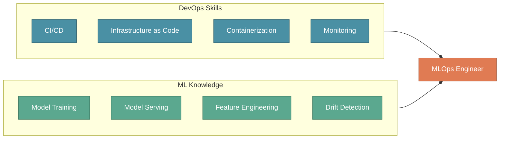
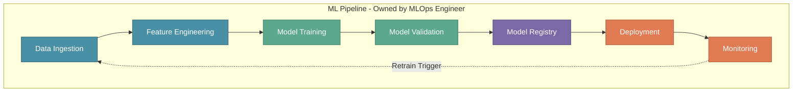
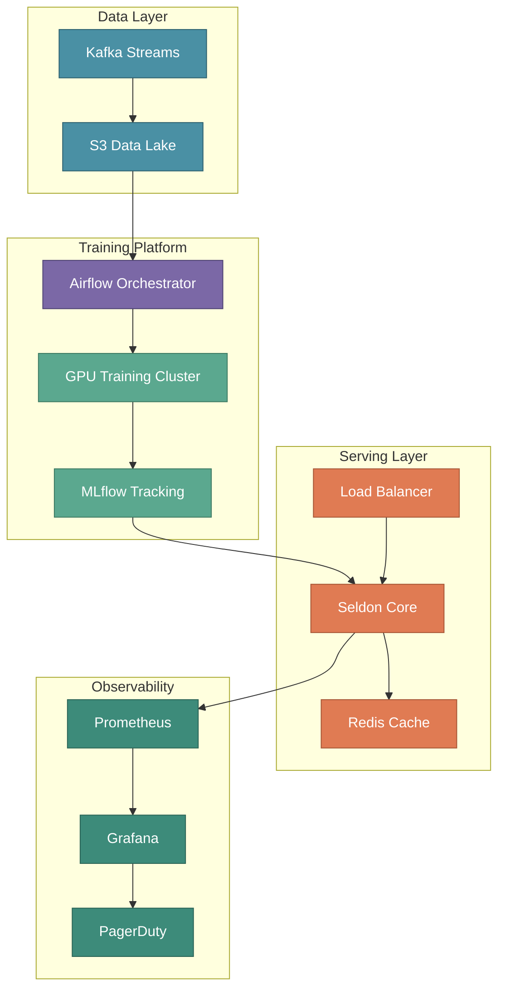

# The MLOps Engineer Role

In the previous section, we introduced the four pillars of an ML team: Product, Data Science, Data Engineering, and MLOps. While each role is essential, the **MLOps Engineer** deserves special attention—this is the role that transforms notebooks into production systems.

Let's take a deeper look at what it means to be an MLOps Engineer and why this role is increasingly critical in modern ML organizations.

---

## What is an MLOps Engineer?

An MLOps Engineer is a **DevOps engineer with specialized expertise in Machine Learning workflows**. They combine traditional operations skills with ML-specific knowledge to ensure models don't just work in notebooks — they thrive in production.

:::info Definition
**MLOps Engineer** = DevOps Foundation + ML Domain Knowledge + Data Engineering Skills
:::

Think of the MLOps Engineer as the person who answers the question: *"The model works on my laptop — now what?"*

---

## Core Responsibilities

An MLOps Engineer wears many hats. Their responsibilities span three key areas:

### 1. DevOps Expertise Applied to ML

The MLOps Engineer brings traditional DevOps practices into the ML world:

| Responsibility | Description | XYZShopSmart Example |
|----------------|-------------|----------------------|
| **Blend DevOps with ML** | Apply infrastructure-as-code, automation, and reliability practices to ML systems | Use Terraform to provision GPU clusters for model training |
| **Manage Operations** | Handle deployment, scaling, and maintenance of ML workloads | Manage Kubernetes deployments for the recommendation service |
| **Infrastructure Design** | Build robust, scalable platforms for ML workflows | Design auto-scaling inference endpoints that handle 10K requests/second |



### 2. Implementing Best Practices

Quality and reliability are non-negotiable in production ML systems:

| Responsibility | Description | XYZShopSmart Example |
|----------------|-------------|----------------------|
| **Industry Standards** | Follow established practices for training, deployment, and monitoring | Implement model validation gates before production deployment |
| **Automated Versioning** | Track every model version with metadata and lineage | Use MLflow Model Registry to version all recommendation models |
| **Quality Control** | Automate testing to catch issues before production | Run automated A/B tests comparing new models against baselines |

**Best practices an MLOps Engineer implements:**

```yaml
# Example: Model Deployment Checklist
deployment_checklist:
  pre_deployment:
    - model_validation: "accuracy >= baseline + 2%"
    - data_validation: "no schema drift detected"
    - performance_test: "latency p99 < 100ms"
    - security_scan: "no vulnerabilities found"
  
  deployment:
    - strategy: "canary"
    - initial_traffic: "10%"
    - rollback_trigger: "error_rate > 1%"
  
  post_deployment:
    - smoke_tests: true
    - monitoring_alerts: enabled
    - documentation: updated
```

### 3. Building and Managing ML Pipelines

The MLOps Engineer designs end-to-end automation:

| Responsibility | Description | XYZShopSmart Example |
|----------------|-------------|----------------------|
| **Pipeline Design** | Create workflows from data ingestion to model deployment | Build Airflow DAGs that orchestrate the entire ML workflow |
| **Seamless Automation** | Ensure every step runs without manual intervention | Trigger retraining automatically when data drift is detected |
| **System Integration** | Connect disparate tools into a cohesive platform | Integrate Feast (features) → MLflow (training) → Seldon (serving) |



---

## Key Benefits of MLOps

Why invest in MLOps practices and an MLOps Engineer? Here are the transformative benefits:

### Operational Excellence

| Benefit | Description | Impact |
|---------|-------------|--------|
| 🔄 **Streamlines ML Lifecycles** | Automate repetitive tasks across the entire ML workflow | Reduce manual effort by 70% |
| 🚀 **Enables CI/CD for ML** | Continuous integration and deployment adapted for models | Deploy new models in hours, not weeks |
| 👥 **Facilitates Team Collaboration** | Shared tools and standardized processes align teams | Data Scientists and Engineers speak the same language |

### Speed and Automation

| Benefit | Description | Impact |
|---------|-------------|--------|
| ⚡ **Automates Training & Deployment** | Trigger training on new data, deploy without manual steps | 10x faster iteration cycles |
| 📈 **Accelerates Time-to-Market** | Faster experimentation to production path | Competitive advantage through rapid innovation |

### Reliability and Scale

| Benefit | Description | Impact |
|---------|-------------|--------|
| 📊 **Monitoring Performance** | Track model accuracy, latency, and business metrics continuously | Catch degradation before users notice |
| 🏗️ **Ensures Scalability** | Infrastructure that grows with demand | Handle 10x traffic spikes seamlessly |
| 🛡️ **Improves Robustness** | Automated rollbacks, health checks, and self-healing | 99.9% uptime for ML services |

---

## XYZShopSmart: MLOps Engineer in Action

Let's see how the MLOps Engineer contributes to XYZShopSmart's recommendation system:

### The Challenge

The Data Science team has built a recommendation model with 68% accuracy. Now it needs to:
- Serve 5 million users with < 100ms latency
- Retrain weekly on fresh data
- Handle Black Friday traffic (10x normal load)
- Maintain 99.9% uptime

### The MLOps Engineer's Solution

**Week 8-10: Production Deployment**

| Task | Action | Outcome |
|------|--------|---------|
| **Containerization** | Package model in Docker with ONNX runtime | Consistent behavior across environments |
| **Kubernetes Setup** | Deploy to EKS with Horizontal Pod Autoscaler | Auto-scale from 3 to 30 pods based on load |
| **CI/CD Pipeline** | GitHub Actions → Model Registry → ArgoCD | One-click deployment with rollback capability |
| **Monitoring Stack** | Prometheus + Grafana + custom ML dashboards | Real-time visibility into model performance |

**Infrastructure Architecture:**



### Results Achieved

| Metric | Target | Achieved |
|--------|--------|----------|
| Prediction Latency (p99) | < 100ms | 45ms ✅ |
| System Uptime | 99.9% | 99.95% ✅ |
| Deployment Frequency | Weekly | Daily ✅ |
| Mean Time to Recovery | < 30 min | 8 min ✅ |
| Black Friday Traffic | 10x scale | Handled seamlessly ✅ |

---

## Skills Required for MLOps Engineers

### Technical Skills

| Category | Skills | Proficiency |
|----------|--------|-------------|
| **DevOps Fundamentals** | Linux, Git, CI/CD, Docker, Kubernetes | Expert |
| **Cloud Platforms** | AWS/GCP/Azure, Terraform, Infrastructure as Code | Advanced |
| **Programming** | Python, Bash, SQL | Advanced |
| **ML Frameworks** | Scikit-learn, TensorFlow/PyTorch (understanding) | Intermediate |
| **Data Engineering** | Spark, Airflow, Kafka | Intermediate |
| **MLOps Tools** | MLflow, Kubeflow, Feast, Seldon | Advanced |

### Soft Skills

| Skill | Why It Matters |
|-------|----------------|
| **Communication** | Bridge between Data Scientists and Platform Engineers |
| **Problem Solving** | Debug complex distributed ML systems |
| **Systems Thinking** | Understand how components interact end-to-end |
| **Continuous Learning** | ML tooling evolves rapidly |

---

## Common MLOps Engineer Tasks

Here's a typical week for XYZShopSmart's MLOps Engineer:

| Day | Task | Tools Used |
|-----|------|------------|
| Monday | Review model performance dashboards, investigate drift alert | Grafana, Evidently |
| Tuesday | Update training pipeline to include new features | Airflow, Feast |
| Wednesday | Optimize inference latency (reduce p99 from 60ms to 45ms) | Seldon, Kubernetes |
| Thursday | Set up A/B test infrastructure for new model version | Istio, MLflow |
| Friday | Document runbooks, conduct incident retrospective | Confluence, PagerDuty |

---

## Key Takeaways

| Lesson | Description |
|--------|-------------|
| 🔧 **DevOps + ML** | MLOps Engineers bring DevOps rigor to the unpredictable world of ML |
| 📋 **Best Practices Matter** | Standards for versioning, testing, and monitoring prevent production disasters |
| 🔄 **Automation is Key** | Manual processes don't scale; pipelines do |
| 📊 **Monitor Everything** | You can't improve what you can't measure |
| 🚀 **Enable the Team** | MLOps Engineers multiply the impact of Data Scientists |

---

## What's Next?

Now that we understand the MLOps Engineer role and responsibilities, it's time to understand the **complete lifecycle** that this role must master.

In the next section, we'll explore:

| Topic | What You'll Learn |
|-------|-------------------|
| **The Four Phases** | Data Exploration, Model Development, Testing & Deployment, Operations |
| **Phase Transitions** | How smooth handoffs enable continuous iteration |
| **Time Allocation** | Why Data Exploration takes 30-40% of project time |
| **The Continuous Loop** | How Operations feeds back into Data Exploration |

:::info Up Next
In the next section, we'll explore the **MLOps Lifecycle** — the four phases every MLOps Engineer must master to deliver production ML systems.
:::
