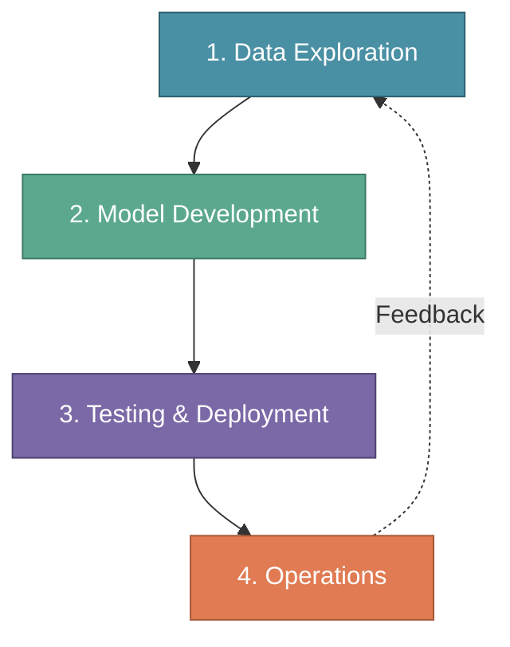

# The MLOps Lifecycle

In the previous section, we explored the MLOps Engineer role and the skills required to succeed. Now it's time to understand the **complete lifecycle** that an MLOps Engineer must master — a continuous, iterative process where each phase flows into the next.

:::tip Key Insight
An MLOps Engineer must focus on all four phases. Weakness in any phase creates bottlenecks that slow down the entire ML delivery pipeline.
:::

---

## XYZShopSmart: The Challenge

When XYZShopSmart decided to build their product recommendation system, the data science team initially focused only on model accuracy. They spent months perfecting their algorithm in Jupyter notebooks. But when deployment time came, they had no data pipeline, no deployment strategy, and no monitoring plan.

The result? A six-month delay while the team backtracked to build overlooked infrastructure. This taught them a valuable lesson: successful ML projects require attention to the **complete lifecycle**, not just model development.

---

## The Four Phases

The MLOps lifecycle consists of four interconnected phases that form a continuous loop.

:::warning Reality Check
Data Exploration takes 30-40% of total project time. Many teams underestimate this phase, leading to poor model performance and delayed timelines.
:::

---

## Phase 1: Data Exploration

Data Exploration ensures data is ready for model training. Most ML failures trace back to data problems — a model is only as good as the data it learns from.

**Collect Data** gathers information from databases, APIs, and streaming systems. **Curate Data** cleans and organizes raw data by removing duplicates, handling missing values, and addressing outliers. **Transform Data** applies preprocessing and feature engineering to create ML-ready features. **Validate Data** checks for completeness, consistency, and quality before training begins.

### XYZShopSmart's Approach

1. Connected Airflow pipelines to PostgreSQL and clickstream system for automated daily collection
2. Used Pandas and Great Expectations for curation with automated quality checks
3. Ran Spark jobs to transform raw data into user-item interaction matrices, storing results in Feast
4. Generated Evidently data quality reports for review before model development

This systematic approach took five weeks but prevented quality issues that had plagued earlier projects.

---

## Phase 2: Model Development

With clean data in hand, focus shifts to building and training ML models through exploring algorithms, training with experiment tracking, and evaluating against meaningful baselines.

**Explore Models** researches and prototypes candidate algorithms. **Train Models** trains selected algorithms with proper experiment tracking — logging hyperparameters, random seeds, data versions, and code versions. **Evaluate Models** compares performance against baselines and validates business relevance.

### XYZShopSmart's Approach

1. Research team created prototypes for three approaches: collaborative filtering, content-based filtering, and hybrid methods
2. Ran hyperparameter tuning with cross-validation, tracking every run in MLflow
3. Offline evaluation compared models against random baseline — winning model showed 68% accuracy with 23% lift over existing business rules
4. Business stakeholders validated recommendations aligned with merchandising goals

This phase took two weeks and produced a well-documented model ready for production testing.

---

## Phase 3: Testing & Deployment

Testing and Deployment bridges development and production, ensuring the model is packaged correctly, tested thoroughly, and deployed safely.

**Build Model** packages the model for deployment using containerization. **Test Model** runs comprehensive tests including unit tests (individual components), integration tests (component connections), performance tests (latency and throughput), and validation tests (accuracy thresholds). **Plan Deployment** defines the rollout strategy.

### Deployment Strategies

**Canary deployment** gradually routes traffic to the new model, detecting problems before affecting all users. **Blue-green deployment** maintains two identical environments and switches traffic between them for instant rollback. **A/B testing** splits traffic between versions to compare real-world performance. **Shadow deployment** runs new models alongside production without affecting users — outputs are logged but not shown.

### XYZShopSmart's Approach

1. Built Docker image with FastAPI and ONNX runtime, pushed to registry after security scans
2. Deployed to staging environment mirroring production for integration and performance tests
3. Started canary release with 5% traffic, monitored for 24 hours
4. Increased traffic to 25%, then 50%, then 100% over one week
5. Configured automatic rollback if error rates exceeded 0.1% or latency exceeded 150ms

---

## Phase 4: Operations

The model is live, and now the real work begins. Operations ensures continuous reliability through monitoring, drift detection, and automated retraining.

**Release Model** completes production deployment and confirms the model serves traffic correctly. **Monitor Service** tracks performance, latency, errors, and business metrics in real-time across four categories: system health (uptime, latency, throughput), model performance (accuracy, click-through rate), data quality (feature drift, freshness), and alerting (automated notifications). **Retrain & Release** updates the model with fresh data to combat drift.

### The Feedback Loop

Operations connects back to Data Exploration, creating a continuous improvement cycle. Monitoring detects data drift and triggers data collection. Performance degradation initiates retraining pipelines. Production insights inform future feature engineering.

```mermaid
flowchart LR
    MONITOR[Monitor Service] --> DETECT[Detect Issues]
    DETECT --> DRIFT[Data Drift?]
    DRIFT -->|Yes| RETRAIN[Trigger Retraining]
    RETRAIN --> NEWDATA[Collect New Data]
    NEWDATA --> TRAIN[Train New Model]
    TRAIN --> DEPLOY[Deploy Update]
    DEPLOY --> MONITOR
    
    style MONITOR fill:#E07B53,stroke:#A65535,color:#fff
    style DETECT fill:#E07B53,stroke:#A65535,color:#fff
    style DRIFT fill:#7B68A6,stroke:#4E4272,color:#fff
    style RETRAIN fill:#7B68A6,stroke:#4E4272,color:#fff
    style NEWDATA fill:#4A90A4,stroke:#2C5F6E,color:#fff
    style TRAIN fill:#5BA88F,stroke:#3D7A62,color:#fff
    style DEPLOY fill:#7B68A6,stroke:#4E4272,color:#fff
```

---

## XYZShopSmart: The Complete Journey

| Phase | Duration | Key Outcomes |
|-------|----------|--------------|
| Data Exploration | Weeks 1-5 | 50+ features validated and documented |
| Model Development | Weeks 6-7 | 68% accuracy, 23% lift over baseline |
| Testing & Deployment | Weeks 8-10 | Canary deployment from 5% to 100% |
| Operations | Week 11+ | 99.95% uptime, 18% conversion improvement |

---

## Common Mistakes

- **Underestimating Data Exploration**: Skipping thorough data work leads to models that fail in production — allocate 30-40% of project time
- **Ignoring Experiment Tracking**: Training without proper tracking makes reproduction impossible when debugging or improving models
- **Rushing Deployment**: Deploying without comprehensive testing invites production incidents
- **Treating Deployment as the Finish Line**: Without ongoing monitoring and retraining, model performance degrades over time
- **Breaking the Feedback Loop**: Disconnected phases lead to repeated mistakes — each phase should inform the others

---

## Key Takeaways

- **The MLOps lifecycle is a continuous loop, not a linear process.** Operations feeds back into Data Exploration, enabling continuous improvement.
- **Data Exploration deserves significant investment.** At 30-40% of project time, this phase often takes longer than model development.
- **Each phase has distinct but connected activities.** Data Exploration prepares the foundation, Model Development builds on it, Testing & Deployment ensures safe release, Operations maintains the system.
- **XYZShopSmart's structured approach delivered results.** By respecting each phase and maintaining the feedback loop, they achieved 99.95% uptime and 18% conversion improvement.

---

## What's Next?

Now that we understand the complete MLOps lifecycle, it's time to explore the **continuous practices** that keep this lifecycle running smoothly — CI, CD, CT, and CM.

:::info Up Next
We'll explore **CI, CD, CT, and CM in MLOps** — the automation backbone of production ML systems that operationalizes everything we've learned about the MLOps lifecycle.
:::
