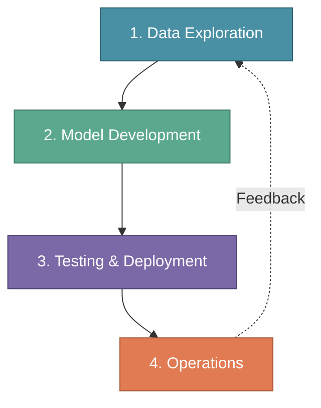

```mermaid
flowchart LR
    MONITOR[Monitor Service] --> DETECT[Detect Issues]
    DETECT --> DRIFT[Data Drift?]
    DRIFT -->|Yes| RETRAIN[Trigger Retraining]
    RETRAIN --> NEWDATA[Collect New Data]
    NEWDATA --> TRAIN[Train New Model]
    TRAIN --> DEPLOY[Deploy Update]
    DEPLOY --> MONITOR
    
    style MONITOR fill:#E07B53,stroke:#A65535,color:#fff
    style DETECT fill:#E07B53,stroke:#A65535,color:#fff
    style DRIFT fill:#7B68A6,stroke:#4E4272,color:#fff
    style RETRAIN fill:#7B68A6,stroke:#4E4272,color:#fff
    style NEWDATA fill:#4A90A4,stroke:#2C5F6E,color:#fff
    style TRAIN fill:#5BA88F,stroke:#3D7A62,color:#fff
    style DEPLOY fill:#7B68A6,stroke:#4E4272,color:#fff
```

# The MLOps Lifecycle

In the previous sections, we explored the MLOps Engineer role and the skills required to succeed. Now it's time to understand the **complete lifecycle** that an MLOps Engineer must master.

The MLOps lifecycle is a continuous, iterative process where each phase flows smoothly into the next. Understanding this lifecycle is essential for building production-ready ML systems.

:::tip Key Insight
An MLOps Engineer must focus on all four phases to master the discipline. Weakness in any phase creates bottlenecks that slow down the entire ML delivery pipeline.
:::

---

## Why the Lifecycle Matters

When XYZShopSmart decided to build their product recommendation system, the data science team initially focused only on model accuracy. They spent months perfecting their algorithm in Jupyter notebooks. But when it came time to deploy, they realized they had no data pipeline, no deployment strategy, and no monitoring plan.

The result? A six-month delay while the team backtracked to build the infrastructure they had overlooked. This experience taught them a valuable lesson: successful ML projects require attention to the **complete lifecycle**, not just model development.

---

## The Four Phases of MLOps

The MLOps lifecycle consists of four interconnected phases that form a continuous loop. Each phase has distinct activities, but they all connect to create a seamless flow from data to deployed model and back again.

Understanding how time is distributed across these phases helps teams plan realistically. **Data Exploration** typically consumes 30-40% of project time, often more than teams expect. **Model Development** takes 20-30%, while **Testing & Deployment** requires 15-20%. **Operations** accounts for 15-25% of ongoing effort.

:::warning Reality Check
Data Exploration takes 30-40% of total project time. Many teams underestimate this phase, leading to poor model performance and delayed timelines. Plan accordingly.
:::

---

## Phase 1: Data Exploration

Data Exploration is the foundation of any successful ML project. This phase ensures data is ready for model training by collecting, cleaning, transforming, and validating datasets.

Most ML failures trace back to data problems. A model is only as good as the data it learns from. Investing time in thorough data exploration prevents costly issues later in the lifecycle.

### Core Activities

**Collect Data** involves gathering data from various sources including databases, APIs, and streaming systems. At XYZShopSmart, the team pulled data from four primary sources: the orders database containing three years of transaction history, clickstream logs tracking user browsing behavior, the product catalog with item attributes, and user profile data.

**Curate Data** cleans and organizes the raw data. This includes removing duplicates, handling missing values, and addressing outliers. The XYZShopSmart team discovered that 12% of their clickstream records had missing user IDs. They implemented logic to either recover the IDs from session data or exclude incomplete records.

**Transform Data** applies preprocessing and feature engineering to create ML-ready features. The team created a user-item interaction matrix, calculated purchase frequency features, and engineered recency scores. They used Spark for large-scale transformations and Feast to manage their feature store.

**Validate Data** checks for completeness, consistency, and quality before training begins. Using Great Expectations and custom validation scripts, XYZShopSmart verified that no data leakage occurred between training and test sets, confirmed feature distributions matched expectations, and documented data lineage for reproducibility.

### How XYZShopSmart Approached Data Exploration

The team structured their data exploration in four steps:

1. They connected Airflow pipelines to PostgreSQL and their clickstream system to automate daily data collection
2. Pandas and Great Expectations handled data curation, with automated quality checks flagging anomalies
3. Spark jobs transformed raw data into the user-item interaction matrix, storing results in Feast
4. Evidently generated data quality reports, which the team reviewed before proceeding to model development

This systematic approach took five weeks but prevented the data quality issues that had plagued their earlier projects.

---

## Phase 2: Model Development

With clean data in hand, the focus shifts to building and training ML models. This phase involves exploring algorithmic approaches, training models with rigorous experiment tracking, and evaluating performance against meaningful baselines.

### Core Activities

**Explore Models** researches and prototypes candidate algorithms. XYZShopSmart's data scientists evaluated three approaches for their recommendation system: collaborative filtering (based on user behavior patterns), content-based filtering (based on product attributes), and hybrid approaches combining both methods. They created quick prototypes of each to assess feasibility and computational requirements.

**Train Models** trains selected algorithms with proper experiment tracking. Every training run must be reproducible, which means logging hyperparameters, random seeds, data versions, and code versions. The team used MLflow to track 15 experiments across different model architectures and hyperparameter configurations.

**Evaluate Models** compares model performance against baselines and validates business relevance. The XYZShopSmart team didn't just measure accuracy. They compared their models against a random baseline and against the existing business rules. They tracked precision, recall, F1 score, and most importantly, simulated the business impact of each model's recommendations.

### How XYZShopSmart Approached Model Development

The model development process followed a structured workflow:

1. The data science team researched state-of-the-art recommendation algorithms and created prototypes for the three most promising approaches
2. They ran hyperparameter tuning experiments, using cross-validation to prevent overfitting and MLflow to track every run
3. Offline evaluation compared each model against the random baseline, with the winning model showing 68% accuracy and a 23% lift over the existing business rules
4. Business stakeholders validated that the model's recommendations aligned with merchandising goals before approving progression to deployment

This phase took two weeks and produced a well-documented model ready for production testing.

---

## Phase 3: Testing & Deployment

Testing and Deployment bridges development and production. This phase ensures the model is packaged correctly, tested thoroughly, and deployed safely.

Many teams rush through this phase, eager to see their model in production. XYZShopSmart learned that thorough testing here prevents incidents later. They allocated two weeks specifically for this phase.

### Core Activities

**Build Model** packages the model for deployment, typically using containerization. The XYZShopSmart team containerized their recommendation model with FastAPI for the inference API and ONNX runtime for optimized model execution. The Docker image included all dependencies, ensuring consistent behavior across environments.

**Test Model** runs comprehensive tests at multiple levels:
- **Unit tests** verify individual components work correctly, such as checking that the model returns valid JSON and handles missing input values
- **Integration tests** confirm components work together, testing connections to the feature store and model registry
- **Performance tests** validate latency and throughput requirements, simulating 10,000 requests per second to ensure the p99 latency stayed under 100ms
- **Validation tests** check that the model meets accuracy thresholds and shows no signs of data drift

**Plan Deployment** defines the rollout strategy. Rather than releasing to all users immediately, XYZShopSmart chose a canary deployment strategy, starting with 5% of traffic and gradually expanding.

### Deployment Strategies

Different situations call for different deployment approaches. **Canary deployment** gradually routes traffic to the new model, making it easy to detect problems before they affect all users. XYZShopSmart uses this as their primary strategy for model updates.

**Blue-green deployment** maintains two identical production environments and switches traffic between them. This works well for infrastructure changes where instant rollback capability is essential.

**A/B testing** splits traffic between model versions to compare real-world performance. XYZShopSmart uses this when they want to measure whether a new model actually improves business metrics like click-through rate.

**Shadow deployment** runs a new model alongside production without affecting users. The new model receives real traffic and its outputs are logged but not shown to users. This is ideal for validating completely new model architectures.

### How XYZShopSmart Approached Deployment

The team followed a careful progression:

1. They built the Docker image and pushed it to their container registry after passing security scans
2. The image deployed to a staging environment that mirrored production, where integration and performance tests ran
3. A canary release started with 5% of production traffic, monitored for 24 hours for any anomalies
4. After successful canary monitoring, traffic increased to 25%, then 50%, then 100% over the course of a week
5. Automatic rollback was configured to revert to the previous version if error rates exceeded 0.1% or latency exceeded 150ms

---

## Phase 4: Operations

The model is live, and now the real work begins. Operations ensures continuous reliability and improvement through active monitoring, drift detection, and automated retraining.

This phase never truly ends. As long as the model serves users, operations activities continue. For XYZShopSmart, operations represents an ongoing commitment to maintaining and improving their recommendation system.

### Core Activities

**Release Model** completes the production deployment and confirms the model is serving traffic correctly. The XYZShopSmart team uses ArgoCD for GitOps-based deployments to their Kubernetes cluster, enabling automated weekly releases when new models are available.

**Monitor Service** tracks performance, latency, errors, and business metrics in real-time. The team monitors four categories of metrics:
- **System health**: uptime (target 99.9%), latency (p99 under 100ms), error rate (under 0.1%), and throughput
- **Model performance**: prediction accuracy tracked daily, click-through rate targeting above 8%, conversion rate targeting above 2.5%
- **Data quality**: feature drift alerts, data freshness under 1 hour, missing values under 1%
- **Alerting**: automated alerts for latency spikes, accuracy drops, and elevated error rates

**Retrain & Release** updates the model with fresh data to combat drift. XYZShopSmart runs weekly automated retraining through Airflow pipelines. If drift detection identifies significant distribution changes mid-week, retraining triggers immediately.

### The Feedback Loop

Operations connects back to Data Exploration, creating a continuous improvement cycle. When monitoring detects data drift, it triggers data collection and validation. When model performance degrades, it initiates the retraining pipeline. Insights from production inform future feature engineering.

This feedback loop is what makes MLOps different from one-time model deployments. The system continuously learns and adapts.

---

## Putting It All Together

Here's how XYZShopSmart executed their recommendation system across all four phases:

**Weeks 1-5 (Data Exploration)**: The team collected transaction data, user profiles, and clickstream logs. They spent significant time on data curation, discovering and fixing quality issues. Feature engineering produced over 50 features, all validated and documented.

**Weeks 6-7 (Model Development)**: Data scientists ran 15 experiments with different algorithms and hyperparameters. The winning model achieved 68% accuracy with a 23% lift over the baseline. All experiments were tracked in MLflow for reproducibility.

**Weeks 8-10 (Testing & Deployment)**: The team containerized the model, ran comprehensive tests, and executed a canary deployment. Traffic gradually increased from 5% to 100% over two weeks, with monitoring at every stage.

**Week 11 onward (Operations)**: The model serves production traffic with 99.95% uptime. Weekly retraining keeps the model fresh. Monitoring dashboards track all key metrics. The system has delivered an 18% improvement in conversion rate.

---

## Common Mistakes to Avoid

**Underestimating Data Exploration**: Teams often want to jump straight to model development. Skipping thorough data work leads to models that fail in production. Allocate 30-40% of project time to this phase.

**Ignoring Experiment Tracking**: Training models without proper tracking makes reproduction impossible. When a model needs debugging or improvement, teams can't recreate the exact conditions that produced it.

**Rushing Deployment**: Deploying without comprehensive testing invites production incidents. Unit tests, integration tests, performance tests, and validation tests all serve essential purposes.

**Treating Deployment as the Finish Line**: Launching a model is the beginning, not the end. Without ongoing monitoring and retraining, model performance degrades over time.

**Breaking the Feedback Loop**: Each phase should inform the others. Operations insights should flow back to data exploration. Deployment lessons should improve testing. Disconnected phases lead to repeated mistakes.

---

## Key Takeaways

**The MLOps lifecycle is a continuous loop, not a linear process.** Operations feeds back into Data Exploration, enabling continuous improvement. Teams that treat deployment as the end goal miss the opportunity to learn from production data.

**Data Exploration deserves significant investment.** At 30-40% of project time, this phase often takes longer than model development. Teams that rush through data work pay the price in model quality and debugging time.

**Each phase has distinct but connected activities.** Data Exploration prepares the foundation. Model Development builds on that foundation. Testing & Deployment ensures safe release. Operations maintains and improves the system.

**XYZShopSmart's structured approach delivered results.** By respecting each phase and maintaining the feedback loop, they achieved 99.95% uptime and 18% conversion improvement. Their initial shortcut of skipping infrastructure work cost them six months. The structured lifecycle approach worked.

---

## What's Next?

Now that we understand the complete MLOps lifecycle, it's time to explore the **continuous practices** that keep this lifecycle running smoothly. In the next section, we'll dive into CI, CD, CT, and CM — the automation backbone of production ML systems.

You'll learn how Continuous Integration ensures code, data, and model changes work together. How Continuous Deployment automates safe model releases. How Continuous Training keeps models fresh as data evolves. And how Continuous Monitoring detects issues before they impact users.

:::info Up Next
In the next section, we'll explore **CI, CD, CT, and CM in MLOps** — the continuous practices that automate and operationalize everything we've learned about the MLOps lifecycle.
:::
