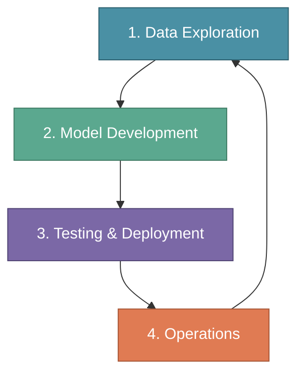
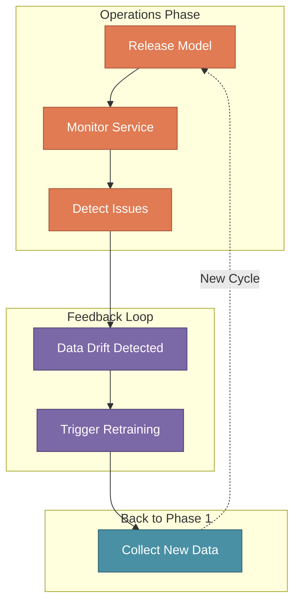
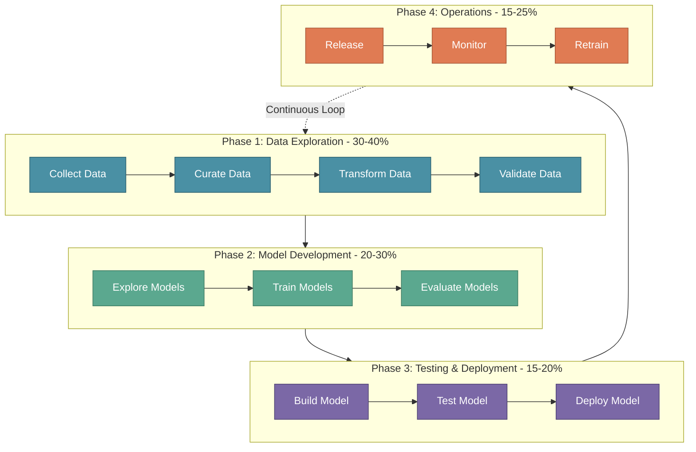

# The MLOps Lifecycle

In the previous sections, we explored the MLOps Engineer role and the skills required to succeed. Now it's time to understand the **complete lifecycle** that an MLOps Engineer must master.

The MLOps lifecycle is a continuous, iterative process where each phase flows smoothly into the next. Understanding this lifecycle is essential for building production-ready ML systems.

:::tip Key Insight
**An MLOps Engineer must focus on all four phases to master the discipline.** Weakness in any phase creates bottlenecks that slow down the entire ML delivery pipeline.
:::

---

## The Four Phases of MLOps

The MLOps lifecycle consists of four interconnected phases that form a continuous loop:



**Smooth transitions between each phase enable efficiency and continuous iteration.**

| Phase | Focus | Time Allocation |
|-------|-------|-----------------|
| **1. Data Exploration** | Prepare data for ML | 30-40% of project time |
| **2. Model Development** | Build and train models | 20-30% of project time |
| **3. Testing & Deployment** | Validate and release | 15-20% of project time |
| **4. Operations** | Monitor and maintain | 15-25% of project time |

:::warning Reality Check
Data Exploration takes **30-40% of total project time**. Many teams underestimate this phase, leading to poor model performance and delayed timelines. Plan accordingly!
:::

---

## Phase 1: Data Exploration

The foundation of any successful ML project. This phase ensures data readiness for model training.

### Key Activities

| Activity | Description | Outcome |
|----------|-------------|---------|
| **Collect Data** | Gather data from various sources (databases, APIs, streams) | Raw dataset assembled |
| **Curate Data** | Clean, deduplicate, and organize data | Quality dataset ready |
| **Transform Data** | Apply preprocessing and feature engineering | ML-ready features |
| **Validate Data** | Check for completeness, consistency, and quality | Data quality report |

### XYZShopSmart Example

**Goal:** Prepare data for the recommendation system

```mermaid
flowchart LR
    subgraph sources[Data Sources]
        O[Orders DB]
        C[Clickstream]
        P[Product Catalog]
        U[User Profiles]
    end
    
    subgraph exploration[Data Exploration]
        COLLECT[Collect]
        CURATE[Curate]
        TRANSFORM[Transform]
        VALIDATE[Validate]
    end
    
    subgraph output[Output]
        FEATURES[ML-Ready Features]
    end
    
    sources --> COLLECT
    COLLECT --> CURATE
    CURATE --> TRANSFORM
    TRANSFORM --> VALIDATE
    VALIDATE --> FEATURES
    
    style O fill:#4A90A4,stroke:#2C5F6E,color:#fff
    style C fill:#4A90A4,stroke:#2C5F6E,color:#fff
    style P fill:#4A90A4,stroke:#2C5F6E,color:#fff
    style U fill:#4A90A4,stroke:#2C5F6E,color:#fff
    style COLLECT fill:#5BA88F,stroke:#3D7A62,color:#fff
    style CURATE fill:#5BA88F,stroke:#3D7A62,color:#fff
    style TRANSFORM fill:#5BA88F,stroke:#3D7A62,color:#fff
    style VALIDATE fill:#5BA88F,stroke:#3D7A62,color:#fff
    style FEATURES fill:#E07B53,stroke:#A65535,color:#fff
```



**Practical Example:** Using historical sales data to predict future trends

| Step | XYZShopSmart Action | Tools Used |
|------|---------------------|------------|
| Collect | Pull 3 years of transaction data from PostgreSQL | Airflow, Spark |
| Curate | Remove duplicates, handle missing values | Pandas, Great Expectations |
| Transform | Create user-item interaction matrix | Spark, Feast |
| Validate | Verify no data leakage, check distributions | Evidently, custom scripts |

### Data Exploration Checklist

```yaml
data_exploration_checklist:
  collection:
    - sources_identified: true
    - access_permissions: verified
    - ingestion_pipeline: automated
  
  curation:
    - duplicates_removed: true
    - missing_values_handled: true
    - outliers_addressed: true
  
  transformation:
    - features_engineered: true
    - scaling_applied: where_needed
    - encoding_completed: categorical_variables
  
  validation:
    - schema_verified: true
    - quality_score: ">= 95%"
    - documentation: complete
```

---

## Phase 2: Model Development

With clean data in hand, the focus shifts to building and training ML models.

### Key Activities

| Activity | Description | Outcome |
|----------|-------------|---------|
| **Explore Models** | Research and select candidate algorithms | Shortlist of approaches |
| **Train Models** | Train models with experiment tracking | Trained model artifacts |
| **Evaluate Models** | Compare performance against baselines | Best model selected |

### XYZShopSmart Example

**Goal:** Build a recommendation model that predicts user preferences

| Step | Action | Metrics Tracked |
|------|--------|-----------------|
| **Explore** | Evaluate Collaborative Filtering, Content-Based, and Hybrid approaches | Feasibility, compute requirements |
| **Train** | Train models with different hyperparameters | Accuracy, Precision, Recall, F1 |
| **Evaluate** | Compare against random baseline and business rules | Lift over baseline, A/B test results |

```mermaid
flowchart LR
    subgraph explore[Explore]
        E1[Research Algorithms]
        E2[Prototype Solutions]
    end
    
    subgraph train[Train]
        T1[Hyperparameter Tuning]
        T2[Cross-Validation]
        T3[Experiment Tracking]
    end
    
    subgraph evaluate[Evaluate]
        V1[Offline Metrics]
        V2[Business Validation]
        V3[Model Selection]
    end
    
    explore --> train --> evaluate
    
    style E1 fill:#4A90A4,stroke:#2C5F6E,color:#fff
    style E2 fill:#4A90A4,stroke:#2C5F6E,color:#fff
    style T1 fill:#5BA88F,stroke:#3D7A62,color:#fff
    style T2 fill:#5BA88F,stroke:#3D7A62,color:#fff
    style T3 fill:#5BA88F,stroke:#3D7A62,color:#fff
    style V1 fill:#7B68A6,stroke:#4E4272,color:#fff
    style V2 fill:#7B68A6,stroke:#4E4272,color:#fff
    style V3 fill:#7B68A6,stroke:#4E4272,color:#fff
```



### Experiment Tracking Example

```python
import mlflow

with mlflow.start_run(run_name="collaborative_filtering_v1"):
    # Log parameters
    mlflow.log_param("algorithm", "ALS")
    mlflow.log_param("factors", 100)
    mlflow.log_param("regularization", 0.01)
    mlflow.log_param("iterations", 20)
    
    # Train model
    model = train_als_model(data, factors=100, reg=0.01, iters=20)
    
    # Log metrics
    mlflow.log_metric("rmse", 0.82)
    mlflow.log_metric("precision_at_10", 0.15)
    mlflow.log_metric("recall_at_10", 0.08)
    mlflow.log_metric("ndcg", 0.12)
    
    # Log model
    mlflow.spark.log_model(model, "recommendation_model")
```

---

## Phase 3: Testing & Deployment

The bridge between development and production. This phase ensures the model is ready for real-world use.

### Key Activities

| Activity | Description | Outcome |
|----------|-------------|---------|
| **Build Model** | Package model for deployment (containerization) | Deployable artifact |
| **Test Model** | Run comprehensive tests (unit, integration, performance) | Test report |
| **Plan Deployment** | Define rollout strategy (canary, blue-green, A/B) | Deployment plan |

### XYZShopSmart Example

**Goal:** Deploy the recommendation model to production safely

| Step | Action | Success Criteria |
|------|--------|------------------|
| **Build** | Containerize model with FastAPI + ONNX runtime | Image builds successfully |
| **Test** | Run load tests simulating 10K requests/second | p99 latency < 100ms |
| **Plan** | Canary deployment starting with 5% traffic | Error rate < 0.1% |

### Testing Strategy

```yaml
testing_strategy:
  unit_tests:
    - model_prediction_format: "returns valid JSON"
    - feature_preprocessing: "handles missing values"
    - edge_cases: "empty input, single item"
  
  integration_tests:
    - feature_store_connection: "fetches features correctly"
    - model_registry_pull: "loads correct version"
    - api_endpoint: "returns predictions"
  
  performance_tests:
    - latency_p50: "< 20ms"
    - latency_p99: "< 100ms"
    - throughput: "> 10K requests/second"
    - memory_usage: "< 2GB per replica"
  
  validation_tests:
    - accuracy_threshold: ">= baseline + 2%"
    - no_data_drift: true
    - feature_importance: "stable"
```

### Deployment Patterns

| Pattern | Use Case | XYZShopSmart Choice |
|---------|----------|---------------------|
| **Canary** | Gradual rollout, easy rollback | ✅ Primary strategy |
| **Blue-Green** | Zero-downtime deployments | For infrastructure changes |
| **A/B Testing** | Compare model versions | For model improvements |
| **Shadow Mode** | Test in production without impact | For new model architectures |

```mermaid
flowchart LR
    subgraph build[Build]
        B1[Containerize]
        B2[Push to Registry]
    end
    
    subgraph test[Test]
        T1[Unit Tests]
        T2[Integration Tests]
        T3[Performance Tests]
    end
    
    subgraph deploy[Deploy]
        D1[Staging]
        D2[Canary 5%]
        D3[Canary 25%]
        D4[Full Rollout]
    end
    
    build --> test --> deploy
    
    style B1 fill:#4A90A4,stroke:#2C5F6E,color:#fff
    style B2 fill:#4A90A4,stroke:#2C5F6E,color:#fff
    style T1 fill:#5BA88F,stroke:#3D7A62,color:#fff
    style T2 fill:#5BA88F,stroke:#3D7A62,color:#fff
    style T3 fill:#5BA88F,stroke:#3D7A62,color:#fff
    style D1 fill:#7B68A6,stroke:#4E4272,color:#fff
    style D2 fill:#7B68A6,stroke:#4E4272,color:#fff
    style D3 fill:#E07B53,stroke:#A65535,color:#fff
    style D4 fill:#E07B53,stroke:#A65535,color:#fff
```



---

## Phase 4: Operations

The model is live — now the real work begins. This phase ensures continuous reliability and improvement.

### Key Activities

| Activity | Description | Outcome |
|----------|-------------|---------|
| **Release Model** | Complete production deployment | Model serving traffic |
| **Monitor Service** | Track performance, latency, and errors | Real-time dashboards |
| **Retrain & Release** | Update model with fresh data | Improved model in production |

### XYZShopSmart Example

**Goal:** Maintain 99.9% uptime and continuously improve recommendations

| Activity | Frequency | Tools |
|----------|-----------|-------|
| **Release** | Weekly (automated) | ArgoCD, Kubernetes |
| **Monitor** | Continuous | Prometheus, Grafana, Evidently |
| **Retrain** | Weekly or on drift detection | Airflow, MLflow |

### Monitoring Dashboard

```yaml
monitoring_metrics:
  system_health:
    - uptime: "99.9%"
    - latency_p99: "< 100ms"
    - error_rate: "< 0.1%"
    - throughput: "requests/second"
  
  model_performance:
    - prediction_accuracy: "track daily"
    - click_through_rate: "target > 8%"
    - conversion_rate: "target > 2.5%"
  
  data_quality:
    - feature_drift: "alert on significant change"
    - data_freshness: "< 1 hour old"
    - missing_values: "< 1%"
  
  alerts:
    - latency_spike: "p99 > 150ms for 5 min"
    - accuracy_drop: "> 5% below baseline"
    - error_rate: "> 1% for 2 min"
```

### The Continuous Loop

Operations feeds back into Data Exploration, creating a continuous improvement cycle:



---

## The Complete MLOps Lifecycle

Putting it all together — here's the full lifecycle with XYZShopSmart's implementation:



---

## XYZShopSmart: Full Lifecycle Timeline

Here's how XYZShopSmart executed their recommendation system across all four phases:

| Week | Phase | Activities | Deliverables |
|------|-------|------------|--------------|
| 1-3 | **Data Exploration** | Collect transaction data, user profiles, clickstream | Clean dataset, feature store populated |
| 4-5 | **Data Exploration** | Feature engineering, data validation | 50+ features, quality report |
| 6-7 | **Model Development** | Experiment with algorithms, train models | 15 experiments tracked, best model: 68% accuracy |
| 8 | **Testing & Deployment** | Containerize, load test, staging deployment | Docker image, performance report |
| 9-10 | **Testing & Deployment** | Canary deployment, A/B testing | 5% → 25% → 100% rollout |
| 11+ | **Operations** | Monitor, detect drift, weekly retraining | 99.95% uptime, +18% conversion |

---

## Key Takeaways

| Lesson | Description |
|--------|-------------|
| 🔄 **It's a Cycle, Not a Line** | Operations feeds back into Data Exploration continuously |
| 📊 **Data is 30-40% of Effort** | Don't underestimate data exploration and preparation |
| 🧪 **Test Before You Ship** | Comprehensive testing prevents production disasters |
| 📈 **Monitor Everything** | You can't improve what you don't measure |
| 🔧 **Master All Four Phases** | MLOps Engineers must be proficient across the entire lifecycle |

---

## What's Next?

Now that we understand the complete MLOps lifecycle, it's time to get hands-on! In the upcoming sections, we'll build each component of XYZShopSmart's ML platform:

| Section | Topic | What You'll Build |
|---------|-------|-------------------|
| **Data Pipelines** | ETL for ML | Airflow DAGs for feature extraction |
| **Feature Store** | Feast Setup | Online/offline feature serving |
| **Experiment Tracking** | MLflow Deep Dive | Reproducible experiments |
| **Model Deployment** | Kubernetes + Seldon | Production inference API |
| **Monitoring** | Observability Stack | Drift detection and alerting |

:::info Up Next
In the next section, we'll start building **XYZShopSmart's data pipelines** — the foundation of Phase 1 (Data Exploration) in action.
:::
