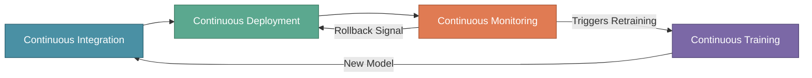

# CI, CD, CT, and CM in MLOps

In the previous section, we explored the four phases of the MLOps lifecycle. Now it's time to understand the **continuous practices** that keep the lifecycle running smoothly and efficiently.

Traditional software development relies on CI/CD (Continuous Integration and Continuous Deployment). MLOps extends these practices with two additional dimensions: **Continuous Training (CT)** and **Continuous Monitoring (CM)**.

:::tip Key Insight
The four pillars of continuous MLOps practices work together to ensure models remain accurate, reliable, and up-to-date in production. Neglecting any one pillar creates gaps that can lead to model degradation, deployment failures, or undetected performance issues.
:::

---

## Why Continuous Practices Matter

Consider XYZShopSmart's recommendation system. After launching successfully, the team faced a critical incident: a data scientist pushed a feature engineering update that worked locally but broke in production. The change went live without proper testing, and nobody noticed until customer complaints flooded in at 3 AM.

This incident exposed gaps in their workflow. Building a model is only the beginning. To run ML systems reliably at scale, teams need automated, continuous practices that catch problems early and keep systems healthy.

---

## 1. Continuous Integration (CI) in MLOps

Continuous Integration ensures that code changes, data updates, and model modifications are merged seamlessly into a shared repository. In traditional software, CI focuses only on code. In MLOps, CI must handle **code, data, and models** together.

### Core Components of CI in MLOps

**Automated Code and Model Integration** merges code changes and ML models into a shared repository seamlessly. When XYZShopSmart's data scientist Maya submits a new feature engineering script, the CI system automatically validates it against the existing codebase before allowing the merge.

**Version Control for Code, Data, and Models** tracks changes across all artifacts. Git handles code versioning. DVC (Data Version Control) or Delta Lake tracks training data changes. MLflow or Weights & Biases versions model artifacts with metadata. This complete versioning ensures any model can be reproduced exactly.

**Automated Testing of ML Pipelines** implements multiple test layers:
- **Unit tests** verify individual functions work correctly (feature transformations, data preprocessing)
- **Integration tests** confirm components work together (data pipeline connects to feature store)
- **Validation tests** ensure model quality meets thresholds (accuracy above baseline)

**Build Reproducibility** ensures that builds can be replicated consistently across environments. XYZShopSmart uses Docker containers to guarantee that code running in CI behaves identically in production.

**Enhanced Collaboration** facilitates teamwork between data scientists, engineers, and stakeholders. CI creates a shared checkpoint where everyone's work is validated before merging, preventing the "works on my machine" problem.

### How CI Works at XYZShopSmart

When Maya submits her feature engineering update:

1. The CI pipeline triggers automatically on pull request
2. Data versioning tools verify the training dataset version is tracked
3. Unit tests run against the new feature functions
4. Integration tests confirm the features work with the existing pipeline
5. A validation test trains a quick model to verify accuracy isn't degraded
6. If all checks pass, the change can be merged

This process catches the exact type of issue that caused their 3 AM incident. The broken script would have failed integration tests before ever reaching production.

---

## 2. Continuous Deployment (CD) in MLOps

Continuous Deployment automates the release of machine learning models to production environments. Unlike traditional software deployment, model releases must account for inference latency, resource requirements, and the possibility that a model might produce subtly wrong predictions without crashing.

### Core Components of CD in MLOps

**Automated Model Deployment** pushes machine learning models to production environments automatically once they pass CI validation. Manual deployment steps are eliminated, reducing human error and deployment time.

**Infrastructure as Code (IaC)** uses tools like Terraform or Kubernetes to define deployment infrastructure. XYZShopSmart's entire model serving infrastructure is defined in YAML manifests, making deployments reproducible and version-controlled.

**Blue-Green and Canary Deployments** implement strategies for safe, incremental model releases:
- **Blue-Green**: Maintain two identical environments; switch traffic instantly between them
- **Canary**: Release to a small percentage of users first, then gradually expand
- **Shadow**: Run new models alongside production without affecting users, logging outputs for comparison
- **A/B Testing**: Split traffic between model versions to compare business metrics

**Rollback Mechanisms** enable quick reversion to previous model versions when issues are detected. Automated rollback triggers when error rates or latency exceed defined thresholds.

**Seamless Integration with CI Pipelines** ensures smooth transition from integration to deployment phases. When CI approves a change, CD takes over automatically.

### How CD Works at XYZShopSmart

When Maya's feature update passes CI:

1. The CD pipeline builds a Docker container with the updated model and dependencies
2. Security scans verify the container has no vulnerabilities
3. The container deploys to staging for integration testing against production-like data
4. A canary release routes 5% of production traffic to the new model
5. Monitoring tracks error rates, latency, and recommendation quality for 30 minutes
6. If metrics remain healthy, traffic gradually increases: 25%, 50%, 100%
7. If any threshold is breached, traffic automatically reverts to the previous version

This graduated approach means even if something slips past CI, only a small percentage of users are affected before automatic rollback kicks in.

---

## 3. Continuous Training (CT) in MLOps

Continuous Training is unique to MLOps and addresses a fundamental challenge: **models degrade over time** as data distributions shift. CT ensures models are automatically retrained on fresh data to maintain accuracy and relevance.

Three months after launch, XYZShopSmart noticed their recommendation click-through rate dropping week over week. The model hadn't changed, but user behavior had. New products were added. Seasonal trends shifted. The model, trained on old data, couldn't keep up. This phenomenon is called **model drift**.

### Core Components of CT in MLOps

**Automated Retraining Pipelines** schedule and trigger retraining based on multiple conditions:
- **Scheduled**: Retrain weekly or monthly on a fixed cadence
- **Drift-based**: Trigger when data distribution shifts significantly
- **Performance-based**: Trigger when business metrics drop below thresholds
- **Data-driven**: Trigger when sufficient new data accumulates

**Data Versioning and Management** uses tools like DVC or Delta Lake to track training datasets. Every training run references a specific data version, enabling exact reproduction of any model.

**Hyperparameter Tuning and Experimentation** automates the search for optimal model parameters. Frameworks like Optuna run multiple experiments with different configurations, selecting the best performer without manual intervention.

**Scalable Training Infrastructure** leverages cloud resources or distributed computing for efficient training. XYZShopSmart uses AWS SageMaker with spot instances to keep training costs manageable while enabling GPU-accelerated training.

**Model Validation and Testing** ensures new models meet quality standards before deployment. A critical gate: new models must demonstrably outperform the current production model before being promoted.

### How CT Works at XYZShopSmart

The team configured multiple retraining triggers:

**Weekly scheduled retraining** runs every Sunday night:
1. The pipeline fetches the latest week of user interaction data
2. Data quality validation runs using Great Expectations
3. The dataset is versioned with DVC
4. Hyperparameter tuning runs 50 experiments using Optuna
5. The best model is evaluated against the production model
6. If accuracy improves by at least 1%, the new model is promoted
7. The CD pipeline handles deployment

**Drift-based retraining** activates immediately when monitoring detects significant input data distribution changes. If users suddenly browse different product categories than what the model was trained on, retraining triggers within hours rather than waiting for the weekly schedule.

**Performance-based retraining** triggers when click-through rate drops more than 5% below baseline, regardless of whether scheduled retraining is due.

---

## 4. Continuous Monitoring (CM) in MLOps

Continuous Monitoring tracks model performance, data quality, and system health in production. Unlike traditional software monitoring that focuses on uptime and latency, CM must detect **ML-specific issues** like data drift, prediction quality degradation, and subtle model failures that don't cause crashes.

XYZShopSmart's 3 AM incident happened because traditional monitoring showed everything was fine. Servers were up. Latency was normal. But the model was returning the same recommendations for every user. Without ML-specific monitoring, the problem went undetected for hours.

### Core Components of CM in MLOps

**Real-Time Model Performance Monitoring** tracks prediction quality using tools like Prometheus and Grafana. Key metrics include prediction distribution, confidence scores, and recommendation diversity.

**Data and Model Drift Detection** identifies changes in data distribution or model behavior. Tools like Evidently and Whylogs compare incoming data against training data baselines, alerting when significant drift occurs.

**Automated Alerts and Notifications** notify teams of anomalies or performance degradation. Alerts route to Slack, PagerDuty, or email based on severity. Critical alerts page the on-call engineer immediately.

**Logging and Auditing** maintains complete records for compliance and troubleshooting. Prediction inputs, outputs, and model versions are logged, enabling root cause analysis when issues arise.

**Feedback Loops for Model Improvement** connect monitoring insights to retraining and deployment decisions. When monitoring detects drift, it automatically triggers the CT pipeline. When it detects deployment issues, it triggers CD rollback.

### What to Monitor: Four Layers

**System Metrics** cover infrastructure health:
- Latency (p50, p95, p99 response times)
- Throughput (requests per second)
- Error rate (failed predictions)
- Resource usage (CPU, memory, GPU utilization)

**Model Metrics** track prediction behavior:
- Prediction distribution (are outputs clustered or varied?)
- Confidence score distribution (is the model becoming uncertain?)
- Feature importance stability (are the same features driving predictions?)

**Data Metrics** monitor input quality:
- Feature drift (PSI scores comparing current vs. training data)
- Data freshness (how old is the incoming data?)
- Missing values (are required fields present?)

**Business Metrics** measure real-world impact:
- Click-through rate
- Conversion rate
- Revenue attribution

### How CM Works at XYZShopSmart

The team implemented layered monitoring with actionable thresholds:

**System monitoring** alerts if p99 latency exceeds 150ms for 5+ minutes or error rate exceeds 0.5% for 2+ minutes. Brief spikes during traffic surges don't trigger alerts.

**Model monitoring** checks daily for accuracy drops exceeding 5% from baseline. The team also monitors prediction diversity, alerting if recommendations become too homogeneous.

**Data monitoring** runs hourly, calculating PSI scores for key features. Significant drift triggers both an alert and automatic retraining.

**Business monitoring** compares weekly metrics to the previous week. A click-through rate drop exceeding 10% escalates to the team lead.

The monitoring system connects to other practices:
- Drift detection triggers CT retraining pipelines
- Latency spikes during canary releases trigger CD rollback
- Recurring issues after certain change types inform CI test improvements

---

## How All Four Practices Connect

The four practices form a continuous loop:

A complete cycle at XYZShopSmart:

**Monday**: Maya submits an improved feature. CI runs tests, versions artifacts, and approves the merge.

**Monday evening**: CD deploys via canary release. 5% of users see the new model. Metrics look good. Traffic expands to 100%.

**Throughout the week**: CM monitors all four metric layers. It detects gradual click-through rate decline and identifies data drift from new product categories.

**Sunday night**: CT triggers scheduled retraining with the latest data. The new model outperforms production by 3%. It's promoted and flows through CI and CD.

**Next Monday**: The cycle continues with fresh data and an updated model.

---

## Common Mistakes to Avoid

**CI without data versioning**: Teams version code but forget data. When models fail, they cannot reproduce training conditions. Version code, data, and models together.

**CD without rollback capability**: Deploying without automatic rollback is risky. Every deployment should include threshold-based automatic reversion.

**CT without validation gates**: Retraining doesn't guarantee improvement. Always require new models to beat the current production baseline before promotion.

**CM without actionable thresholds**: Alerting on every fluctuation causes alert fatigue. Tune thresholds so alerts are rare but meaningful.

**Treating practices as silos**: The practices are most effective when integrated. Monitoring should trigger training. Training outputs should flow through CI and CD. Everything should connect.

---

## Key Takeaways

**Continuous Integration** in MLOps extends beyond code to include data and model versioning. Every change passes through automated testing. Every artifact is reproducible.

**Continuous Deployment** automates releases while adding ML-specific safety measures. Canary releases and automatic rollback protect users from problematic model changes.

**Continuous Training** addresses model drift by automatically retraining on fresh data. Validation gates ensure only improved models reach production.

**Continuous Monitoring** watches system health, model performance, data quality, and business metrics. It closes the feedback loop by triggering retraining and rollbacks when needed.

Together, these four practices create resilient, self-improving ML systems that catch problems early and adapt to changing conditions.

---

## What's Next?

With a solid understanding of CI, CD, CT, and CM, you're ready to implement these practices. In the upcoming sections, we'll build each component:

- **CI Pipeline**: GitHub Actions with data versioning and automated ML testing
- **CD Pipeline**: Kubernetes deployment with canary releases via ArgoCD
- **CT Pipeline**: Airflow-based retraining with drift detection triggers
- **CM Dashboard**: Prometheus, Grafana, and Evidently for comprehensive observability

:::info Up Next
In the next section, we'll start building **production CI pipelines** using GitHub Actions, complete with data versioning and automated ML testing.
:::
