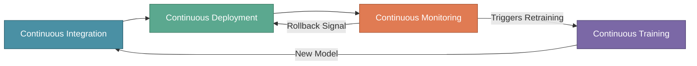

# CI, CD, CT, and CM in MLOps

In the previous section, we explored the four phases of the MLOps lifecycle. Now it's time to understand the continuous practices that keep the lifecycle running smoothly.

Traditional software development relies on CI/CD (Continuous Integration and Continuous Deployment). MLOps extends these with two additional dimensions: **Continuous Training (CT)** and **Continuous Monitoring (CM)**.

:::tip Key Insight
The four pillars of continuous MLOps practices work together to ensure models remain accurate, reliable, and up-to-date in production.
:::

---

## Why Continuous Practices Matter

After launching their recommendation system, XYZShopSmart faced a critical incident: a data scientist pushed a feature engineering update that worked locally but broke in production. The change went live without proper testing, and nobody noticed until customer complaints flooded in at 3 AM. Building a model is only the beginning. To run ML systems reliably at scale, teams need automated, continuous practices that catch problems early.

---

## Continuous Integration (CI)

Continuous Integration ensures that code changes, data updates, and model modifications merge seamlessly into a shared repository. In traditional software, CI focuses only on code. In MLOps, CI must handle **code, data, and models** together.

### Core Components

**Automated Code and Model Integration** merges changes into a shared repository seamlessly. **Version Control for Code, Data, and Models** tracks all artifacts using Git for code, DVC for data, and MLflow for model versioning.

**Automated Testing** implements multiple layers: unit tests verify individual functions, integration tests confirm components work together, and validation tests ensure model quality meets thresholds.

**Build Reproducibility** ensures builds replicate consistently across environments using Docker containers. **Enhanced Collaboration** creates a shared checkpoint where everyone's work is validated before merging.

### How CI Works at XYZShopSmart

When Sonu submits her feature engineering update:

1. The CI pipeline triggers automatically on pull request
2. Data versioning tools verify the training dataset version is tracked
3. Unit tests run against the new feature functions
4. Integration tests confirm the features work with the existing pipeline
5. A validation test trains a quick model to verify accuracy isn't degraded
6. If all checks pass, the change can be merged

---

## Continuous Deployment (CD)

Continuous Deployment automates the release of machine learning models to production. Unlike traditional software, model releases must account for inference latency, resource requirements, and the possibility that a model might produce subtly wrong predictions without crashing.

### Core Components

**Automated Model Deployment** pushes models to production automatically once they pass CI validation. **Infrastructure as Code (IaC)** uses Terraform or Kubernetes to define deployment infrastructure in version-controlled manifests.

**Deployment Strategies** implement safe, incremental releases: Blue-Green maintains two environments and switches traffic instantly, Canary releases to a small percentage first, Shadow runs new models alongside production for comparison, and A/B Testing splits traffic to compare business metrics.

**Rollback Mechanisms** enable quick reversion when issues are detected, with automated triggers based on error rates or latency thresholds.

### How CD Works at XYZShopSmart

When Sonu's feature update passes CI:

1. The CD pipeline builds a Docker container with the updated model
2. Security scans verify the container has no vulnerabilities
3. The container deploys to staging for integration testing
4. A canary release routes 5% of production traffic to the new model
5. Monitoring tracks error rates, latency, and quality for 30 minutes
6. If metrics remain healthy, traffic gradually increases to 100%
7. If any threshold is breached, traffic automatically reverts

---

## Continuous Training (CT)

Continuous Training addresses a fundamental challenge: **models degrade over time** as data distributions shift. CT ensures models are automatically retrained on fresh data to maintain accuracy.

Three months after launch, XYZShopSmart noticed their click-through rate dropping week over week. The model hadn't changed, but user behavior had. This phenomenon is called **model drift**.

### Core Components

**Automated Retraining Pipelines** trigger based on multiple conditions: scheduled (weekly or monthly), drift-based (when data distribution shifts), performance-based (when metrics drop), or data-driven (when sufficient new data accumulates).

**Data Versioning** uses DVC or Delta Lake to track datasets, enabling exact reproduction of any model. **Hyperparameter Tuning** automates the search for optimal parameters using frameworks like Optuna.

**Scalable Training Infrastructure** leverages cloud resources for efficient training. **Model Validation** ensures new models outperform the current production model before promotion.

### How CT Works at XYZShopSmart

The team configured multiple retraining triggers:

1. Weekly scheduled retraining fetches the latest user interaction data
2. Data quality validation runs using Great Expectations
3. Hyperparameter tuning runs 50 experiments using Optuna
4. The best model is evaluated against the production model
5. If accuracy improves by at least 1%, the new model is promoted

Drift-based retraining activates immediately when monitoring detects significant input distribution changes. Performance-based retraining triggers when click-through rate drops more than 5% below baseline.

---

## Continuous Monitoring (CM)

Continuous Monitoring tracks model performance, data quality, and system health in production. Unlike traditional monitoring that focuses on uptime and latency, CM must detect **ML-specific issues** like data drift and prediction quality degradation.

XYZShopSmart's 3 AM incident happened because traditional monitoring showed everything was fine. Servers were up. Latency was normal. But the model was returning the same recommendations for every user.

### What to Monitor: Four Layers

**System Metrics** cover infrastructure health: latency (p50, p95, p99), throughput, error rate, and resource usage.

**Model Metrics** track prediction behavior: prediction distribution, confidence scores, and feature importance stability.

**Data Metrics** monitor input quality: feature drift (PSI scores), data freshness, and missing values.

**Business Metrics** measure real-world impact: click-through rate, conversion rate, and revenue attribution.

### How CM Works at XYZShopSmart

The team implemented layered monitoring with actionable thresholds:

1. System monitoring alerts if p99 latency exceeds 150ms for 5+ minutes
2. Model monitoring checks daily for accuracy drops exceeding 5%
3. Data monitoring runs hourly, calculating PSI scores for key features
4. Business monitoring compares weekly metrics to the previous week

The monitoring system connects to other practices: drift detection triggers CT pipelines, latency spikes trigger CD rollback, and recurring issues inform CI test improvements.

---

## How All Four Practices Connect

The four practices form a continuous loop:

A complete cycle at XYZShopSmart:

1. Sonu submits an improved feature; CI runs tests and approves the merge
2. CD deploys via canary release, gradually expanding to 100% of users
3. CM monitors all metric layers throughout the week, detecting gradual decline
4. CT triggers scheduled retraining; the new model outperforms production
5. The improved model flows through CI and CD, completing the cycle

---

## Common Mistakes to Avoid

- **CI without data versioning**: Teams version code but forget data. Version code, data, and models together.
- **CD without rollback capability**: Every deployment should include threshold-based automatic reversion.
- **CT without validation gates**: Always require new models to beat the current production baseline before promotion.
- **CM without actionable thresholds**: Tune thresholds so alerts are rare but meaningful.
- **Treating practices as silos**: The practices are most effective when integrated and connected.

---

## Key Takeaways

**Continuous Integration** extends beyond code to include data and model versioning, with automated testing for every artifact.

**Continuous Deployment** automates releases with ML-specific safety measures like canary releases and automatic rollback.

**Continuous Training** addresses model drift by automatically retraining on fresh data with validation gates.

**Continuous Monitoring** watches system health, model performance, data quality, and business metrics, closing the feedback loop.

---

## What's Next

With a solid understanding of CI, CD, CT, and CM, you're ready to explore the tools that make these practices possible. The next section covers the essential MLOps toolchain.

:::info Up Next
In the next section, we'll explore the essential tools for MLOps—from version control and CI/CD to experiment tracking, monitoring, and workflow orchestration.
:::
