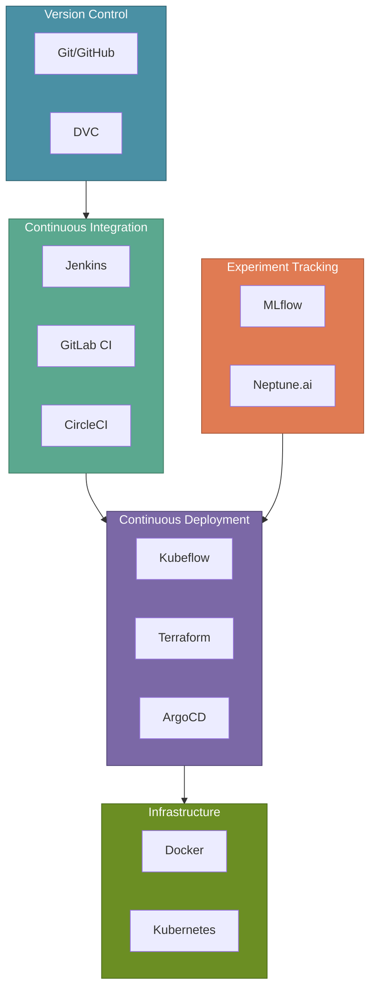

# Essential Tools for MLOps

In the previous section, we covered CI, CD, CT, and CM—the continuous practices that keep MLOps running smoothly. Now let's explore the tools that make these practices possible.

MLOps borrows heavily from DevOps tooling but extends it for machine learning workflows. Selecting the right tools enables **smooth deployment**, **automation**, **efficiency**, and **scalability** in production ML systems.

:::tip Key Insight
You don't need every tool on this list. Start with tools that solve your immediate pain points and expand as your ML infrastructure matures.
:::

---

## Why Tool Selection Matters

After implementing their CI/CD pipelines, XYZShopSmart faced a challenge: their data scientists used Jupyter notebooks, their ML engineers preferred Python scripts, and their DevOps team managed infrastructure with Terraform. Without a cohesive toolchain, handoffs between teams created bottlenecks and introduced errors. The right combination of tools bridges these gaps.

---

## Version Control and Collaboration

Version control forms the foundation of any MLOps workflow. Unlike traditional software, ML projects must track **code, data, and models** together.

### Core Tools

**Git with GitHub/GitLab** manages code versioning and collaboration. Every team member works from the same source of truth, with pull requests enabling code review and automated testing.

**Data Version Control (DVC)** extends Git to handle large datasets and model files. DVC stores metadata in Git while pushing actual files to remote storage like S3 or GCS.

### How XYZShopSmart Uses Version Control

Sonu commits her feature engineering code to Git. DVC tracks the training dataset version alongside the code, so any team member can reproduce her exact experiment by checking out both the code commit and the corresponding data version.

---

## Continuous Integration Tools

CI tools automate testing and validation whenever code changes are pushed. They catch issues early, before problems reach production.

### Core Tools

**Jenkins** provides maximum flexibility with self-hosted infrastructure. Teams with complex requirements or strict security policies often choose Jenkins for its extensibility.

**GitLab CI/CD** integrates directly with GitLab repositories, offering a streamlined experience for teams already using GitLab. Configuration lives in `.gitlab-ci.yml` files alongside the code.

**CircleCI** offers cloud-native CI with fast build times and easy parallelization. Its orbs system provides reusable configuration packages for common tasks.

### How XYZShopSmart Uses CI Tools

The team chose GitLab CI/CD for its tight repository integration:

1. Every push triggers the pipeline defined in `.gitlab-ci.yml`
2. Unit tests run in parallel across multiple containers
3. A validation job trains a quick model to verify accuracy thresholds
4. Security scanning checks dependencies for vulnerabilities
5. Successful pipelines enable merge to the main branch

---

## Continuous Deployment Tools

CD tools automate the release of models and services to production environments. ML deployments require infrastructure that can handle model serving at scale.

### Core Tools

**Kubeflow** provides a complete ML platform on Kubernetes. It includes components for pipelines, model serving, and hyperparameter tuning, all orchestrated through Kubernetes.

**Terraform** defines infrastructure as code, enabling reproducible deployments across environments. Teams use Terraform to provision cloud resources, configure networking, and manage access controls.

**ArgoCD** implements GitOps for Kubernetes deployments. Changes to deployment manifests in Git automatically sync to the cluster, providing auditable, declarative infrastructure management.

### How XYZShopSmart Uses CD Tools

The team combines Terraform and ArgoCD:

1. Terraform provisions the Kubernetes cluster and supporting infrastructure
2. Model serving manifests are stored in a Git repository
3. ArgoCD watches the repository and syncs changes to the cluster
4. Canary releases route traffic gradually to new model versions
5. Rollback is as simple as reverting a Git commit

---

## Experiment Tracking and Management

Experiment tracking tools capture the metadata needed to reproduce and compare ML experiments. Without tracking, teams lose visibility into what worked and why.

### Core Tools

**MLflow** provides an open-source platform for the complete ML lifecycle. It tracks experiments, packages models, and serves them via REST endpoints. MLflow's model registry enables versioning and stage transitions.

**Neptune.ai** offers a hosted experiment tracking solution with rich visualization capabilities. Teams can compare runs, track resource usage, and collaborate on experiment analysis.

### How XYZShopSmart Uses Experiment Tracking

Sonu logs every training run to MLflow:

1. Parameters, metrics, and artifacts are captured automatically
2. The model registry tracks which version is in staging vs. production
3. Comparison dashboards help identify the best-performing configurations
4. Approved models are tagged for promotion through the CD pipeline

---

## Automated Testing and Validation

Testing tools verify that code, data, and models meet quality standards. ML systems require testing beyond traditional unit and integration tests.

### Core Tools

**Pytest** provides the foundation for Python testing. Teams use pytest for unit tests, integration tests, and custom ML validation tests.

**Great Expectations** validates data quality with declarative expectations. Teams define what their data should look like, and Great Expectations alerts when reality diverges.

### How XYZShopSmart Uses Testing Tools

The team layers multiple testing approaches:

1. Pytest runs unit tests on feature engineering functions
2. Great Expectations validates incoming data against quality rules
3. Model validation tests compare new models against baseline accuracy
4. Integration tests verify the complete pipeline end-to-end

---

## Containerization and Orchestration

Containers ensure consistent environments from development to production. Orchestration manages containers at scale.

### Core Tools

**Docker** packages applications and dependencies into portable containers. Data scientists can define their exact environment, eliminating "works on my machine" issues.

**Kubernetes** orchestrates containers across clusters of machines. It handles scaling, load balancing, rolling updates, and self-healing for production workloads.

### How XYZShopSmart Uses Containers

Every model deployment follows the same pattern:

1. Data scientists define dependencies in a Dockerfile
2. CI builds and tests the container image
3. The image is pushed to a container registry
4. Kubernetes deploys the container with defined resource limits
5. Horizontal pod autoscaling adjusts capacity based on load

---

## Monitoring and Logging

Monitoring tools track system health and model performance. Logging captures the details needed to diagnose issues.

### Core Tools

**Prometheus** collects time-series metrics from applications and infrastructure. Its query language enables flexible alerting based on metric conditions.

**Grafana** visualizes metrics from Prometheus and other data sources. Teams build dashboards that surface the most important indicators at a glance.

**ELK Stack** (Elasticsearch, Logstash, Kibana) aggregates and searches logs across services. When issues occur, teams can trace requests through the entire system.

### How XYZShopSmart Uses Monitoring

The team configured a comprehensive observability stack:

1. Prometheus scrapes metrics from model serving endpoints every 15 seconds
2. Grafana dashboards display latency, throughput, and error rates
3. Alerts fire to Slack when p99 latency exceeds thresholds
4. ELK Stack captures prediction logs for debugging and analysis

---

## Security and Compliance

Security tools protect ML systems from vulnerabilities and ensure compliance with organizational policies.

### Core Tools

**HashiCorp Vault** manages secrets like API keys, database credentials, and model signing keys. Applications retrieve secrets at runtime rather than storing them in code.

**SonarQube** scans code for security vulnerabilities and code quality issues. It integrates with CI pipelines to block merges that introduce problems.

### How XYZShopSmart Uses Security Tools

The team implemented security at every layer:

1. Vault stores database credentials and API keys
2. CI pipelines retrieve secrets from Vault at build time
3. SonarQube scans every pull request for vulnerabilities
4. Container images are scanned before deployment

---

## Workflow Orchestration

Orchestration tools coordinate complex, multi-step ML pipelines. They manage dependencies, retries, and scheduling.

### Core Tools

**Airflow** provides a Python-based platform for authoring and scheduling workflows. DAGs (Directed Acyclic Graphs) define task dependencies, and the scheduler ensures they run in order.

**Luigi** offers a simpler alternative for pipeline orchestration. Teams with straightforward workflows often start with Luigi before graduating to Airflow.

### How XYZShopSmart Uses Workflow Orchestration

Airflow manages the complete retraining pipeline:

1. A scheduled DAG triggers weekly retraining
2. Data extraction tasks pull the latest user interactions
3. Feature engineering tasks transform raw data
4. Training tasks submit jobs to the compute cluster
5. Validation tasks compare the new model to production
6. Promotion tasks update the model registry

---

## Hyperparameter Tuning and Optimization

Tuning tools automate the search for optimal model configurations. Manual tuning doesn't scale as model complexity grows.

### Core Tools

**Optuna** provides an efficient hyperparameter optimization framework. It uses advanced algorithms like TPE to explore the search space intelligently.

**Hyperopt** offers similar capabilities with a focus on distributed optimization. Teams running experiments across clusters often choose Hyperopt.

### How XYZShopSmart Uses Tuning Tools

The team integrated Optuna into their CT pipeline:

1. Each retraining run spawns 50 Optuna trials
2. Optuna prunes unpromising trials early to save compute
3. The best configuration is logged to MLflow
4. Winning hyperparameters inform the production model

---

## Choosing the Right Tool Stack

Start with the tools that address your biggest pain points:

1. **Just starting**: Git, Docker, pytest, MLflow
2. **Growing team**: Add DVC, GitLab CI, Great Expectations
3. **Production scale**: Add Kubernetes, Airflow, Prometheus/Grafana
4. **Enterprise maturity**: Add Vault, ArgoCD, Kubeflow

---

## Common Mistakes to Avoid

- **Tool sprawl**: Adopting too many tools creates integration overhead. Start small and add tools as needs emerge.
- **Ignoring data versioning**: Teams version code but forget data. DVC or similar tools are essential for reproducibility.
- **Skipping security tools**: Adding Vault and SonarQube early prevents security debt from accumulating.
- **Over-engineering early**: A startup doesn't need Kubeflow on day one. Match tool complexity to team maturity.

---

## Key Takeaways

**Version control** must cover code, data, and models together using Git and DVC.

**CI/CD tools** like GitLab CI and ArgoCD automate testing and deployment with ML-specific validation.

**Experiment tracking** with MLflow or Neptune.ai ensures reproducibility and enables informed model selection.

**Monitoring and orchestration** tools like Prometheus, Grafana, and Airflow keep production systems healthy and automated.

---

## What's Next

With a solid understanding of the MLOps toolchain, you're ready to see how these tools fit together in a complete architecture. The next section provides a high-level view of how data pipelines, ML workflows, and production monitoring connect.

:::info Up Next
We'll explore the **MLOps High-Level Architecture** — a complete blueprint showing how data flows from problem statement through collection, modeling, deployment, and back via continuous monitoring and retraining.
:::
