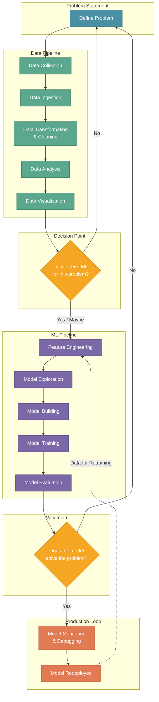
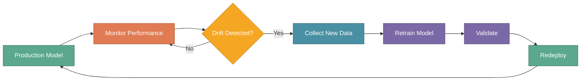

# MLOps High-Level Architecture

In the previous section, we explored the essential tools that power MLOps workflows. Now let's see how these tools fit together in a **complete architecture** that takes a problem statement through data processing, model development, and continuous monitoring.

Understanding this architecture helps teams design systems where each component has a clear purpose and connects seamlessly to the next.

:::tip Key Insight
The MLOps architecture isn't linear — it's a loop. Data flows from collection to model deployment, but model monitoring feeds back into retraining, creating a self-improving system.
:::

---

## XYZShopSmart: Seeing the Big Picture

After deploying their recommendation system, XYZShopSmart's team realized they needed a clear architectural blueprint. Different team members had built components in isolation — the data pipeline didn't align with feature engineering needs, and the monitoring system couldn't trigger retraining automatically. They needed a unified view of how all pieces connect.

---

## The Complete Architecture

The MLOps architecture consists of three interconnected tracks: the **Data Pipeline**, the **ML Pipeline**, and the **Production Loop**. Each track handles specific responsibilities while feeding into the next.

---

## The Data Pipeline

The Data Pipeline prepares raw information for machine learning. Every ML project starts here, regardless of the algorithm used later.

- **Data Collection** gathers raw data from various sources — databases, APIs, user interactions, and external systems.  
- **Data Ingestion** moves collected data into a centralized storage system where it can be processed.  
- **Data Transformation and Cleaning** standardizes formats, handles missing values, removes duplicates, and addresses outliers.  
- **Data Analysis** explores patterns, distributions, and relationships within the cleaned data.  
- **Data Visualization** presents findings through charts and dashboards that inform modeling decisions.

### XYZShopSmart's Data Pipeline

1. Collection pulls user clickstream data, purchase history, and product catalog from three sources
2. Ingestion streams data into a data lake using Apache Kafka
3. Transformation jobs run nightly in Spark, outputting clean tables
4. Analysis notebooks explore user behavior patterns weekly
5. Visualization dashboards show data health metrics to the team

---

## The Decision Point: Do We Need ML?

Not every problem requires machine learning. After analyzing the data, teams should ask: **Does this problem actually need ML, or would simpler approaches work?**

If the answer is **No**, return to the problem statement and refine it — perhaps the solution is a rule-based system or a simple statistical approach.

If the answer is **Yes** or **Maybe**, proceed to the ML Pipeline with the prepared data.

### When XYZShopSmart Chose ML

The team initially considered rule-based recommendations ("show popular items"). Data analysis revealed that user preferences varied significantly by segment, purchase history, and browsing patterns. These complex relationships justified the ML investment.

---

## The ML Pipeline

The ML Pipeline transforms prepared data into a trained, validated model ready for production.

- **Feature Engineering** creates meaningful input variables from raw data — combining, transforming, and encoding features that help models learn patterns.  
- **Model Exploration** researches and prototypes candidate algorithms to find approaches suited to the problem.  
- **Model Building** implements the selected algorithms with proper architecture and hyperparameters.  
- **Model Training** fits models to training data while tracking experiments.  
- **Model Evaluation** measures performance against baselines and validates that the model solves the original problem.

### XYZShopSmart's ML Pipeline

1. Feature Engineering creates 50+ features: user embeddings, item popularity scores, time-based patterns
2. Model Exploration tests collaborative filtering, content-based, and hybrid approaches
3. Model Building implements a neural collaborative filtering architecture
4. Training runs on GPU cluster with MLflow tracking every experiment
5. Evaluation compares against random baseline and existing business rules

---

## The Validation Gate

After model evaluation, teams face a critical question: **Does this model actually solve the problem statement?**

If **No**, the model doesn't meet requirements. Return to the problem statement — perhaps requirements need refinement, or the data pipeline needs improvements before another ML iteration.

If **Yes**, the model is ready for production deployment and enters the production loop.

---

## The Production Loop

The Production Loop keeps deployed models healthy and improves them over time.

- **Model Monitoring and Debugging** tracks model performance in production, watching for accuracy degradation, latency issues, and data drift. When problems arise, debugging tools help identify root causes.  
- **Model Redeployment** pushes updated models to production after retraining. The redeployed model generates new data that feeds back into Feature Engineering, completing the loop.

### The Retraining Feedback Loop

---

## MLOps Engineer Responsibilities Across the Architecture

The MLOps Engineer supports the entire architecture with specialized skills in three key areas:

### Data Handling

**Collect, ingest, transform, clean, and analyze data** — ensuring the data pipeline produces high-quality inputs for ML. The MLOps Engineer builds and maintains the infrastructure that makes data flow reliably.

### CI/CD and Monitoring

**Build CI/CD systems and implement testing, monitoring, and debugging** — automating the path from code commit to production deployment. Continuous monitoring catches issues before they impact users.

### Scalability

**Ensure ML model scalability** — designing infrastructure that handles traffic spikes, manages compute resources efficiently, and maintains performance as data volumes grow.

### How XYZShopSmart's MLOps Engineer Contributes

| Responsibility | Implementation |
|---------------|----------------|
| Data Handling | Airflow DAGs for ETL, Great Expectations for validation |
| CI/CD | GitLab pipelines, automated testing, ArgoCD deployments |
| Monitoring | Prometheus metrics, Grafana dashboards, PagerDuty alerts |
| Scalability | Kubernetes HPA, GPU auto-scaling, load balancing |

---

## Architecture in Action: XYZShopSmart's Weekly Cycle

1. **Monday**: Data Pipeline processes weekend user interactions
2. **Tuesday**: Analysis dashboards flag unusual patterns
3. **Wednesday**: Feature Engineering incorporates new behavioral signals
4. **Thursday**: Automated training pipeline produces candidate models
5. **Friday**: Validated models deploy via canary release
6. **Weekend**: Monitoring tracks performance; cycle repeats

---

## Common Mistakes

- **Skipping the ML decision point**: Not every problem needs ML — validate the need before investing in complex solutions
- **Disconnected pipelines**: Data and ML pipelines built in isolation create handoff friction and data quality issues
- **Missing the feedback loop**: Without retraining triggers, models degrade silently over time
- **Ignoring the problem statement**: Technical teams focus on model accuracy while losing sight of the business problem
- **Underinvesting in monitoring**: Production issues go undetected without comprehensive observability

---

## Key Takeaways

**The architecture forms a complete loop.** Data flows from problem statement through collection, analysis, modeling, and back via monitoring and retraining.

**Decision gates prevent wasted effort.** Asking "Do we need ML?" and "Does the model solve the problem?" ensures resources go to valuable work.

**MLOps Engineers enable the entire architecture.** Through data handling, CI/CD, monitoring, and scalability, they keep every component running smoothly.

**The production loop drives continuous improvement.** Monitoring and redeployment create a self-improving system that adapts to changing data patterns.

---

## What's Next

With a solid understanding of MLOps architecture, you're ready to apply these concepts in practice. The next sections will provide hands-on implementations of each architectural component.

:::info Up Next
We'll dive into practical implementations, starting with setting up a complete version control workflow using Git and DVC for tracking code, data, and models together.
:::
